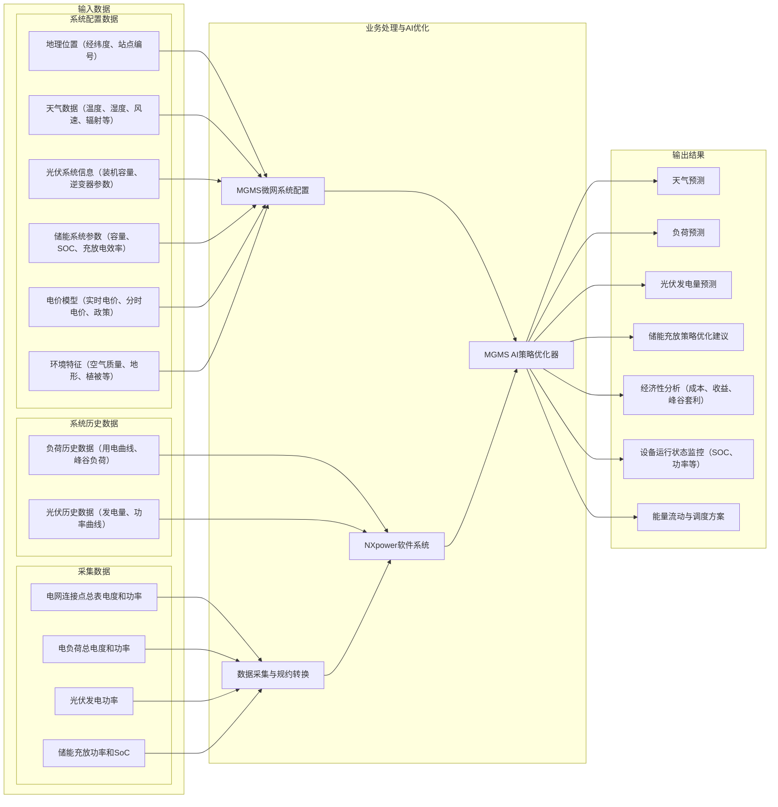
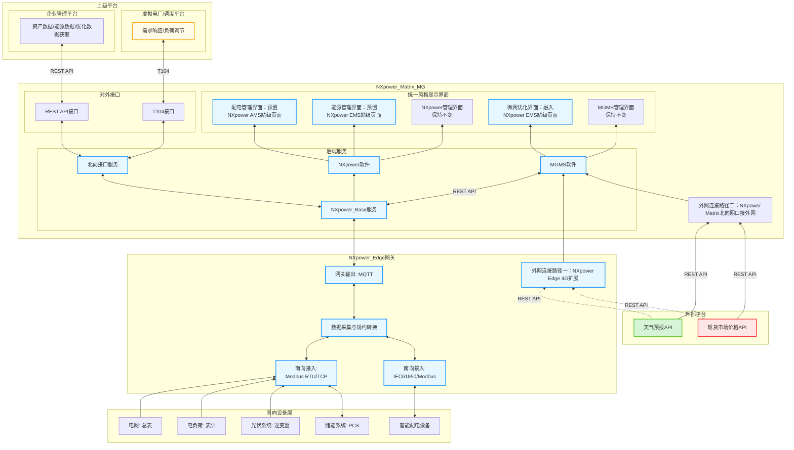

# NXpower + MGMS融合方案

## 1. 业务场景

---

// Mermaid图说明：
// 输入数据涵盖地理、天气、光伏、储能、电价、负荷、环境等所有关键要素。
// 业务处理包括数据采集、能量管理、AI预测与优化（TimesNet+XGBoost）。
// 输出结果包括各类预测、优化建议、经济分析、设备监控和调度方案。
// 目标与价值体现微电网智能化、经济性、灵活性和新能源消纳。

经济型分析包括：峰谷套利、光伏消纳、需求响应、负荷调节、动态增容带来的经济效益统计
防逆流：如果分布式光伏发电量超过本地负荷时，多余电能逆流到主网，会造成主网冲击或违反并网协议。通过监测并网点表计的功率数据，判断是否发生逆流，如果发生逆流，通过EMS或逆变器自动切断分布式电源或自动告警，自动调节分布式电源出力或储能充放电。
能源管理界面：能耗与排放概览、电价配置、能耗与用能成本分析、能流图、能耗和排放报表、能耗KPI管理、微电网单线图
微网优化界面: 发电量预测结果、储能充放策略优化建议、经济性分析结果、微网设备状态

## 2. 系统架构

---

