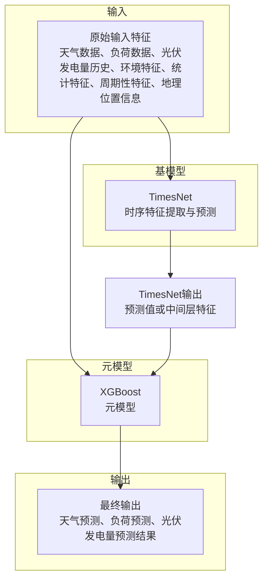

`TimesNet XGBoost stacking` 是一种将深度学习模型 `TimesNet` 与梯度提升模型 `XGBoost` 结合起来的集成学习方法。其核心思想是利用 `TimesNet` 强大的时间序列特征提取能力，然后将 `TimesNet` 的输出作为 `XGBoost` 的输入特征，让 `XGBoost` 学习如何结合这些高级特征进行最终预测。

以下是实现 `TimesNet XGBoost stacking` 的具体步骤和考虑因素：

### 1. 概念理解

*   **基模型 (Base Models):** 在这里，`TimesNet` 将作为基模型。它负责从原始时间序列数据中学习模式并生成预测或高级特征。
*   **元模型 (Meta-Model / Blender):** `XGBoost` 将作为元模型。它不直接处理原始数据，而是接收基模型（`TimesNet`）的输出作为输入特征，并学习如何将这些输出组合起来以做出最终预测。

### 2. 实现步骤

#### 步骤 A: 数据准备

1.  **数据集划分:** 将您的时间序列数据集划分为训练集和测试集。对于时间序列数据，通常需要保持时间顺序，例如，训练集是较早的数据，测试集是较晚的数据。
2.  **元特征生成的数据划分 (关键):** 为了避免数据泄露（即元模型在训练时“看到”了它应该预测的数据），通常需要对训练集进行进一步的划分，或者使用交叉验证策略来生成基模型的“**袋外 (Out-of-Fold, OOF)**”预测。
    *   **推荐方法 (时间序列交叉验证):** 使用时间序列专用的交叉验证方法（如滚动窗口交叉验证或扩展窗口交叉验证）。在每个折叠中：
        *   用当前折叠的训练数据训练 `TimesNet`。
        *   用当前折叠的验证数据让训练好的 `TimesNet` 进行预测。这些预测将构成元模型的训练特征。

#### 步骤 B: 训练 TimesNet (基模型)

1.  **TimesNet 模型定义与训练:**
    *   根据您的时间序列任务（分类、回归等）定义 `TimesNet` 模型架构。
    *   使用步骤 A 中划分的“基模型训练数据”来训练 `TimesNet`。

2.  **生成元特征 (TimesNet 输出):**
    *   **选项 1: TimesNet 预测作为特征 (更常见且简单):**
        *   使用训练好的 `TimesNet` 模型对步骤 A 中划分的“元模型训练数据”进行预测。这些预测值将作为 `XGBoost` 的一个或多个新特征。
        *   对整个测试集进行预测，这些预测值将作为 `XGBoost` 在测试阶段的输入特征。
    *   **选项 2: TimesNet 内部特征作为特征 (更强大，但复杂):**
        *   从 `TimesNet` 的中间层（例如，在最终输出层之前的某个全连接层或特征提取层）提取激活值或嵌入向量。这些高维特征可以更丰富地捕捉时间序列的模式。
        *   这些提取出的特征将作为 `XGBoost` 的输入特征。

#### 步骤 C: 训练 XGBoost (元模型)

1.  **准备元模型的输入特征:**
    *   将步骤 B 中 `TimesNet` 生成的元特征（预测值或内部特征）与原始数据的部分或全部特征进行拼接。
    *   **重要提示:** 通常，将原始特征也传递给 `XGBoost` 元模型是非常有益的，这样 `XGBoost` 可以学习 `TimesNet` 输出与原始数据之间的复杂关系。
2.  **XGBoost 模型定义与训练:**
    *   定义 `XGBoost` 模型（例如 `XGBRegressor` 或 `XGBClassifier`）。
    *   使用步骤 C.1 中准备好的元特征作为输入，原始任务的目标变量作为输出，来训练 `XGBoost` 模型。

#### 步骤 D: 进行最终预测

1.  **TimesNet 预测/特征提取:**
    *   对于新的、未见过的数据（测试集），首先通过训练好的 `TimesNet` 模型生成预测或提取内部特征。
2.  **元特征准备:**
    *   将这些 `TimesNet` 的输出与原始测试数据的特征进行拼接，形成 `XGBoost` 的输入特征。
3.  **XGBoost 最终预测:**
    *   将准备好的测试集元特征输入到训练好的 `XGBoost` 元模型中，得到最终的集成预测结果。

### 3. 时间序列数据特殊考虑

*   **数据泄露 (Data Leakage):** 这是时间序列 stacking 中最关键的问题。确保元模型在训练时只使用基模型在**未来数据**上生成的预测。使用时间序列交叉验证是解决此问题的最佳实践。
*   **特征工程:** 在将数据输入 `TimesNet` 或 `XGBoost` 之前，仍然可以进行传统的时间序列特征工程（如滞后特征、移动平均、趋势、周期性特征、节假日指示器等）。这些特征可以作为 `TimesNet` 的输入，也可以直接作为 `XGBoost` 元模型的输入。
*   **模型复杂度:** `TimesNet` 本身是一个复杂的深度学习模型，`XGBoost` 也是一个强大的模型。在组合时，要注意避免过拟合，并合理调整每个模型的超参数。

### 4. 示例代码结构 (概念性)

```python
import numpy as np
# 假设您已经有了 TimesNetModel 和 XGBoostModel 的实现

# 1. 数据准备 (概念性，实际需要时间序列交叉验证)
# X_train_raw, y_train_raw: 原始训练数据
# X_test_raw, y_test_raw: 原始测试数据

# 2. TimesNet 作为基模型
# timesnet_model = TimesNetModel(...) # 初始化 TimesNet 模型
# timesnet_model.fit(X_train_raw, y_train_raw, ...) # 训练 TimesNet

# 生成 TimesNet 的训练集 OOF 预测 (或直接预测，但 OOF 更佳)
# meta_train_timesnet_preds = np.zeros(len(X_train_raw))
# # 假设 tscv 是时间序列交叉验证器
# for train_idx, val_idx in tscv.split(X_train_raw):
#     fold_timesnet_model = TimesNetModel(...) # 为每个折叠重新初始化或克隆模型
#     fold_timesnet_model.fit(X_train_raw[train_idx], y_train_raw[train_idx])
#     meta_train_timesnet_preds[val_idx] = fold_timesnet_model.predict(X_train_raw[val_idx])

# 生成 TimesNet 的测试集预测
# meta_test_timesnet_preds = timesnet_model.predict(X_test_raw)

# 3. XGBoost 作为元模型
# 准备元模型的训练数据
# 可以将 TimesNet 预测与原始特征结合
# meta_X_train = np.hstack((X_train_raw, meta_train_timesnet_preds.reshape(-1, 1)))
# meta_X_test = np.hstack((X_test_raw, meta_test_timesnet_preds.reshape(-1, 1)))

# xgb_meta_model = XGBoostModel(...) # 初始化 XGBoost 模型
# xgb_meta_model.fit(meta_X_train, y_train_raw) # 训练 XGBoost

# 4. 最终预测
# final_predictions = xgb_meta_model.predict(meta_X_test)
```

这种 stacking 方式能够结合 `TimesNet` 在捕捉时间序列复杂模式上的优势和 `XGBoost` 在处理表格数据和非线性关系上的强大能力，通常能带来比单一模型更好的性能。

---

### TimesNet + XGBoost stacking 深入讲解

你的分析是合理的，TimesNet + XGBoost stacking 是一种有效的集成学习方法，尤其适合时间序列预测任务。其核心思想是利用 TimesNet 强大的时序特征提取能力，将其输出作为 XGBoost 的输入特征，让 XGBoost进一步学习和优化最终预测。

**具体实现方式如下：**

1. **数据准备与交叉验证**  
   - 使用时间序列交叉验证（如滚动窗口）生成 TimesNet 的袋外（OOF）预测，避免数据泄露。
   - TimesNet 预测结果作为元特征，拼接原始特征作为 XGBoost 的输入。

2. **基模型训练（TimesNet）**  
   - 训练 TimesNet，获得 OOF 预测或中间层特征。
   - 对测试集生成 TimesNet 预测或特征。

3. **元模型训练（XGBoost）**  
   - 用 TimesNet 预测（或特征）+原始特征训练 XGBoost。
   - 用同样方式准备测试集输入，获得最终预测。

4. **注意事项**  
   - 严格避免数据泄露，交叉验证时每折只用过去数据训练、未来数据验证。
   - 可选用 TimesNet 的最终输出或中间层特征作为 XGBoost 输入。
   - 特征工程可在原始数据和 TimesNet输出上同时进行。

5. **代码结构建议**  
   - 先训练 TimesNet，生成 OOF 预测。
   - 拼接 TimesNet 预测与原始特征，训练 XGBoost。
   - 测试时先用 TimesNet预测，再用 XGBoost做最终预测。

这种 stacking 能有效结合深度模型的时序建模能力和集成树模型的结构化数据处理能力，提升整体性能。实际工程中建议多做交叉验证和模型融合实验，选择最优方案。

---



---

#### 输入数据说明
- **天气数据**：包括温度、湿度、风速、降水量、气压、辐射等气象要素，是影响负荷和光伏发电量的关键外部因素。
- **负荷数据**：历史用电负荷曲线，反映微电网的用电需求变化，是负荷预测的主要目标和输入。
- **光伏发电量历史**：历史光伏发电量数据，体现光伏系统的发电能力和波动性，是光伏发电量预测的基础。
- **光伏功率信息**：如光伏实时功率、历史功率曲线，直接反映光伏系统的发电能力和动态变化，是发电量预测和能量管理的重要基础数据。
- **电价模型信息**：如实时电价、分时电价、历史电价曲线等，反映微电网经济运行和负荷调度的激励机制，是优化预测和储能策略的重要依据。
- **环境特征**：如空气质量、污染物浓度、周边植被、地形等，可能影响发电效率和负荷需求。
- **统计特征**：如均值、方差、最大值、最小值、周期性指标等，通过特征工程从原始数据中提取，帮助模型理解数据分布和趋势。
- **周期性特征**：如小时、星期、月份、节假日等时间属性，反映用电和发电的周期性规律。
- **地理位置信息**：如经纬度、站点编号、区域编码等，帮助模型捕捉空间相关性，提升多站点或区域级预测精度。

---


