# 机器学习
深度学习的目的：提取特征
三大分类
- CV图像分类
- NLP
- Data mining

## 机器学习的分类

### 1. CV计算机视觉
通过训练权重（weight）让原始数据更容易被识别出来
将原始数据映射到一个新的数据空间，让原始数据更好的被计算机理解
如果通过算法和模型最终得到合理的权重

#### 已知条件
- 原始的输入数据（可以是图像、原始数据）
- 图像的原始数据就是RGB
- 可以作为向量作为计算输入

#### 数学表示
- f(x,W) = Wx + b
- W为各个类别的得分
- b为偏执，对得分做微调，每个类别的得分可以分别做微调
- 训练模型的目的需要得到权重矩阵，学习的目的就是调整权重参数矩阵
- 一开始权重参数矩阵是随机值，可以用打标签的验证集反复验证不断优化权重参数矩阵
- y = wx + b中，x和y是已知的，需求w和b
- 正确类别的得分需要比错误类别的得分高
- 不断的更新w和b让结果做的更好

#### 梯度下降：沿着梯度的反方向更新权重

softmax分类器：
- 分类需要得到什么？实际上是得到不同类别的得分
- 把数值转换为概率，需要拉开差异让分类数据更好的表达概率，通过非线性变换把差异拉开
- 用y=ex的x次方exp，然后通过归一化normalize就能得到每个类别的概率
- 然后对答案，错的越多，则损失越多，如果概率约接近0，则损失越大
- 把现实世界转换为可以计算的公式，如对数计算在1的时候y为0，可以用来表达概率
- 先做得分，再做指数变换，再做归一化，然后用对数公式算损失（取绝对值）Li = -logP(Y=yi|X=xi)
- 损失得分不仅仅是一个指标，需要对很多目标计算损失值
- 需要通过损失计算什么样的一组权重参数损失是最小的
- 每一组权重参数计算完损失后需要更新权重参数，但更新的方向是什么：需要沿着损失下降的方向，损失下降方向最快的方向就是延切线方向求梯度，然后更新权重参数。但需要注意每个点的梯度都不一样，需要在每个权重参数都需要求梯度
- 训练模型的迭代就是一步一步求权重，再求梯度，再更新权重，进一步求梯度，最后找到损失最小的权重

### CV计算机视觉的公式解释
- 在计算机视觉（CV）任务中，常见的数学建模方式是将输入的图像数据 $x$（通常为像素向量或张量）通过线性变换和非线性激活映射到输出空间。
- 以图像分类为例，最基础的线性模型为：
  $f(x, W, b) = Wx + b$
  其中：
  - $x$：输入图像的特征向量（如展平成一维的像素值，或卷积后的特征）
  - $W$：权重矩阵（每一行对应一个类别）
  - $b$：偏置向量
  - $f(x, W, b)$：输出为每个类别的得分
- 通过softmax函数将得分转为概率：
  $P(y = k|x) = \frac{e^{s_k}}{\sum_j e^{s_j}}$
  其中 $s_k$ 是第 $k$ 类的得分。
- 损失函数常用交叉熵损失：
  $L = -\log P(y = y_{true}|x)$
- 训练目标：最小化所有样本的损失总和
  $\min_{W, b} \sum_{i=1}^N L^{(i)}$
- 参数更新：通过梯度下降等优化算法，迭代更新 $W$ 和 $b$，使损失最小。

- 综上，CV中的核心公式包括：
  - 线性变换 $Wx + b$
  - softmax概率归一化
  - 交叉熵损失 $L$
  - 梯度下降参数更新

#### 学习率Learning Rate
- 学习率（Learning Rate）是控制模型参数每次更新步伐的超参数，决定了每次参数更新时前进的步长。
- 学习率过大，模型可能发散或震荡；学习率过小，收敛慢甚至陷入局部最优。
- 常见的学习率变化方式有：固定、衰减、warmup+衰减等。
- 学习率一开始可以设置warmup，初期缓慢上升，达到基准学习率后逐步衰减，帮助模型更稳定地收敛。
- 典型的学习率变化曲线如下：

```python
import matplotlib.pyplot as plt
import numpy as np

steps = np.arange(0, 1000)
warmup_steps = 200
base_lr = 0.1
lr = np.piecewise(
    steps,
    [steps < warmup_steps, steps >= warmup_steps],
    [lambda x: base_lr * (x / warmup_steps), lambda x: base_lr * np.exp(-0.003 * (x - warmup_steps))]
)

plt.plot(steps, lr)
plt.xlabel('Step')
plt.ylabel('Learning Rate')
plt.title('Learning Rate Schedule (Warmup + Decay)')
plt.show()
```
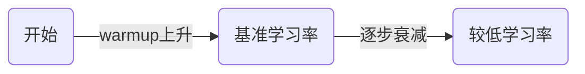

- 上图展示了学习率先warmup上升，后逐步衰减的典型曲线。
- 实际训练中，合理设置学习率及其变化策略对模型收敛和最终效果非常重要。

#### 批处理数量
- batch越大越好
- 能够帮助我们减少计算机资源的需求
- 样本数量量足够大就能避免小样本的过拟合问题

#### 批处理（Batch）与过拟合（Overfitting）
- 批处理（Batch）是指在训练神经网络时，将训练数据分成若干小批量（batch）进行模型参数的更新。每个batch包含若干样本，模型会在每个batch上计算损失和梯度，然后更新参数。
- 批处理的优点：
  - 提高计算效率，充分利用硬件资源（如GPU并行计算）。
  - 有助于模型收敛更稳定，减少每次更新的方差。
  - 可以通过调整batch size来平衡内存消耗和训练速度。
- batch越大，模型参数更新越平滑，但需要更多内存；batch越小，更新更频繁，可能带来更多噪声。

- 过拟合（Overfitting）是指模型在训练集上表现很好，但在新数据（测试集）上效果变差。原因是模型“记住”了训练数据的细节和噪声，失去了泛化能力。
- 过拟合的常见原因：
  - 训练样本数量太少，模型复杂度太高。
  - 没有合适的正则化手段。
- 批处理有助于缓解过拟合：
  - 较大的batch size可以让模型在每次更新时看到更多样本，减少对单一样本的依赖。
  - 但根本解决过拟合还需增加数据量、使用正则化（如Dropout、L2正则）、数据增强等方法。

#### 泛化能力（Generalization）
- 泛化能力是指模型在未见过的新数据（测试集或实际应用场景）上表现良好的能力。
- 一个具有良好泛化能力的模型，不仅能在训练集上取得好成绩，更能适应和预测新的、未见过的数据。
- 泛化能力强的模型可以有效避免过拟合，即不会只记住训练数据的细节和噪声，而是学到数据的本质规律。
- 提高模型泛化能力的常用方法：
  - 增加训练数据量，提升数据多样性。
  - 使用正则化技术（如L1/L2正则、Dropout等）。
  - 数据增强（如图像旋转、裁剪、噪声扰动等）。
  - 选择合适的模型复杂度，避免模型过于复杂。
  - 交叉验证等方法评估模型在不同数据上的表现。
- 总结：泛化能力是衡量机器学习模型优劣的核心标准之一，目标是让模型不仅在训练集上表现好，更能适应实际应用中的新数据。

#### 反向传播（Backpropagation）
- 反向传播是一种用于训练神经网络的核心算法，通过计算损失函数对每个参数的梯度，指导参数如何更新以最小化损失。
- 反向传播的核心思想是利用链式法则（Chain Rule）计算损失函数对每一层参数的梯度。
- 以一个简单的两层神经网络为例：
  - 假设输入 $x$，第一层权重 $W_1$，第二层权重 $W_2$，激活函数 $f$，输出 $y$，损失函数 $L$。
  - 前向传播：
    $h = f(W_1 x)$
    $\hat{y} = f(W_2 h)$
    $L = \text{Loss}(\hat{y}, y)$
  - 反向传播时，目标是计算 $\frac{\partial L}{\partial W_1}$ 和 $\frac{\partial L}{\partial W_2}$。
  - 利用链式法则：
    $\frac{\partial L}{\partial W_2} = \frac{\partial L}{\partial \hat{y}} \cdot \frac{\partial \hat{y}}{\partial W_2}$
    $\frac{\partial L}{\partial W_1} = \frac{\partial L}{\partial \hat{y}} \cdot \frac{\partial \hat{y}}{\partial h} \cdot \frac{\partial h}{\partial W_1}$
- 通过逐层递推，反向传播算法可以高效地计算出所有参数的梯度，用于参数更新。
- 公式总结：
  $\frac{\partial L}{\partial W} = \frac{\partial L}{\partial y} \cdot \frac{\partial y}{\partial W}$
- 这种链式求导的方式，使得深度神经网络的训练成为可能。

#### 神经网络结构图示

单层神经网络（感知机）：
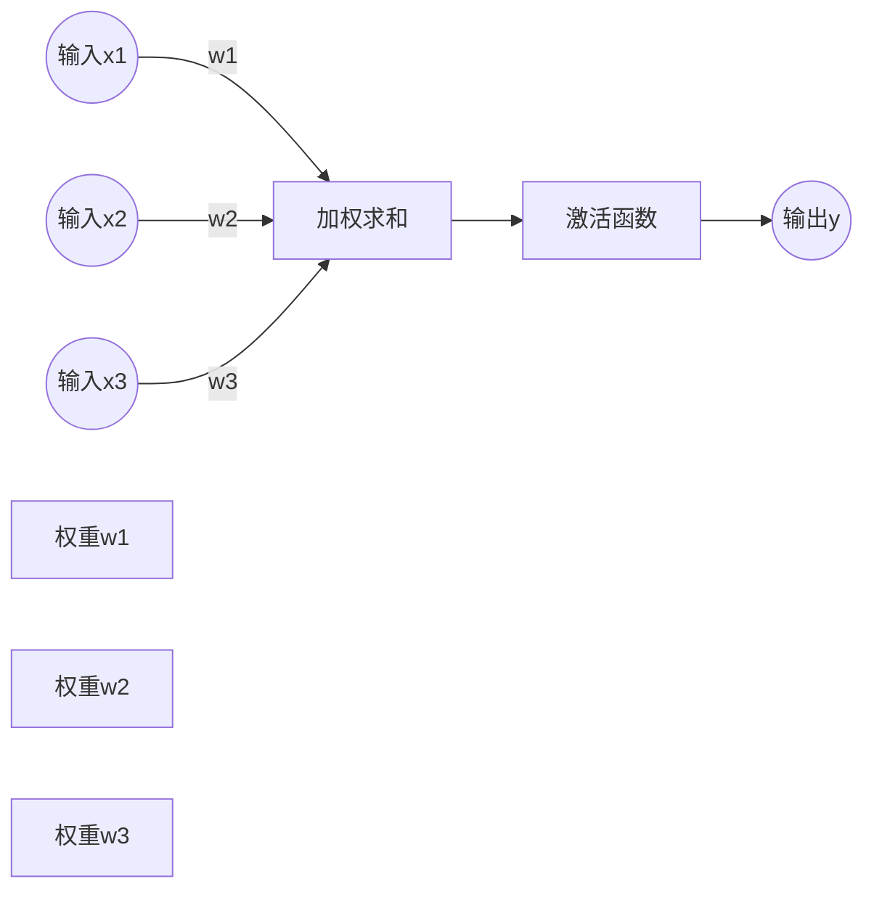

多层神经网络（多层感知机MLP）：
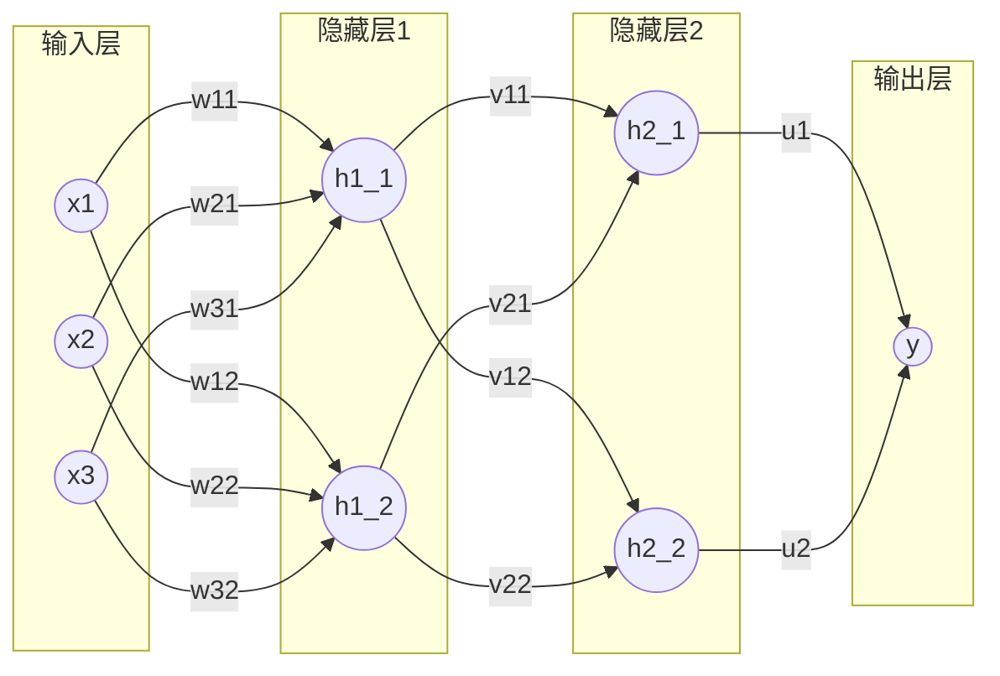

#### 神经网络的数据公式表达
- 以最简单的单层神经网络（感知机）为例：
  - 输入特征向量 $x = [x_1, x_2, ..., x_n]$
  - 权重向量 $w = [w_1, w_2, ..., w_n]$
  - 偏置 $b$
  - 输出 $y = w_1 x_1 + w_2 x_2 + ... + w_n x_n + b = w^T x + b$
  - 激活函数 $f$（如sigmoid、ReLU）：$\hat{y} = f(y)$

- 多层神经网络（以两层为例）：
  - 第一层：$h = f_1(W_1 x + b_1)$
  - 第二层：$\hat{y} = f_2(W_2 h + b_2)$
  - 其中 $W_1$、$W_2$ 是权重矩阵，$b_1$、$b_2$ 是偏置，$f_1$、$f_2$ 是激活函数

- 损失函数（以均方误差为例）：
  $L = \frac{1}{2}(\hat{y} - y_{true})^2$

- 梯度下降更新参数：
  $w \leftarrow w - \eta \frac{\partial L}{\partial w}$
  其中 $\eta$ 是学习率

- 机器学习的过程：
  1. 输入数据 $x$，前向传播计算输出 $\hat{y}$
  2. 计算损失 $L$
  3. 反向传播计算梯度 $\frac{\partial L}{\partial w}$
  4. 用梯度下降法更新参数 $w$
  5. 重复以上步骤，直到损失收敛

- 公式总结：
  - $\hat{y} = f(Wx + b)$
  - $L = \text{Loss}(\hat{y}, y_{true})$
  - $W \leftarrow W - \eta \frac{\partial L}{\partial W}$

- 通过这些公式，神经网络可以自动学习数据中的规律，实现分类、回归等任务。

#### 激活函数与投影解释
- 激活函数（Activation Function）是神经网络中用于引入非线性变换的函数，常见的有：
  - Sigmoid: $f(x) = \frac{1}{1 + e^{-x}}$
  - Tanh: $f(x) = \tanh(x)$
  - ReLU: $f(x) = \max(0, x)$
- 激活函数的作用是将线性变换 $Wx + b$ 的结果映射到一个新的空间，使神经网络能够拟合复杂的非线性关系。

- 对 $xW_1 + b_1$ 做投影：
  - $xW_1 + b_1$ 可以看作是将输入 $x$ 通过权重矩阵 $W_1$ 和偏置 $b_1$ 映射（投影）到新的特征空间（通常是隐藏层）。
  - 这种投影本质上是线性变换，将原始输入空间的数据“投影”到一个新的空间，提取更有用的特征。
  - 公式：$h = f(xW_1 + b_1)$，其中 $h$ 是隐藏层的输出。

- 直观理解：
  - $x$ 是原始输入，$W_1$ 决定了投影的方向和尺度，$b_1$ 决定了平移。
  - 激活函数 $f$ 再对投影结果进行非线性变换，增强模型表达能力。

- 总结：
  - $xW_1 + b_1$ 是对输入的线性投影，激活函数 $f$ 让神经网络能拟合更复杂的函数。

#### 常见激活函数进一步解释
- Sigmoid激活函数：
  - 公式：$f(x) = \frac{1}{1 + e^{-x}}$
  - 输出范围在(0, 1)，常用于二分类的输出层。
  - 特点：可以将输入“压缩”到0~1之间，适合概率输出，但在深层网络中容易出现梯度消失问题（输入绝对值较大时梯度趋近于0，导致参数难以更新）。

- ReLU激活函数（Rectified Linear Unit）：
  - 公式：$f(x) = \max(0, x)$
  - 输出范围为[0, +∞)，只保留正数部分，负数部分直接输出0。
  - 特点：
    - 计算简单，收敛速度快。
    - 有效缓解梯度消失问题，适合深层神经网络。
    - 具有“稀疏激活”特性：当输入为负时，输出为0，相当于该神经元在当前样本下不激活。

- ReLU如何淘汰无用数据：
  - 在训练过程中，输入为负的神经元输出恒为0，这些神经元对当前样本的前向传播和反向传播都没有贡献，相当于被“屏蔽”或“淘汰”。
  - 这种机制让网络自动忽略对当前任务无用的特征或噪声，提高了模型的稀疏性和泛化能力。
  - 但如果某些神经元长期输出为0，可能导致“神经元死亡”现象（即永远不激活），需要合理初始化权重和设置学习率。

- 总结：
  - Sigmoid适合输出概率，但深层网络易梯度消失。
  - ReLU高效、稀疏、能自动淘汰无用特征，是现代深度学习的主流激活函数。

这里面的x、h1、h2都是权重组合，但机器学习存在的问题是一个不可解释的黑盒子
特征是不是越多越好？特征增加了会带来什么问题？
cs.stanford.edu/people/karparthy/convertjs/demo/classfy2d.html
开源的代码，不仅仅需要源码、权重，还需要初始化权重，才能得到我们想要的结果。大模型有训练好的初始化权重，所以大模型对于机器学习来说好用

- 离群点会导致神经网络学习错误，但机器学习不知道它是离群点，因为过拟合导致在应用的时候判断错误。所以学习的数据质量或人工往里面注入垃圾数据会导致过拟合，如何解决该问题？

- 离群点（outlier）和低质量数据会影响神经网络的训练，导致模型过拟合甚至学习到错误的规律。
- 解决方法：
  1. 数据清洗：在训练前对数据进行统计分析，剔除或修正异常值、离群点和明显错误的数据。
  2. 增加数据量：收集更多高质量、真实分布的数据，减少离群点对整体模型的影响。
  3. 数据增强：通过旋转、裁剪、加噪声等方式扩充数据集，提高模型鲁棒性。
  4. 正则化：如L1/L2正则、Dropout等，防止模型过度拟合离群点。
  5. 鲁棒损失函数：采用对离群点不敏感的损失函数（如Huber loss等）。
  6. 交叉验证：用多组数据评估模型，及时发现因离群点导致的过拟合。
- 总结：提升数据质量、合理清洗和增强数据、采用正则化和鲁棒方法，是防止离群点和垃圾数据导致过拟合的有效手段。

#### 正则化惩罚进一步解释
- 正则化（Regularization）是一种防止模型过拟合的技术，通过在损失函数中加入“惩罚项”来约束模型参数。惩罚权重比较大的数据，求所有权重的平方和，把平方和加到损失上，则可以排除损失大的权重参数
- 常见正则化方式：
  - L1正则化（Lasso）：惩罚项为参数绝对值之和
    $L_{total} = L_{data} + \lambda \sum_i |w_i|$
    - 作用：促使部分权重变为0，实现特征选择，模型更稀疏。
  - L2正则化（Ridge）：惩罚项为参数平方和
    $L_{total} = L_{data} + \lambda \sum_i w_i^2$
    - 作用：抑制权重过大，让模型更平滑，提升泛化能力。
- 其中 $L_{data}$ 是原始损失（如均方误差、交叉熵），$\lambda$ 是正则化系数，控制惩罚强度。

- 简明例子：
  - 假设有线性回归 $y = wx + b$，损失函数为均方误差：
    $L_{data} = (y_{true} - (wx + b))^2$
  - 加L2正则化后：
    $L_{total} = (y_{true} - (wx + b))^2 + \lambda w^2$
  - 这样即使模型能完美拟合训练数据，若$w$过大也会被惩罚，促使模型选择更小的权重，防止过拟合。

- 总结：正则化通过惩罚过大的参数，让模型更简单、更健壮，是深度学习防止过拟合的常用手段。

#### Dropout机制与过拟合的防治

- **过拟合**是神经网络训练中常见的问题，表现为模型在训练集上表现很好，但在新数据上效果变差，原因是模型“记住”了训练数据的细节和噪声。

**Dropout机制原理：**
- Dropout是一种简单有效的正则化方法，通过在训练过程中“随机杀死”部分神经元（即将其输出暂时置为0），防止模型对某些特征或神经元过度依赖。
- 每次前向传播时，按照设定概率$p$（如0.5）随机将一部分神经元的输出置零。
- 这样每次训练都相当于在不同的“子网络”上训练，模型无法依赖某一部分特征，增强了模型的泛化能力。

**Dropout的作用：**
- 防止神经元之间的“共适应”，减少对局部特征的依赖。
- 等价于对神经网络进行集成（ensemble），提升泛化能力。
- 简单易用，常用于全连接层，也可用于卷积层。

**训练与推理的区别：**
- 训练时：Dropout随机丢弃神经元。
- 推理（测试）时：不丢弃神经元，但需将输出乘以保留概率$p$，保证输出期望一致。

**Python代码示例（PyTorch）：**
```python
import torch.nn as nn
layer = nn.Sequential(
    nn.Linear(128, 64),
    nn.ReLU(),
    nn.Dropout(p=0.5),  # 以50%概率随机丢弃神经元
    nn.Linear(64, 10)
)
```

**Mermaid图示：**
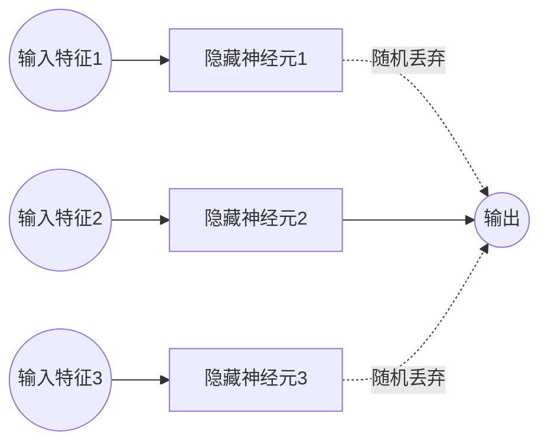

- 总结：Dropout通过训练时随机丢弃部分神经元，有效防止过拟合，是深度学习中常用的正则化手段。

#### 梯度截断（Gradient Clipping）
- 梯度截断是一种防止神经网络训练过程中梯度爆炸（即梯度值过大，导致参数更新过大，模型发散）的技术。权重越小越好，越稳定越好。
- 原理：当反向传播计算得到的梯度超过设定阈值时，将其“截断”到阈值范围内，防止梯度过大。
- 常见做法：
  - 按元素截断：将每个梯度元素限制在[-threshold, threshold]区间。如果梯度超过threshold，则截断为threshold。
  - 按范数截断：如果梯度向量的L2范数大于阈值，则按比例缩小梯度，使其范数等于阈值。
    - 公式：$g \leftarrow g \cdot \frac{\text{threshold}}{\|g\|}$（当$\|g\| > \text{threshold}$时）
- 应用场景：
  - 常用于循环神经网络（RNN）等深层网络，防止训练不稳定。
- 总结：梯度截断能有效防止梯度爆炸，保证模型训练过程的稳定性。

#### 数据预处理及其对模型效果的影响
- 数据预处理是指在模型训练前，对原始数据进行清洗、转换和规范化等操作，以提升数据质量和模型效果。
- 数据预处理不仅仅是在模型训练前对原始数据进行清洗和转换，在网络模型的学习和推理过程中也常常需要进行预处理和后处理。
- 训练过程中的预处理：
  1. 动态数据增强：如每个epoch/每个batch随机裁剪、旋转、加噪声等，提升模型鲁棒性。
  2. 在线归一化/标准化：如BatchNorm、LayerNorm等在网络内部对特征进行归一化，帮助模型更快收敛、提升稳定性。
  3. 特征变换：如对输入特征做log变换、分桶、嵌入等，提升特征表达能力。
- 推理（预测）过程中的预处理：
  - 输入数据需与训练时采用相同的预处理流程（如归一化、编码等），保证模型输入分布一致。
- 总结：数据预处理不仅仅是训练前的准备工作，训练和推理过程中也需要动态或同步的预处理，才能保证模型效果和泛化能力。每层都需要做标准化，不做不行。
- 常见的数据预处理方法：
  1. 缺失值处理：填充、删除或用统计值（均值/中位数）替换缺失数据。
  2. 异常值处理：检测并剔除或修正离群点，防止极端值影响模型。
  3. 特征缩放：如归一化（Min-Max）、标准化（Z-score），让各特征在相同尺度，提升模型收敛速度和效果。
  4. 编码处理：将类别型数据转换为数值型（如One-Hot编码、Label Encoding）。
  5. 特征构造与选择：根据业务和数据分布，构造新特征或筛选有用特征，去除冗余和无关特征。
  6. 数据去重、文本分词、去停用词等针对不同数据类型的处理。

- 数据预处理对模型效果的影响：
  - 预处理不当（如未标准化、未处理异常值）会导致模型训练困难、收敛慢、泛化能力差，甚至模型失效。
  - 合理预处理能提升数据质量，减少噪声和偏差，让模型更容易学习到数据的本质规律。
  - 不同预处理方式对同一模型的效果影响很大，甚至决定模型能否成功应用。

- 如何用好数据预处理：
  1. 结合数据分布和业务理解，选择合适的预处理方法。
  2. 在训练集和测试集上采用相同的预处理流程，防止数据泄漏。
  3. 充分分析数据，针对不同特征采用不同策略，避免“一刀切”。
  4. 通过交叉验证等方式评估不同预处理方案对模型效果的影响。

- 总结：数据预处理是机器学习成败的关键环节，合理的预处理能极大提升模型效果，反之则可能导致模型失效。

#### 大模型对数据量和多样性的需求及解决思路
- 随着模型规模（神经元和参数数量）增大，模型表达能力更强，但也更容易过拟合，需要更多、更丰富的数据进行训练。
- 主要矛盾：大模型需要大量且多样性高的数据，但现实中高质量、多样性的数据难以获取。
- 解决思路：
  1. 数据增强：通过旋转、缩放、裁剪、加噪声等方式扩充现有数据集，提升数据多样性。
  2. 合成数据：利用仿真、生成模型（如GAN）等方法自动生成新样本，弥补真实数据的不足。
  3. 多任务学习：让模型在多个相关任务上共同训练，提升泛化能力，间接增加数据多样性。
  4. 迁移学习：先用大规模通用数据预训练模型，再用少量特定领域数据微调，充分利用已有知识。
  5. 联邦学习/数据共享：多方协作共享数据或模型参数，扩大数据覆盖范围，保护隐私。
  6. 主动学习：让模型主动挑选最有价值的数据进行标注，提升数据利用效率。
- 总结：通过数据增强、合成、迁移学习等多种手段，可以在有限数据下提升大模型的泛化能力，缓解对大规模多样性数据的依赖。

#### 梯度下降举例说明
- 梯度下降（Gradient Descent）是一种常用的优化算法，用于最小化损失函数，找到模型参数的最优解。
- 直观理解：就像在山地中寻找最低点，每次沿着当前斜率（梯度）的反方向走一步，逐步接近最低点。

- 以一元线性回归为例：
  - 假设损失函数 $L(w) = (wx - y)^2$，目标是找到使损失最小的 $w$。
  - 梯度为 $\frac{\partial L}{\partial w} = 2x(wx - y)$。
  - 梯度下降更新公式：$w \leftarrow w - \eta \frac{\partial L}{\partial w}$，其中 $\eta$ 是学习率。

- Python代码示例：
```python
import numpy as np
import matplotlib.pyplot as plt

def loss(w):
    x, y = 2, 4
    return (w * x - y) ** 2

def grad(w):
    x, y = 2, 4
    return 2 * x * (w * x - y)

w = 0.0
lr = 0.1
ws, ls = [w], [loss(w)]
for i in range(10):
    w = w - lr * grad(w)
    ws.append(w)
    ls.append(loss(w))

plt.plot(ws, ls, marker='o')
plt.xlabel('w')
plt.ylabel('Loss')
plt.title('Gradient Descent Trajectory')
plt.show()
```

- 上图展示了参数 $w$ 如何在梯度下降过程中逐步逼近损失函数的最小值。

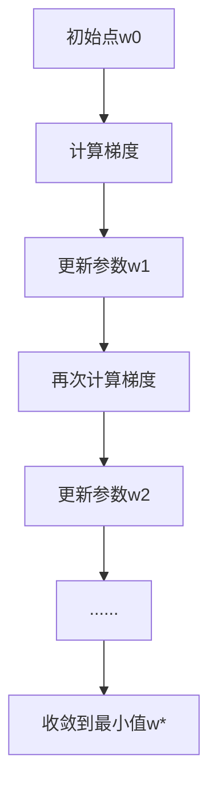

- 总结：梯度下降通过不断沿着损失函数的下降方向更新参数，最终找到最优解，是深度学习训练的核心方法。

梯度下降举例说明

- 假设我们有一个简单的二次函数损失 $L(w) = (w-3)^2$，目标是找到使损失最小的 $w$。
- 梯度下降的思想是：每次沿着损失函数关于参数 $w$ 的负梯度方向更新 $w$，逐步逼近最优解。
- 公式：$w_{new} = w_{old} - \eta \frac{dL}{dw}$，其中 $\eta$ 是学习率。

**举例：**
- 初始 $w=0$，学习率 $\eta=0.1$。
- 第1步：$\frac{dL}{dw} = 2(w-3) = 2(0-3) = -6$，$w_{new} = 0 - 0.1 \times (-6) = 0.6$
- 第2步：$\frac{dL}{dw} = 2(0.6-3) = -4.8$，$w_{new} = 0.6 - 0.1 \times (-4.8) = 1.08$
- 如此迭代，$w$ 会逐步接近3，损失最小。

**Python代码可视化：**
```python
import numpy as np
import matplotlib.pyplot as plt

# 损失函数和梯度
def loss(w):
    return (w - 3) ** 2

def grad(w):
    return 2 * (w - 3)

w = 0
lr = 0.1
ws = [w]
for i inrange(10):
    w = w - lr * grad(w)
    ws.append(w)

x = np.linspace(-1, 5, 100)
plt.plot(x, loss(x), label='Loss Curve')
plt.scatter(ws, [loss(wi) for wi in ws], color='red', label='GD Steps')
plt.xlabel('w')
plt.ylabel('Loss')
plt.title('Gradient Descent Example')
plt.legend()
plt.show()
```

**Mermaid图示：**
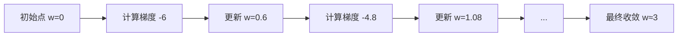

- 上述例子展示了梯度下降如何通过多次迭代，逐步逼近损失函数的最小值。

#### 梯度下降中的动量（Momentum）/惯性

- **动量（Momentum）** 是对标准梯度下降法的改进，借鉴了物理中的惯性原理。其核心思想是：参数更新时不仅考虑当前的梯度，还叠加上一次更新的“惯性”，让优化过程更平滑、更快。
- 物理类比：就像小球在山谷中滚动，带有惯性，遇到小的阻力或震荡时能更快冲过，减少来回震荡。

**动量梯度下降公式：**
- 设 $v$ 为速度（动量项），$\gamma$ 为动量系数（常取0.9），$\eta$ 为学习率：
  - $v_{t+1} = \gamma v_t + \eta \nabla L(w_t)$
  - $w_{t+1} = w_t - v_{t+1}$
- 其中 $v$ 会累积之前的梯度信息，使参数更新方向更稳定。

**动量的作用：**
- 加快收敛速度，尤其是在狭长谷地或曲面上，能减少“锯齿”式震荡。
- 有助于跳出局部最优。
- 但动量过大可能导致发散，需要合理设置 $\gamma$。

**Python代码示例：**
```python
import numpy as np
import matplotlib.pyplot as plt

def loss(w):
    return (w - 3) ** 2

def grad(w):
    return 2 * (w - 3)

w = 0
lr = 0.1
momentum = 0.9
v = 0
ws = [w]
for i in range(10):
    v = momentum * v + lr * grad(w)
    w = w - v
    ws.append(w)

x = np.linspace(-1, 5, 100)
plt.plot(x, loss(x), label='Loss Curve')
plt.scatter(ws, [loss(wi) for wi in ws], color='green', label='Momentum Steps')
plt.xlabel('w')
plt.ylabel('Loss')
plt.title('Gradient Descent with Momentum')
plt.legend()
plt.show()
```

**Mermaid图示：**
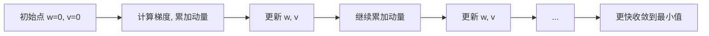

- 动量法通过累积历史梯度，能更快、更平滑地收敛到最优解，是深度学习优化常用技巧。

#### 参数初始化及其策略

- **参数初始化**是指在神经网络训练开始前，为每一层的权重和偏置赋予初始值。良好的初始化有助于模型快速收敛，避免梯度消失或爆炸。

**1. 为什么参数初始化很重要？**
- 如果所有参数都初始化为0，所有神经元的梯度和输出都一样，无法学习到多样特征（称为“对称性破坏”）。
- 初始化过大或过小会导致前向/反向传播时激活值或梯度迅速变大（爆炸）或变小（消失），影响训练。

**2. 常见的随机初始化策略**
- **均匀分布/高斯分布初始化**：
  - 权重 $w \sim \mathcal{U}(-a, a)$ 或 $w \sim \mathcal{N}(0, \sigma^2)$，其中 $a$ 和 $\sigma$ 需根据网络层输入/输出规模调整。
- **Xavier（Glorot）初始化**：
  - 适用于Sigmoid/Tanh等激活函数。
  - $w \sim \mathcal{U}\left(-\sqrt{\frac{6}{n_{in}+n_{out}}, \sqrt{\frac{6}{n_{in}+n_{out}}}\right)$
  - 或 $w \sim \mathcal{N}\left(0, \frac{2}{n_{in}+n_{out}}\right)$
  - 其中 $n_{in}$、$n_{out}$ 分别为输入和输出单元数。
- **He初始化**：
  - 适用于ReLU激活函数。
  - $w \sim \mathcal{N}\left(0, \frac{2}{n_{in}}\right)$ 或 $w \sim \mathcal{U}\left(-\sqrt{\frac{6}{n_{in}}}, \sqrt{\frac{6}{n_{in}}}\right)$
- **偏置b** 通常初始化为0或很小的常数。

**3. 不良初始化的危害**
- 权重过大：激活值/梯度爆炸，训练不稳定。
- 权重过小：激活值/梯度消失，网络难以学习。
- 全零初始化：神经元无差异，无法学习。

**4. 如何更好地进行参数初始化？**
- 选择与激活函数匹配的初始化方法（如ReLU用He，Sigmoid/Tanh用Xavier）。
- 保证每层输出的方差与输入方差相近，避免信号在网络中逐层放大或缩小。
- 对于深层网络，建议采用框架自带的初始化方法（如PyTorch、TensorFlow等均已内置）。

**5. 利用预训练模型进行参数初始化**
- 预训练模型（如ImageNet上的ResNet、BERT等）已在大规模数据上训练好权重。
- 在新任务中，直接加载预训练权重作为初始化，称为“迁移学习”。
- 优势：
  - 加快收敛速度，减少训练时间。
  - 显著提升小样本任务的效果。
  - 充分利用已有知识，提升泛化能力。
- 工程实践：
  - 加载预训练模型参数后，可选择“微调”（finetune）全部参数，或只训练最后几层。

**简明举例（PyTorch）：**
```python
import torch.nn as nn
# Xavier初始化
nn.init.xavier_uniform_(layer.weight)
# He初始化
nn.init.kaiming_normal_(layer.weight, nonlinearity='relu')
# 加载预训练模型
from torchvision import models
model = models.resnet18(pretrained=True)
```

- 总结：合理的参数初始化是深度学习成功训练的关键，推荐优先采用与激活函数匹配的初始化方法，或直接利用预训练模型权重。

#### 过拟合问题的系统化解决方法与对比

**一、常见解决过拟合的方法**
1. **增加数据量与多样性**
   - 通过收集更多样本、数据增强（如旋转、裁剪、加噪声等）提升模型泛化能力。
   - 优点：根本性提升泛化能力，适用于所有模型。
   - 缺点：数据收集成本高，部分场景难以获得更多数据。

2. **正则化（Regularization）**
   - L1正则化：促使部分权重为0，实现特征选择，模型更稀疏。
   - L2正则化：抑制权重过大，让模型更平滑。
   - 优点：实现简单，适用于大多数神经网络和线性模型。
   - 缺点：正则化系数需调优，过强可能欠拟合。

3. **Dropout机制**
   - 训练时随机丢弃部分神经元，防止神经元间共适应。
   - 优点：实现简单，显著提升深度网络泛化能力。
   - 缺点：推理时需调整输出，过高dropout率可能导致欠拟合。

4. **提前停止（Early Stopping）**
   - 在验证集损失不再下降时提前终止训练，防止模型在训练集上过度拟合。
   - 优点：无需修改模型结构，简单有效。
   - 缺点：需预留验证集，训练过程需监控。

5. **模型简化/降维**
   - 降低模型复杂度（如减少层数、神经元数），或通过特征选择/降维（PCA等）减少输入特征。
   - 优点：降低过拟合风险，提升模型可解释性。
   - 缺点：可能损失部分表达能力。

6. **数据清洗与异常值处理**
   - 剔除离群点、错误数据，提升数据质量。
   - 优点：提升模型鲁棒性，减少噪声影响。
   - 缺点：需人工分析，部分异常难以识别。

7. **集成学习（Ensemble）**
   - 结合多个模型结果（如Bagging、Boosting、Stacking），提升泛化能力。
   - 优点：显著提升效果，降低单模型过拟合风险。
   - 缺点：计算资源消耗大，部署复杂。

8. **迁移学习与预训练模型**
   - 利用大规模数据上预训练的模型权重，微调于新任务。
   - 优点：小样本场景下效果显著，收敛快。
   - 缺点：需有合适的预训练模型，部分领域适用性有限。

**二、方法对比与适用场景**
| 方法         | 优点                   | 缺点                   | 适用场景           |
|--------------|------------------------|------------------------|--------------------|
| 增加数据量   | 根本提升泛化能力       | 成本高，难获取         | 所有模型           |
| 正则化       | 简单通用，易实现       | 需调参，过强欠拟合     | 神经网络/线性模型  |
| Dropout      | 深度网络效果好         | 过高欠拟合，推理需调整 | 深度神经网络       |
| EarlyStopping| 简单有效，无需改结构   | 需验证集，监控训练     | 所有模型           |
| 模型简化     | 降低风险，易解释       | 表达能力下降           |特征多/模型复杂场景 |
| 数据清洗     | 提升鲁棒性             | 需人工，难自动化       |数据质量不高场景    |
| 集成学习     | 效果提升显著           | 资源消耗大，复杂       |高精度需求场景      |
| 迁移学习     | 小样本效果好           | 需预训练模型           |小样本/新领域       |

**三、实际工程中系统化防止过拟合的建议**
1. **优先保证数据质量和多样性**：数据是基础，优先清洗异常、增强多样性。
2. **合理选择模型复杂度**：根据数据量和任务难度选择合适的模型结构，避免过深或过宽。
3. **常规正则化与Dropout并用**：L2正则+Dropout是深度学习常用组合。
4. **动态监控训练过程**：采用Early Stopping，防止训练过度。
5. **充分利用迁移学习**：小样本任务优先考虑预训练模型。
6. **必要时采用集成方法**：对精度要求极高时可用集成学习。
7. **多方法结合**：实际工程中常需多种手段协同，综合提升泛化能力。

- 总结：过拟合防治需从数据、模型、训练、正则化等多方面系统考虑，结合实际场景灵活选用和组合多种方法，才能获得最优泛化效果。

#### 卷积神经网络（CNN, Convolutional Neural Network）系统化说明

**1. 基本概念**
- 卷积神经网络（CNN）是一类专门用于处理具有类似网格结构的数据（如图像、语音等）的深度学习模型。
- CNN通过卷积操作自动提取局部特征，广泛应用于图像分类、目标检测、语音识别等领域。

**2. 核心结构与原理**
- **卷积层（Convolutional Layer）**：
  - 通过卷积核（filter）在输入数据上滑动，提取局部空间特征。
  - 每个卷积核学习到不同的特征（如边缘、纹理等）。
  - 卷积操作公式：$Y(i, j) = \sum_{m,n} X(i+m, j+n) \cdot K(m, n)$，其中$K$为卷积核。
- **激活函数（Activation）**：
  - 常用ReLU，增加非线性表达能力。
- **池化层（Pooling Layer）**：
  - 降采样操作，常用最大池化（Max Pooling）或平均池化（Average Pooling），减少特征维度，提升平移不变性。
- **全连接层（Fully Connected, FC）**：
  - 将卷积/池化后的特征展平成向量，进行最终分类或回归。
- **归一化层（如BatchNorm）**：
  - 加速收敛，提升稳定性。

**3. 典型结构示意**
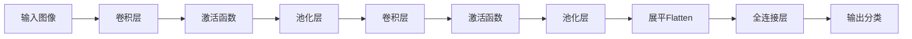

**4. CNN的优势与特点**
- 局部感受野：每个神经元只关注输入的一小块区域，能有效捕捉局部特征。
- 权重共享：同一卷积核在不同位置共享参数，大幅减少模型参数量。
- 平移不变性：通过池化和卷积操作，模型对输入的平移、变形具有较强鲁棒性。
- 自动特征提取：无需手工设计特征，网络可自动学习多层次特征。

**5. 常见CNN结构举例**
- LeNet-5：早期手写数字识别网络，结构简单。
- AlexNet：首次在ImageNet大赛中大幅超越传统方法，推动深度学习发展。
- VGGNet：使用大量3x3小卷积核，结构深且规则。
- ResNet：引入残差连接，极大缓解深层网络训练难题。

**6. Python代码简例（PyTorch）**
```python
import torch.nn as nn
class SimpleCNN(nn.Module):
    def __init__(self):
        super().__init__()
        self.conv1 = nn.Conv2d(3, 16, 3, padding=1)
        self.pool = nn.MaxPool2d(2, 2)
        self.conv2 = nn.Conv2d(16, 32, 3, padding=1)
        self.fc = nn.Linear(32 * 8 * 8, 10)
    def forward(self, x):
        x = self.pool(nn.ReLU()(self.conv1(x)))
        x = self.pool(nn.ReLU()(self.conv2(x)))
        x = x.view(x.size(0), -1)
        x = self.fc(x)
        return x
```

**7. 工程实践建议**
- 输入数据需归一化，提升训练稳定性。
- 合理选择卷积核大小、步幅、池化方式，防止特征过度丢失。
- 可结合BatchNorm、Dropout等提升泛化能力。
- 深层网络建议采用残差结构（ResNet）防止梯度消失。

- 总结：CNN通过卷积、池化等机制高效提取空间特征，是计算机视觉等任务的主流模型。

#### CNN中的参数共享机制系统化解释
- **参数共享（Weight Sharing）**：
  - 在卷积神经网络（CNN）中，卷积核（滤波器）在输入的不同空间位置滑动时，使用同一组权重参数。
  - 这种机制意味着同一个卷积核在整张图像（或特征图）上重复应用，极大减少了模型参数数量。
  - 参数共享让CNN能够自动学习空间局部特征，并具有平移不变性（即特征在不同位置都能被检测到）。
- **优点**：
  - 显著降低模型复杂度和内存消耗，便于训练大规模模型。
  - 提升泛化能力，减少过拟合风险。
  - 适合处理具有空间结构的数据（如图像、语音等）。

#### RNN、CNN、Transformer等神经网络的异同与特点对比

| 特性/模型   | CNN（卷积神经网络）      | RNN（循环神经网络）      | Transformer           |
|-------------|------------------------|------------------------|-----------------------|
| 适用数据    | 图像、局部结构         | 序列、时序             | 序列、图像、跨模态    |
| 依赖建模    | 局部空间               | 时间/顺序               | 全局（任意位置）      |
| 参数共享    | 卷积核全局共享         | 时间步参数共享         | 层内参数共享          |
| 并行能力    | 高                     | 低（递归）             | 高（全并行）          |
| 长距离依赖  | 弱                     | 难（梯度消失/爆炸）     | 强（自注意力）        |
| 结构特点    | 卷积+池化              | 递归/门控单元           | 多头注意力+前馈网络   |
| 训练效率    | 高                     | 低                     | 高                    |
| 代表任务    | 图像分类、检测         | 语音识别、文本生成       | 机器翻译、NLP、CV等   |

- **CNN特点**：参数共享、局部感受野、适合空间结构、并行高效。
- **RNN特点**：时间步递归、参数共享、适合时序建模、难以并行。
- **Transformer特点**：自注意力全局建模、强并行、适合长依赖和多模态任务。

#### 卷积神经网络（CNN）与传统神经网络（全连接网络/MLP）的系统化比较

**1. 结构与原理对比**
- **传统神经网络（MLP/全连接网络）**：
  - 每一层的每个神经元与上一层所有神经元全连接。
  - 结构简单，参数量大，缺乏空间结构建模能力。
- **卷积神经网络（CNN）**：
  - 采用卷积层、池化层等结构，局部连接、权重共享。
  - 能自动提取局部空间特征，参数量大幅减少。

**2. 优势与劣势对比**
| 方面         | 传统神经网络（MLP）         | 卷积神经网络（CNN）           |
|--------------|----------------------------|-------------------------------|
| 参数量       | 非常大，易过拟合           | 显著减少，易于训练            |
| 空间结构建模 | 无法建模空间/局部关系       | 能捕捉空间/局部特征           |
| 权重共享     | 无，参数冗余                | 有，提升泛化能力              |
| 平移不变性   | 差                         | 好（池化/卷积带来不变性）      |
| 计算效率     | 低，资源消耗大              | 高，适合大规模数据             |
| 特征提取     | 需手工设计                  | 自动学习多层次特征            |
| 适用数据类型 | 一维向量（表格、信号等）    | 网格/图像/时空结构数据         |
| 解释性       | 较强（小模型）              | 较弱（深层网络为黑盒）         |

**3. 应用场景对比**
- **传统神经网络（MLP）**：
  - 适用于结构化数据（如表格、金融、传感器信号等），小型分类/回归任务。
  - 特征间无空间关系或空间关系不重要的场景。
- **卷积神经网络（CNN）**：
  - 适用于图像、视频、语音、医学影像等具有空间或时空结构的数据。
  - 主要应用于图像分类、目标检测、分割、视频分析、语音识别等领域。

**4. 总结**
- CNN通过局部连接和权重共享，极大提升了对空间结构数据的建模能力，是视觉等领域的主流模型。
- 传统神经网络适合结构化、无空间结构的数据。
- 实际工程中，需根据数据类型和任务需求选择合适的网络结构。

### 多层CNN结构与各层功能图示

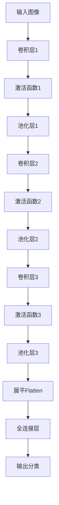

- **卷积层（Convolution）**：提取局部空间特征，参数共享，增强模型对空间结构的感知。
- **池化层（Pooling）**：降采样，减少特征维度，提升平移不变性。
- **转换层（Flatten/Reshape）**：将多维特征展平成一维向量，便于后续全连接层处理。
- **全连接层（Fully Connected）**：综合所有特征，输出最终分类或回归结果。

### 多层卷积效果变差的原因与解决办法
- **问题**：多层卷积堆叠后，可能出现梯度消失、特征退化、训练困难等现象，导致效果变差。
- **解决办法**：
  1. **残差连接（Residual Connection, ResNet）**：在卷积层间引入跳跃连接，直接传递输入特征，缓解退化和梯度消失。
  2. **批归一化（BatchNorm）**：规范化每层输出，稳定训练过程。
  3. **合理初始化和激活函数**：如ReLU、He初始化，提升深层网络训练效果。
  4. **堆叠时引入1x1卷积、瓶颈结构**：减少参数量，提升表达能力。
  5. **适当增加数据和正则化**：防止过拟合。
- **工程建议**：采用ResNet、DenseNet等成熟深层结构，堆叠多层时引入残差或密集连接，保证深度提升时模型性能至少不比原来差。

#### 视觉识别

- 视觉的算法已经很成熟了，很多开源的库已经做很好了
- 视觉识别主要做的是数据打标签完成数据标注
- 一张图4毛钱打标签

##### 案例分析：如何在上海石化工厂识别人员抽烟和喝酒——视觉识别系统化解决方案

1. **问题定义与需求分析**
   - 目标：自动识别工厂内人员是否存在抽烟、喝酒等违规行为，保障安全生产。
   - 难点：场景复杂、人员动作多样、遮挡、光照变化、目标小等。

2. **数据采集与标注**
   - 部署高清摄像头，采集工厂内不同区域、时段的视频数据。
   - 手工标注抽烟、喝酒等行为的图像/视频片段，形成高质量数据集。
   - 数据增强：旋转、裁剪、加噪声、不同光照等，提升模型鲁棒性。

3. **模型选择与设计**
   - **目标检测模型**：如YOLO、Faster R-CNN等，检测人员及手部、烟、酒瓶等关键物体。
   - **行为识别模型**：结合时序信息（如3D CNN、时序卷积、Transformer等），识别抽烟、喝酒等动作。
   - **多模态融合**：可结合人体姿态估计、物体检测结果，提升识别准确率。

4. **系统流程**
   - (1) 人员检测与跟踪：定位工厂内所有人员，跟踪其行为轨迹。
   - (2) 关键物体检测：检测手部、烟、酒瓶等物体。
   - (3) 行为识别：分析手部与烟/酒瓶的空间关系、动作时序，判断是否为抽烟/喝酒。
   - (4) 告警与记录：识别到违规行为后，自动告警并记录视频片段。

5. **工程实践建议**
   - 采用高分辨率摄像头，保证细节可见。
   - 持续采集和标注新数据，定期优化模型。
   - 结合多角度、多摄像头信息，提升检测鲁棒性。
   - 加强隐私保护与合规性设计。

6. **可视化流程图（Mermaid）**
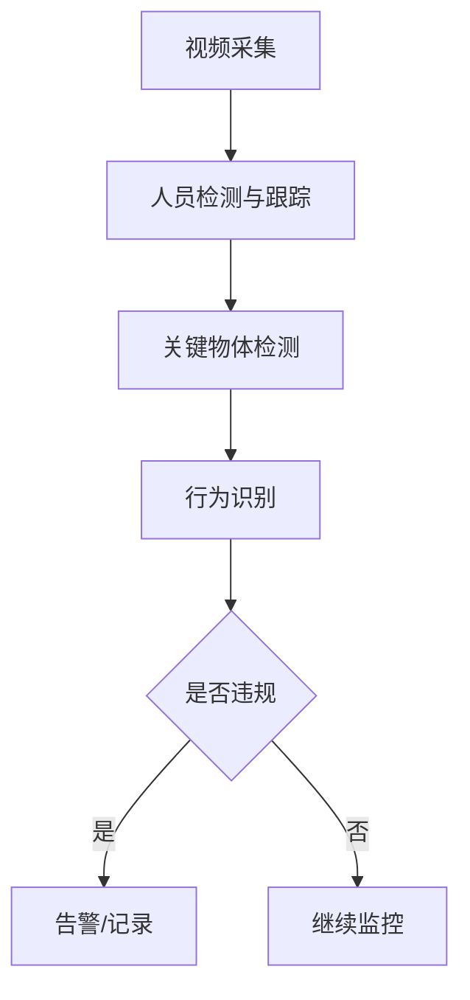

7. **总结**
- 通过“目标检测+行为识别+多模态融合”构建端到端视觉识别系统，可有效识别工厂内抽烟、喝酒等违规行为，提升安全管理智能化水平。

##### 石化行业模型迁移的可行性、挑战与通用性实现思路

1. **模型迁移的可行性**
- 可以将上海石化训练好的视觉识别模型迁移到新的石化行业场景，但直接迁移往往面临通用性和适应性挑战。

2. **主要挑战**
- **场景差异**：不同工厂的环境、摄像头角度、光照、背景、人员服饰等存在差异，影响模型泛化。
- **目标差异**：新场景中抽烟、喝酒等动作的表现形式、物体外观可能不同。
- **数据分布偏移**：新场景数据分布与原场景不同，导致模型性能下降（Domain Shift）。
- **标签不一致**：新场景可能有新的违规行为类别或标签标准。
- **硬件与部署环境差异**：摄像头分辨率、帧率、部署算力等不同，影响模型推理效果。

3. **实现模型通用性的解决思路**
- **数据层面**：
  - 在新场景采集少量有代表性的数据，进行标注，形成“小样本适应集”。
  - 采用数据增强、风格迁移等方法提升数据多样性。
- **模型层面**：
  - 利用迁移学习（Transfer Learning）：加载上海石化模型权重，在新场景数据上微调（finetune），快速适应新环境。
  - 采用领域自适应（Domain Adaptation）技术，缩小源域与目标域分布差异。
  - 多源融合：结合多个工厂的数据训练更通用的模型。
- **工程与部署层面**：
  - 设计灵活的模型输入预处理流程，适配不同摄像头和环境。
  - 持续采集新场景数据，定期增量训练和模型更新。

4. **可视化流程图（Mermaid）**
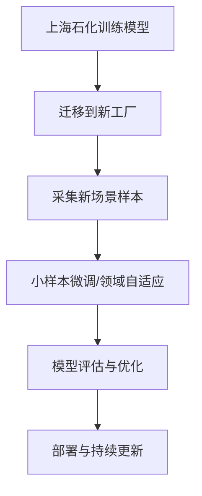

5. **总结**
- 迁移学习和领域自适应是提升模型通用性的核心手段。通过在新场景采集少量数据并微调模型，可大幅提升模型在不同石化工厂的适应性和鲁棒性，实现模型的快速迁移和通用部署。

#### RNN、Transformer整体架构与word2vec、端到端概念系统化介绍

**1. RNN（循环神经网络）整体架构**
- RNN是一类用于处理序列数据（如文本、语音、时间序列等）的神经网络。
- 结构特点：
  - 网络在时间维度上递归，每个时刻的输出依赖于当前输入和上一个时刻的隐藏状态。
  - 公式：$h_t = f(W_{xh}x_t + W_{hh}h_{t-1} + b)$，$y_t = W_{hy}h_t + c$
  - 适合建模时序依赖，如语言建模、机器翻译等。
- 局限：
  - 长序列训练时易出现梯度消失/爆炸。
  - 变体：LSTM、GRU等，通过门控机制缓解长依赖问题。

#### Transformer中的Encoder-Decoder结构与Attention机制系统化介绍

**1. Encoder-Decoder整体流程**
- Transformer采用Encoder-Decoder架构，广泛用于机器翻译、文本生成等任务。
- **Encoder（编码器）**：
  - 输入原始序列（如句子），通过多层自注意力和前馈网络，提取序列的深层特征表示。
  - 输出为一组上下文相关的特征向量（隐藏状态）。
- **Decoder（解码器）**：
  - 以Encoder输出的特征为条件，结合已生成的目标序列，逐步预测下一个输出。
  - 每一步都能关注输入序列的不同部分，实现条件生成。

**2. Attention机制原理**
- Attention（注意力）机制是Transformer的核心，能让模型动态关注输入序列中与当前任务最相关的部分。
- **自注意力（Self-Attention）**：
  - 输入序列的每个位置都能与其他所有位置建立联系，捕捉全局依赖。
  - 计算方式：
    - 对每个输入向量，分别映射为Query（Q）、Key（K）、Value（V）。
    - 相关性分数：$score = Q \cdot K^T / \sqrt{d_k}$
    - 权重归一化（Softmax），再加权求和得到输出：$Attention(Q, K, V) = softmax(score) \cdot V$
- **多头注意力（Multi-Head Attention）**：
  - 并行计算多个不同的注意力子空间，提升模型表达能力。

**3. Encoder-Decoder Attention**
- Decoder中既有自注意力（关注已生成序列），也有Encoder-Decoder Attention（关注输入特征）。
- Decoder每一步根据已生成内容和Encoder特征，动态选择关注输入的哪些部分，实现条件生成。

**4. 典型流程Mermaid图**
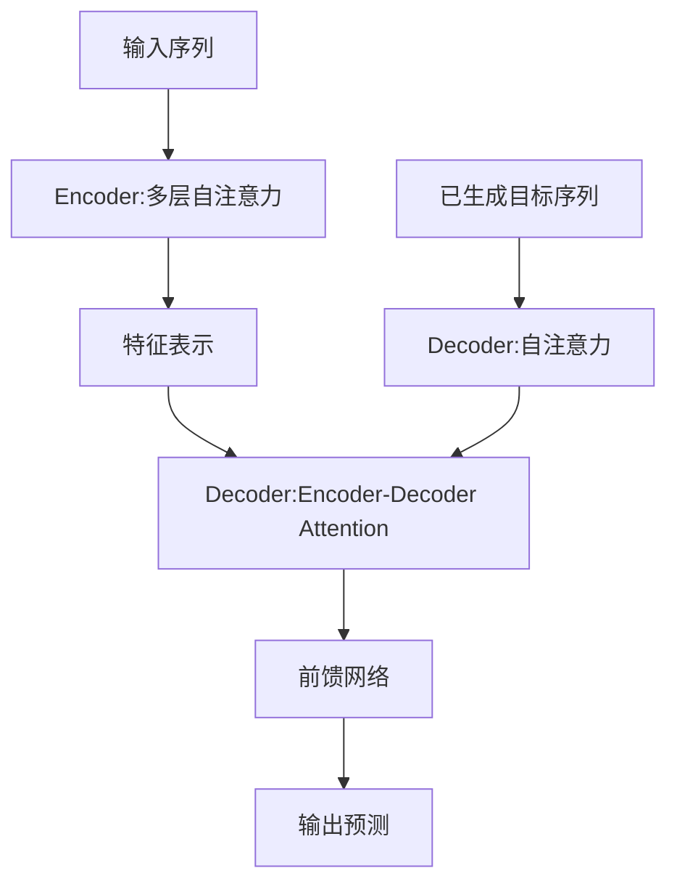

**5. 总结**
- Transformer通过Encoder提取输入特征，再用Decoder结合注意力机制预测新数据，实现高效的序列到序列建模。
- Attention机制让模型能动态聚焦最相关的信息，是提升长距离依赖建模和生成能力的关键。

#### Self-Attention（自注意力）计算方法与图形化讲解

**1. Self-Attention计算步骤**
- 输入：一个序列的特征向量（如句子中每个词的嵌入）。
- 步骤：
  1. 对每个输入向量$x_i$，分别通过线性变换得到Query（Q）、Key（K）、Value（V）：
     - $Q_i = W^Q x_i$
     - $K_i = W^K x_i$
     - $V_i = W^V x_i$
  2. 计算每个Query与所有Key的相似度（如点积）：
     - $score_{ij} = Q_i \cdot K_j^T$
  3. 对分数进行缩放（除以$\sqrt{d_k}$，$d_k$为Key的维度，用来做平均化，保证不同维度的向量内积结果具有可比性），再用Softmax归一化，得到权重：
     - $\alpha_{ij} = softmax_j(score_{ij}/\sqrt{d_k})$
  4. 用权重对所有Value加权求和，得到输出：
     - $z_i = \sum_j \alpha_{ij} V_j$
- 每个输出$z_i$都融合了全序列的信息，权重反映了各位置对当前输出的贡献。

**2. Self-Attention结构图（Mermaid）**
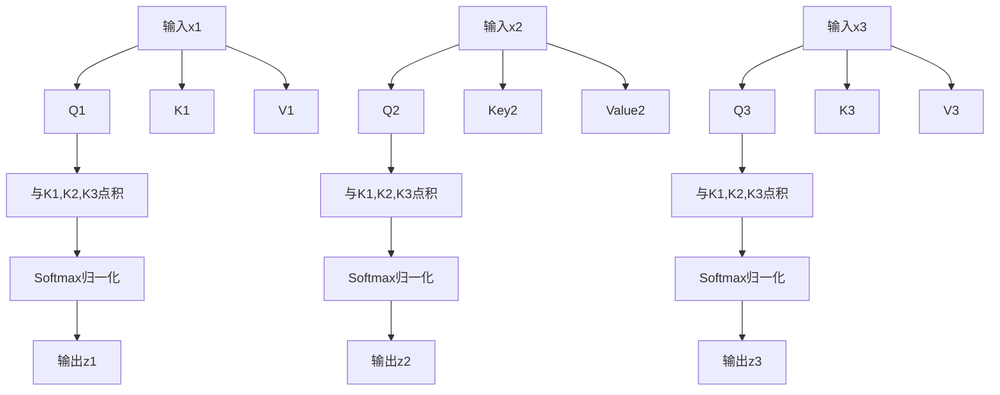

**3. 总结**
- Self-Attention通过Query、Key、Value机制，让每个位置都能动态关注全序列的关键信息，实现信息的全局融合和权重分配，是Transformer的核心计算单元。

#### Self-Attention中的Queries、Keys、Values的作用与关系

**1. 三个辅助向量的作用**
- **Query（查询向量）**：表示当前需要“提问”或“关注”信息的目标（如当前词）。
- **Key（键向量）**：为每个输入位置提供“被检索”的特征，代表序列中每个元素的内容特征。
- **Value（值向量）**：为每个输入位置提供最终要被加权汇总的信息内容。

**2. 计算流程与关系**
- 对于序列中每个位置$i$，用其Query与所有位置的Key计算相似度（如点积），得到一组权重（注意力分数）。
- 用这些权重对所有Value加权求和，得到该位置的输出。
- 公式：
  - $score_{ij} = Q_i \cdot K_j^T$
  - $\alpha_{ij} = softmax_j(score_{ij})$
  - $z_i = \sum_{j=1}^3 \alpha_{ij} V_j$
- 关系总结：
  - Query决定“我要关注什么”，Key决定“我能被关注到什么”，Value决定“我能贡献什么信息”。
  - Query和Key共同决定注意力分配，Value决定信息融合内容。

**3. 图形化关系说明（Mermaid）**
```mermaid
flowchart LR
    subgraph 输入序列
      X1[输入1] X2[输入2] X3[输入3]
    end
    X1 --> Q1[Query1] & K1[Key1] & V1[Value1]
    X2 --> Q2[Query2] & K2[Key2] & V2[Value2]
    X3 --> Q3[Query3] & K3[K3] & V3[V3]
    Q1 --与所有Key点积--> S1[权重分配]
    S1 --加权所有Value--> Z1[输出1]
    Q2 --与所有Key点积--> S2[权重分配]
    S2 --加权所有Value--> Z2[输出2]
    Q3 --与所有Key点积--> S3[权重分配]
    S3 --加权所有Value--> Z3[输出3]
```

**4. 总结**
- Queries、Keys、Values三者协作，让每个位置都能动态聚合全局信息，实现灵活的信息流动和全局依赖建模，是Self-Attention的核心机制。

#### Transformer中Q、K、V矩阵的训练与计算样例

**1. Q、K、V矩阵的训练方式**
- Q（Query）、K（Key）、V（Value）矩阵是通过神经网络中的可学习参数（权重矩阵）与输入特征线性变换得到的。
- 训练过程：
  - Q、K、V的权重矩阵（$W^Q, W^K, W^V$）在模型训练时与其他参数一起，通过反向传播和梯度下降自动优化。
  - 损失函数（如交叉熵）对最终输出有影响，误差信号会反向传递到Q、K、V的权重矩阵，更新其参数。

**2. 具体计算样例说明**
- 假设输入序列有3个词，每个词的嵌入向量维度为4：
  - $X = [x_1, x_2, x_3]$，每个$x_i$为$1\times4$向量
- Q、K、V的权重矩阵均为$4\times4$，初始化为可学习参数。

- 计算步骤：
  1. 线性变换：
     - $Q = X \cdot W^Q$
     - $K = X \cdot W^K$
     - $V = X \cdot W^V$
  2. 计算注意力分数（以第1个词为例）：
     - $score_{1j} = Q_1 \cdot K_j^T / \sqrt{d_k}$，$j=1,2,3$
  3. Softmax归一化得到权重：
     - $\alpha_{1j} = softmax_j(score_{1j})$
  4. 加权求和得到输出：
     - $z_1 = \sum_{j=1}^3 \alpha_{1j} V_j$

**3. Python伪代码样例**
```python
import numpy as np
import torch.nn.functional as F

# 假设输入序列X shape: (3, 4)
X = np.array([[1,2,3,4], [2,3,4,5], [3,4,5,6]])
WQ = np.random.randn(4,4)
WK = np.random.randn(4,4)
WV = np.random.randn(4,4)
Q = X @ WQ  # (3,4)
K = X @ WK  # (3,4)
V = X @ WV  # (3,4)
# 计算注意力分数
scores = Q @ K.T / np.sqrt(4)  # (3,3)
weights = np.exp(scores) / np.exp(scores).sum(axis=1, keepdims=True)  # softmax
Z = weights @ V  # (3,4)
```

**4. 总结**
- Q、K、V矩阵的权重通过训练自动优化，计算过程包括线性变换、相关性打分、softmax归一化和加权求和，最终实现信息融合和动态关注。

#### Multi-Head Attention（多头注意力）机制系统化解释

**1. 概念与原理**
- Multi-Head Attention是Transformer的核心机制之一。
- 它指的是：在同一层中并行地执行多组独立的Self-Attention，每组称为一个“头”（head）。
- 每个头有独立的Q、K、V权重矩阵，能在不同的子空间学习不同的特征关系。

**2. 计算流程**
- 输入序列通过多个不同的Q、K、V线性变换，分别计算多个注意力输出（每个head一个）。
- 所有head的输出在特征维度上拼接（concat），再通过一个线性变换融合，得到最终输出。
- 公式：
  - $head_i = Attention(QW^Q_i, KW^K_i, VW^V_i)$
  - $MultiHead(Q,K,V) = Concat(head_1,...,head_h)W^O$

**3. 用途与优势**
- 多头机制让模型能在不同的子空间、不同角度捕捉序列中多样化的依赖关系（如语法、语义、位置等）。
- 提升模型表达能力和鲁棒性，避免单一注意力头的局限。
- 支持并行计算，提升效率。

**4. 用法举例（PyTorch）**
```python
import torch.nn as nn
mha = nn.MultiheadAttention(embed_dim=512, num_heads=8)
output, attn_weights = mha(query, key, value)
```

**5. 图形化说明（Mermaid）**
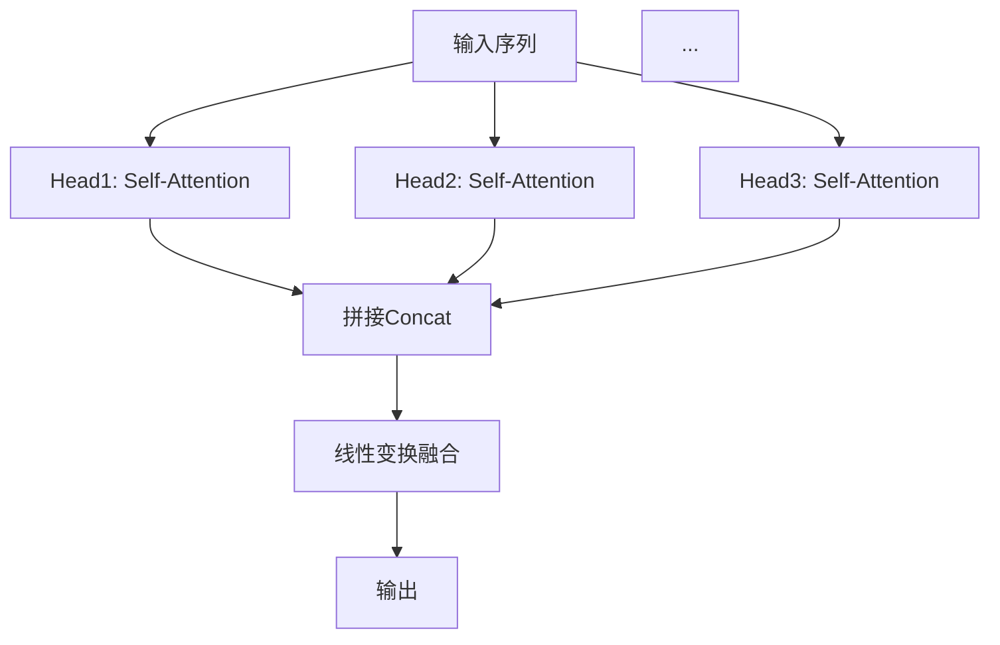

**6. 总结**
- Multi-Head Attention通过多组并行注意力机制，让模型能同时关注信息的不同方面，是Transformer强大建模能力的关键。

## 稀释注意力机制（Sparse Attention）

### 1. 原理
- 标准注意力机制（如Transformer的Self-Attention）对所有Token两两计算注意力，计算复杂度为$O(N^2)$，N为序列长度。
- 稀释注意力机制通过只计算部分Token之间的注意力（如局部窗口、分块、随机采样等），将复杂度降低到$O(N)$或$O(N\log N)$，大幅提升效率。
- 常见稀释方式：
  - 局部窗口注意力（只关注邻近Token）
  - 分块注意力（序列分块，每块内部全连接）
  - 随机稀疏/滑动窗口/全局+局部混合

### 2. 能解决的问题
- 主要解决长序列下注意力计算资源消耗过大、显存溢出、训练速度慢等问题。
- 使Transformer等模型可扩展到更长输入，适用于NLP、CV、时序分析等。

### 3. 具体使用方法与工程建议
- 选择合适稀疏模式：如局部窗口适合有强局部相关性的任务，分块适合结构化数据，混合模式适合需要全局信息的场景。
- 典型实现：Longformer、BigBird、Sparse Transformer等开源模型均实现了稀释注意力。
- PyTorch代码示例（局部窗口稀疏注意力）：
  ```python
  import torch
  import torch.nn.functional as F

  def local_window_attention(q, k, v, window_size=3):
      # q, k, v: [batch, seq_len, dim]
      seq_len = q.size(1)
      output = []
      for i in range(seq_len):
          left = max(0, i - window_size)
          right = min(seq_len, i + window_size + 1)
          attn_scores = torch.matmul(q[:, i:i+1, :], k[:, left:right, :].transpose(-2, -1)) / (q.size(-1) ** 0.5)
          attn_weights = F.softmax(attn_scores, dim=-1)
          attn_output = torch.matmul(attn_weights, v[:, left:right, :])
          output.append(attn_output)
      return torch.cat(output, dim=1)
  ```
- 工程建议：优先使用社区成熟实现（如HuggingFace Transformers的Longformer/BigBird），根据任务和硬件资源调整稀疏策略。

### 4. Mermaid结构图示例
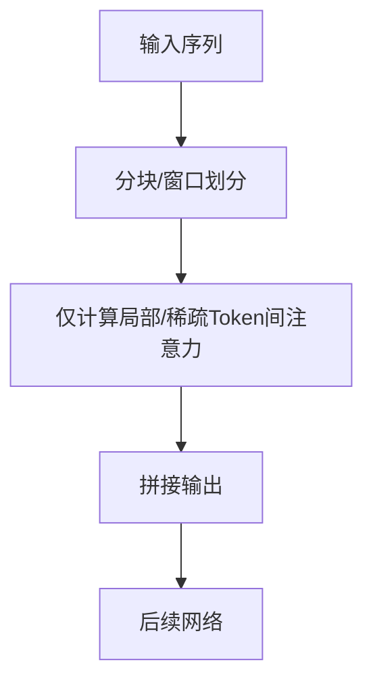

### 5. 常见问题与对比
- 稀释注意力会牺牲部分全局信息，但通过混合全局/局部、引入全局Token等方式可缓解。
- 适合长序列任务，短序列下收益有限。

## 多层Self-Attention特征提取机制

### 1. 原理
- 多层Self-Attention（如多层Transformer Encoder堆叠）可逐层提取序列特征。
- 每层Self-Attention捕捉全局依赖，低层关注基础/局部特征，高层抽象复杂全局特征。
- 类似于CNN的多层卷积，但Self-Attention能直接建模任意位置间关系。

### 2. 优势
- 全局建模能力强，层层递进可捕捉复杂长距离依赖。
- 多层结构可学习多粒度、多层次特征，表达能力强。
- 灵活适应变长序列和多模态输入。
- 支持并行计算，训练效率高。

### 3. 能解决的问题
- 长距离依赖难题：有效捕捉远距离Token间关系，优于RNN。
- 特征表达不足：多层堆叠提取更抽象、更判别力特征。
- 适应复杂任务：如机器翻译、文本理解、图像识别等。

### 4. 工程建议
- 层数可根据任务复杂度和数据规模调整，常见为6~24层。
- 结合残差连接、LayerNorm等提升训练稳定性和效果。

### 5. Mermaid结构图
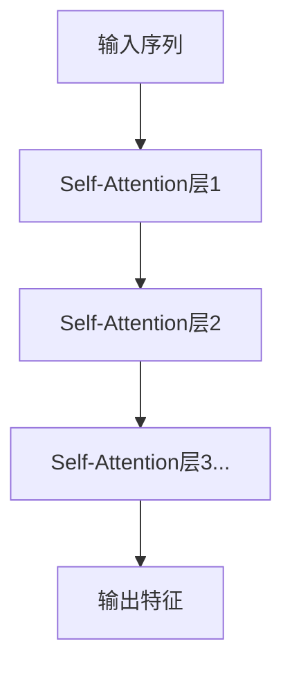

## Transformer中的位置信息表达与解决方案

### 1. 问题：Transformer对文本位置不敏感
- Self-Attention机制本身不区分Token顺序，导致模型无法直接感知输入序列的位置信息。
- 这会影响模型对语序、上下文等依赖顺序的任务表现。

### 2. 解决方法：位置编码（Positional Encoding）
- 在输入Embedding中加入位置编码，使每个Token的表示包含其位置信息。
- 位置编码有两种主流方式：
  - 绝对位置编码（如正弦-余弦编码，Sinusoidal）
  - 可学习的位置编码（Learnable Positional Embedding）

#### 2.1 正弦-余弦位置编码（Sinusoidal Positional Encoding）
- 公式如下：
  $$
  PE_{(pos,2i)} = \sin(pos/10000^{2i/d_{model}})
  $$
  $$
  PE_{(pos,2i+1)} = \cos(pos/10000^{2i/d_{model}})
  $$
  其中 $pos$ 为位置，$i$ 为维度索引，$d_{model}$ 为Embedding维度。
- 这种编码方式能表达绝对和相对位置信息，且无需训练。

#### 2.2 可学习的位置编码
- 直接为每个位置分配一个可训练的向量，随模型训练自动优化。
- 适合固定长度输入，灵活性高。

### 3. 信息位置表达的实现方法
- 将位置编码与Token Embedding相加或拼接，作为Transformer的输入。
- 代码示例（PyTorch）：
  ```python
  # 假设x为[batch, seq_len, d_model]的Token Embedding
  x = x + positional_encoding[:x.size(1), :]
  ```

### 4. Mermaid结构图
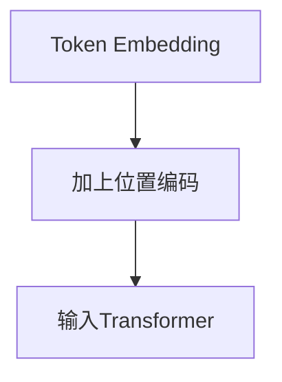

### 5. 工程建议
- NLP任务一般直接采用加法方式注入位置编码。
- 对于变长序列或需要相对位置信息的任务，可采用相对位置编码（如Transformer-XL、T5等）。

## 多种位置编码的融合与Patch划分应用

### 1. 多种位置编码的融合方式
- 可将不同来源的位置信息（如绝对位置、相对位置、周期性/季节性、时间戳等）分别编码为向量，与Token Embedding融合。
- 融合方法：
  - 加法融合：多种位置编码与Token Embedding逐元素相加，适合维度一致。
  - 拼接融合（Concat）：拼接后通过线性变换映射到模型输入维度。
  - 加权融合：为不同类型的位置编码分配可学习权重，模型自动调整各类位置信息的重要性。
- 工程建议：
  - 有周期性/季节性特征的数据可引入周期性正弦/余弦编码或节假日等特殊标记。
  - 多重结构数据（如文本+时间、图像+空间）可分别编码后融合。

#### 代码示例（多种位置编码加权融合，PyTorch伪代码）
```python
# token_embed, abs_pos_embed, rel_pos_embed, seasonal_embed: [batch, seq_len, d_model]
alpha, beta, gamma = nn.Parameter(torch.ones(3))  # 可学习权重
x = token_embed + alpha * abs_pos_embed + beta * rel_pos_embed + gamma * seasonal_embed
```

### 2. Patch划分与位置编码在不同场景的应用

#### 2.1 图像场景（如ViT/视觉Transformer）
- 图像切分为若干Patch，每个Patch展平成向量，作为一个“Token”。
- 每个Patch分配一个位置编码（绝对/相对/二维编码），表达其空间位置。
- Patch Embedding与位置编码相加后输入Encoder。
- 位置编码可采用二维正弦-余弦编码、可学习二维Embedding等。

#### 2.2 时间序列场景
- 长时间序列切分为多个Patch（如滑动窗口），每个Patch作为一个Token。
- Patch可包含时间戳、周期性（如日/周/月）、节假日等多种位置编码。
- Patch Embedding与多种位置编码融合后输入Encoder。
- 适合捕捉局部与全局的时序特征。

#### 2.3 文本场景
- 传统文本为每个Token分配位置编码。
- 有层次结构的文本可引入多级位置编码（如句内、句间、段落内等）。

### 3. Mermaid结构图示例
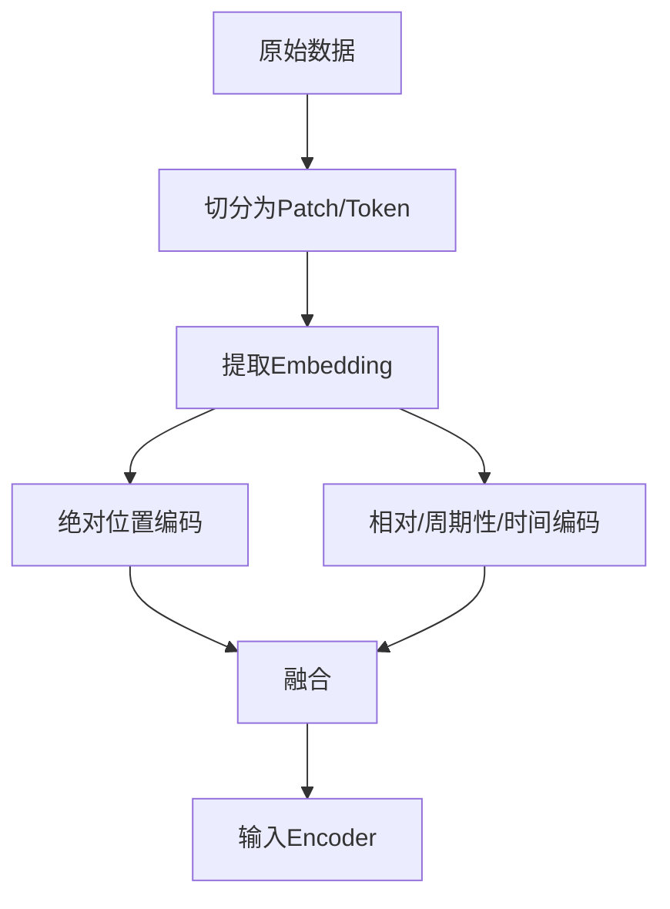

### 4. 工程建议
- 多种位置编码可提升模型对复杂结构和时序/空间特征的建模能力。
- 选择合适的融合方式（加法、拼接、加权）和编码类型，结合任务需求与数据特点。
- 对于图像、时间序列等Patch结构，建议采用二维/多维位置编码。

## Transformer结合标签数据的特征提取与多模态无人驾驶应用

### 1. Transformer如何通过标签数据进行特征提取
- 标签数据（如目标类别、驾驶行为、障碍物类型等）用于监督训练，指导Transformer学习输入特征与目标之间的映射关系。
- 训练时，模型通过最小化预测输出与标签的损失（如交叉熵、MSE等），自动提取对任务有判别力的高维特征。
- 标签不仅可用于分类/回归，还可用于多任务学习（如同时预测物体类别、位置、驾驶决策等）。

### 2. 多模态无人驾驶场景下的特征融合与高维投影

#### 2.1 多摄像头视频信息的高维特征投影
- 多个摄像头采集的二维视频帧，先通过CNN等网络提取每帧的空间特征（如ResNet、ConvNeXt等）。
- 每个摄像头的特征可视为一个“Token”或“Patch”，输入到Transformer中。
- Transformer通过Self-Attention机制融合不同摄像头、不同视角的空间信息，将多源二维特征投影到统一的高维特征空间，实现全局感知。
- 这种高维特征空间便于后续智能驾驶决策（如障碍物检测、路径规划、行为预测等）。

#### 2.2 多模态数据融合
- 除视频外，还可融合激光雷达、毫米波雷达、GPS、IMU等多维传感器数据。
- 各模态特征通过独立网络提取后，拼接或加权融合，统一输入Transformer进行全局建模。
- 标签数据可同时指导多模态特征的联合优化。

#### 2.3 时序建模与前后时间尺度计算
- Transformer可处理序列数据，将连续时刻的多模态特征作为序列输入，利用Self-Attention建模前后时刻的依赖关系。
- 这样不仅能捕捉当前帧信息，还能理解历史与未来趋势（如车辆运动轨迹、动态障碍物预测等）。
- 可采用时序Patch划分+位置编码，提升时序建模能力。

### 3. 结构化流程Mermaid图
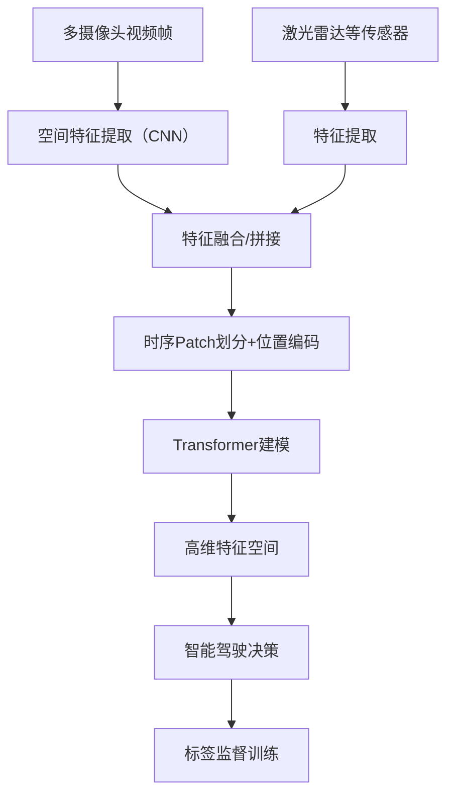

### 4. 工程建议
- 多模态特征建议先归一化/对齐时间戳，保证同步。
- 空间特征建议采用主流CNN，时序建模建议采用时序Transformer或带时序位置编码的ViT。
- 标签设计应覆盖多任务（如检测、分割、行为预测），提升模型泛化能力。
- 可采用端到端训练，标签直接指导高维特征空间的优化。

##### Decorder机制
系统化讲解Decoder（解码器）如何进行预测、特征提取方式的灵活性及其解决方案，并从机器翻译扩展到复杂场景，详细说明查询向量Q的初始化、与Encoder的K/V的交互，以及Decoder中的Self-Attention和Cross-Attention机制。内容如下，并将结构化补充进《培训笔记.md》。

Transformer Decoder预测与特征提取机制
1. 基础场景：机器翻译中的Decoder预测流程
输入：Decoder通常以“起始符”或上一个时刻的预测结果作为输入，逐步生成目标序列（如翻译句子）。
特征提取：Decoder每一步都根据当前输入、历史已生成内容和Encoder输出的上下文特征，动态提取特征并预测下一个Token。
预测流程：
初始化Q（查询向量），通常为当前时刻的输入Embedding或上一步输出。
通过Self-Attention机制，提取已生成序列的内部依赖。
通过Cross-Attention机制，将Q与Encoder输出的K/V进行交互，融合源语言上下文。
经过Feed Forward层和线性变换，输出下一个Token的概率分布。
选取概率最高的Token作为下一个输入，循环上述过程，直到生成终止符。
2. Decoder特征提取方式的灵活性与解决方案
灵活性来源：Decoder每一步的输入、历史状态、注意力权重都可动态变化，特征提取方式不唯一。
解决方案：
采用多层堆叠、残差连接、LayerNorm等结构，提升特征表达能力和稳定性。
结合多头注意力机制，捕捉多粒度、多角度的特征。
在复杂场景（如多模态生成、对话系统）中，可引入额外的上下文、外部知识或多源信息，丰富特征提取方式。
3. 查询向量Q的初始化与权重计算
Q的初始化：
在Self-Attention中，Q通常由当前Decoder输入（Embedding或上一步输出）生成。
在Cross-Attention中，Q为Decoder当前层的输出，K/V为Encoder输出。
与Encoder的K/V交互：
Decoder的Q需与Encoder所有K/V进行注意力计算，得到融合源语言上下文的新权重向量。
这种机制保证了目标序列生成时能动态关注源序列的不同部分。
4. Decoder中的两种注意力机制详解
4.1 Self-Attention（自注意力）
作用：建模已生成目标序列内部的依赖关系，捕捉历史Token间的上下文。
特点：采用掩码（Mask），防止模型看到未来信息（即只关注当前位置及之前的Token）。
公式与Encoder类似，但加了Mask。
4.2 Cross-Attention（交叉注意力）
作用：将Decoder当前状态与Encoder输出的上下文特征融合，实现源-目标序列的信息交互。
机制：Q来自Decoder，K/V来自Encoder输出。
使Decoder能动态关注源序列的不同部分，提升生成质量。
5. Mermaid结构图
```mermaid
graph TD
    A[Decoder输入/上一步输出] --> B[Self-Attention (带Mask)]
    B --> C[Cross-Attention (与Encoder输出K/V)]
    C --> D[Feed Forward & 线性变换]
    D --> E[预测下一个Token]
    E --> F[作为下一个输入，循环]
```
6. 工程建议
简单场景（如机器翻译）可直接采用标准Decoder结构。
复杂场景可引入多源信息、外部知识、动态掩码等机制，提升特征提取能力。
Q/K/V的初始化和交互方式可根据任务需求灵活调整。

### Decoder中的Mask机制与终止字符

#### 1. Mask机制介绍
- 在Transformer的Decoder中，Self-Attention层采用了“掩码（Mask）”机制。
- 作用：防止模型在生成序列时看到未来的信息（即当前位置之后的Token），保证每一步的预测只依赖于已生成的内容。
- 实现方式：对注意力分数矩阵进行上三角遮挡（mask），将未来位置的分数设为负无穷，使Softmax后权重为0。
- 公式：
  - $\text{MaskedAttention}(Q, K, V) = \text{softmax}(\frac{QK^T}{\sqrt{d_k}} + M) V$
  - 其中$M$为mask矩阵，未来位置为$-\infty$，当前及之前为0。
- 工程意义：
  - 保证自回归生成的正确性，防止信息泄漏。
  - 支持并行训练时的正确依赖关系。

#### 2. Mask机制能解决的问题
- 防止模型在生成下一个Token时“偷看”未来的目标序列，保证生成的合理性和泛化能力。
- 支持自回归（Auto-Regressive）生成，适用于机器翻译、文本生成等任务。

#### 3. End of Sentence（终止字符）设置
- 终止字符（如<eos>、[SEP]、[END]等）用于指示序列生成的结束。
- 设置方式：
  - 在目标词表中专门分配一个Token作为终止符。
  - 训练时，目标序列末尾加上终止符，模型学习在合适时机输出该Token。
  - 推理/生成时，遇到终止符即停止生成。
- 工程建议：
  - 终止符应与任务和数据集一致（如NLP常用<eos>，对话系统可用[END]等）。
  - 训练数据需保证每条样本都包含终止符。

## DETR（Detection Transformer）系统化解读

### 1. 概念
- DETR（Detection Transformer）是Facebook提出的一种端到端目标检测方法，将目标检测任务转化为序列到序列的预测问题。
- 它将Transformer架构（Encoder-Decoder）引入目标检测，省略了传统检测中的锚框（anchor）、NMS（非极大值抑制）等复杂后处理，直接输出目标边界框和类别。

### 2. 用法与具体用途
- 用法：输入一张图像，经过CNN（如ResNet）提取特征后，送入Transformer Encoder-Decoder结构。
  - Encoder：对整张图像的特征进行全局建模。
  - Decoder：输入一组可学习的“查询向量”（object queries），每个query预测一个目标。
  - 输出：每个query输出一个边界框和类别，未检测到目标的query输出“无目标”类别。
- 具体用途：
  - 端到端目标检测（物体检测、实例分割等）
  - 适用于遮挡、重叠、复杂场景下的目标检测
  - 可扩展到视频目标检测、多模态检测等任务

### 3. 遮挡目标的识别能力
- DETR通过全局Self-Attention机制，能捕捉图像中任意区域的依赖关系，不局限于局部窗口。
- 即使目标被部分遮挡，模型可利用全局上下文信息推断目标的存在和位置。
- Decoder的object queries能主动“询问”图像中可能存在的目标，提升对遮挡、重叠目标的检测能力。

### 4. Cross-Attention与Self-Attention在Decoder中的作用
- Self-Attention：
  - Decoder内部各object query之间进行信息交互，避免重复预测同一目标，提升多目标区分能力。
- Cross-Attention：
  - Decoder的每个object query与Encoder输出的全局图像特征进行交互，动态关注图像中最相关的区域，实现目标定位和识别。
- 这种机制让Decoder能综合全局特征和目标间关系，实现高效、准确的目标检测。

### 5. Mermaid结构图
```mermaid
graph TD
    A[输入图像] --> B[CNN特征提取]
    B --> C[Transformer Encoder]
    C --> D[Transformer Decoder (object queries)]
    D --> E[边界框+类别输出]
```

### 6. 工程建议
- 训练时建议使用大规模标注数据，提升对复杂场景和遮挡目标的鲁棒性。
- 可根据任务需求调整object query数量，适应不同目标密度。
- 推理时直接输出目标，无需NMS等后处理，简化部署流程。

## Transformer Encoder-Decoder完整模块详解（结构图）

```mermaid
graph TD
    subgraph Encoder
        A1[输入序列/特征] --> B1[Embedding/位置编码]
        B1 --> C1[多层Self-Attention]
        C1 --> D1[多层前馈投影层（Feed Forward）]
        D1 --> E1[编码输出（上下文特征）]
    end
    subgraph Decoder
        A2[目标序列起始符/上一步输出] --> B2[Embedding/位置编码]
        B2 --> C2[多层Masked Self-Attention]
        C2 --> D2[多层Cross-Attention (与Encoder输出交互)]
        D2 --> E2[多层前馈投影层（Feed Forward）]
        E2 --> F2[输出预测（下一个Token/目标）]
    end
    E1 -.-> D2
    F2 --> G2[作为下一个输入，循环]
```


**说明：**
- Encoder部分：输入经过Embedding和位置编码，依次通过多层Self-Attention和前馈投影层，输出全局上下文特征。
- Decoder部分：输入目标序列（或上一步输出），经过Embedding和位置编码，先通过Masked Self-Attention（防止信息泄漏），再与Encoder输出通过Cross-Attention交互，最后通过前馈投影层输出预测结果。
- Encoder输出作为Decoder Cross-Attention的输入，实现源-目标序列的信息融合。
- Decoder输出可循环作为下一个时刻的输入，直到生成终止符。

## 多模态Transformer：Encoder-Decoder结合多模态特征提取系统化解释

### 1. 多模态特征提取的基本思路
- 多模态任务（如文本+图像、语音+文本等）需要融合不同类型的数据，实现信息互补和联合理解。
- Transformer的Encoder-Decoder结构天然适合多模态特征融合：
  - Encoder可分别处理不同模态的原始特征（如文本、图像），提取高层次语义表示。
  - Decoder可融合多模态特征，实现跨模态生成、理解或决策。

### 2. 典型多模态特征提取流程
1. **模态特征提取**：
   - 文本：通过Embedding+位置编码，送入文本Encoder。
   - 图像：通过CNN或ViT等提取Patch特征，送入图像Encoder。
2. **多模态特征融合**：
   - 可采用多路Encoder分别处理各模态，输出高维特征。
   - 融合方式：拼接、加权、Cross-Attention等。
3. **Decoder融合与生成**：
   - Decoder可通过Cross-Attention机制与所有Encoder输出交互，实现多模态信息融合。
   - 支持多模态到单模态（如图文生成）、多模态到多模态（如视觉问答）等任务。

### 3. Cross-Attention在多模态中的作用
- Decoder的Cross-Attention可同时关注文本Encoder和图像Encoder的输出，实现跨模态信息流动。
- 例如：
  - 文本生成时，Decoder可动态聚焦图像和文本的关键信息，提升生成内容的相关性和准确性。
  - 视觉问答时，Decoder可根据问题文本和图像内容联合推理。

### 4. Mermaid结构图
```mermaid
graph TD
    A1[文本输入] --> B1[文本Encoder]
    A2[图像输入] --> B2[图像Encoder]
    B1 --> C[多模态特征融合]
    B2 --> C
    C --> D[Decoder: Cross-Attention融合]
    D --> E[输出/生成/决策]
```

### 5. 工程建议
- 各模态Encoder可采用专用结构（如BERT、ViT等），提升特征提取能力。
- 融合方式可根据任务复杂度选择简单拼接或多层Cross-Attention。
- 训练时建议采用多模态大数据集，提升模型泛化和跨模态理解能力。

## 智能体Agent
智能体（Agent）通常需要包含以下核心要素：

感知（Perception）
能够通过传感器或输入接口感知环境信息，如视觉、听觉、文本、状态等。

状态表示（State Representation）
对环境和自身的感知信息进行内部建模，形成可用于决策的状态表示。

决策与推理（Decision Making & Reasoning）
根据当前状态和目标，利用规则、策略、学习算法等做出行动决策。

行动（Action/Actuation）
通过执行器或输出接口对环境做出响应，如移动、说话、操作等。

目标与动机（Goal & Motivation）
具备明确的目标、任务或激励机制，驱动智能体持续行动。

学习与适应（Learning & Adaptation）
能够通过经验、反馈或数据不断优化自身的感知、决策和行为。

交互与通信（Interaction & Communication）
与其他智能体或人类进行信息交流、协作或竞争。

这些要素共同构成了一个完整的智能体，使其能够在复杂环境中自主感知、决策、行动和学习。

### 主要特征：
- 感知
- 记忆
- 反馈
- 决策

### 智能体驱动的自动化测试技术方案

1. 架构设计
- 构建基于智能体的自动化测试平台，核心模块包括：
  - 感知模块：自动识别测试环境状态、界面元素、接口响应等。
  - 决策模块：根据测试目标和历史数据，动态选择和生成测试用例。
  - 行动模块：自动执行测试操作（如UI点击、API调用、数据输入等）。
  - 学习模块：基于测试结果和反馈，持续优化测试策略和用例集。
  - 交互模块：与CI/CD系统、缺陷管理平台、开发环境等集成，实现自动触发和结果回传。

2. 关键技术实现
- 测试用例自动生成：利用模型推理、规则引擎或大语言模型，根据需求文档、接口定义、历史缺陷等自动生成高覆盖率测试用例。
- 智能异常检测：通过日志分析、异常模式识别、异常分布建模等手段，自动发现和定位潜在缺陷。
- 用户行为模拟：基于强化学习或用户行为数据，智能体可模拟真实用户操作路径，提升探索性测试能力。
- 测试数据自动生成与管理：结合数据生成算法和敏感数据脱敏，自动构造多样化、边界性测试数据。
- 持续学习与自适应：智能体根据测试结果、缺陷修复情况等动态调整测试重点和策略，实现自适应测试。

3. 典型流程
```mermaid
graph TD
    A[需求/变更输入] --> B[用例生成]
    B --> C[测试环境感知]
    C --> D[自动执行测试]
    D --> E[异常检测与反馈]
    E --> F[学习与优化]
    F --> B
    D --> G[结果回传CI/CD]
```

4. 工程建议
- 优先集成主流CI/CD平台，实现自动触发和回归测试。
- 结合大语言模型、RPA、强化学习等前沿技术，提升智能体的泛化和自适应能力。
- 建立测试知识库和用例库，支持智能体持续学习和知识迁移。
- 强化异常检测和结果可视化，便于研发团队快速定位和修复问题。

## 最新单智能体与多智能体的概念、用例及MetaGPT解决方案

### 1. 单智能体（Single-Agent）
- 概念：单智能体系统指在特定环境中只有一个智能体独立感知、决策和行动，目标是最大化自身收益或完成指定任务。
- 典型用例：
  - 智能客服/对话机器人
  - 自动化测试脚本生成与执行
  - 单人游戏AI、自动驾驶车辆的单车决策
  - 代码自动生成、文档摘要等单任务场景

### 2. 多智能体（Multi-Agent）
- 概念：多智能体系统包含多个智能体，智能体间可协作、竞争或通信，共同完成复杂任务或在共享环境中实现各自目标。
- 典型用例：
  - 多机器人协作（如仓储物流、无人机编队）
  - 多角色对话与协作（如AI团队协作写作、项目管理）
  - 智能体博弈与市场模拟
  - 多用户环境下的推荐系统、虚拟社会仿真

### 3. MetaGPT的多智能体协作解决方案
- MetaGPT是GitHub上的开源多智能体协作框架，专注于“多智能体协作式软件开发”。
- 主要特点与解决方式：
  - 采用“角色扮演”机制，将复杂任务拆分为多个子任务，由不同的智能体（如产品经理、架构师、开发、测试等）协作完成。
  - 每个智能体具备独立的感知、决策和行动能力，并能通过消息传递与其他智能体协作，模拟真实团队的工作流。
  - 支持任务分解、需求分析、代码生成、测试、文档等全流程自动化，提升多智能体协作效率。
  - 适用于自动化软件开发、AI团队协作、复杂项目管理等多智能体场景。
- 通过多智能体分工协作、消息通信和自动化流程，MetaGPT有效解决了多智能体协作开发中的任务分解、角色协作和流程自动化等问题，是当前多智能体应用的代表性开源项目。

### 多智能体在电力运维自动化中的技术方案

1. 架构设计
- 构建多智能体协作平台，核心智能体角色包括：
  - 监测智能体：实时采集和分析电力设备运行数据，检测异常和预警。
  - 巡检智能体：自动规划巡检路线，调度无人机/机器人进行现场巡检和图像采集。
  - 诊断智能体：对异常数据和巡检结果进行智能诊断，定位故障原因。
  - 运维决策智能体：根据诊断结果自动生成维修、调度和应急响应方案。
  - 协同调度智能体：协调各类资源（人、设备、备件），优化运维流程。

2. 关键技术实现
- 多源数据融合：集成SCADA、传感器、视频、历史工单等多模态数据，提升感知能力。
- 智能巡检与异常检测：结合机器视觉、时序分析和异常检测算法，实现无人化巡检和早期故障发现。
- 故障诊断与知识推理：利用专家系统、知识图谱和大模型，实现复杂故障的自动诊断和知识推理。
- 多智能体协作机制：通过消息通信、任务分解与分工、协同决策等机制，实现各智能体高效协作。
- 自适应学习与优化：智能体根据运维结果持续学习，优化巡检策略和故障处理流程。

3. 典型流程
```mermaid
graph TD
    A[设备实时监测] --> B[异常检测智能体]
    B --异常--> C[巡检调度智能体]
    C --> D[无人机/机器人巡检]
    D --> E[诊断智能体分析]
    E --> F[运维决策智能体]
    F --> G[协同调度与执行]
    G --> H[结果反馈与学习]
    H --> B
```

4. 工程建议
- 优先集成现有电力自动化平台和IoT设备，降低部署门槛。
- 强化多智能体间的通信协议和安全机制，保障协作可靠性。
- 建立运维知识库和案例库，支持智能体持续学习和知识迁移。
- 推广无人化巡检、智能诊断和自动调度，提升电力运维智能化和自动化水平。

### 迁移学习系统化解释与中间层冻结方法

#### 1. 迁移学习概念
- 迁移学习（Transfer Learning）是指将一个领域（源任务）中学到的知识迁移到另一个相关领域（目标任务），以提升目标任务的学习效率和效果。
- 常用于数据量有限、标注成本高的新任务，通过利用已有大规模数据训练的模型（如ImageNet预训练模型）加速新任务收敛。

#### 2. 迁移学习常见流程
1. 选择与目标任务相关的预训练模型（如ResNet、BERT等）。
2. 将预训练模型的参数加载到新任务模型中。
3. 冻结部分中间层（如前几层卷积/Transformer Block），只训练最后几层或新加的分类头。
4. 用少量目标任务数据微调（fine-tune）未冻结的层。

#### 3. 冻结中间层实现少量数据训练的方法
- **原理**：
  - 预训练模型的低层/中间层已学到通用特征（如边缘、纹理、基础语义），无需在新任务上重复训练。
  - 只训练高层/输出层，减少参数量，降低过拟合风险，适合小样本场景。
- **实现方法（以PyTorch为例）**：
  ```python
  # 假设model为预训练模型
  for param in model.features.parameters():
      param.requires_grad = False  # 冻结特征提取层
  # 只训练分类头
  optimizer = torch.optim.Adam(model.classifier.parameters(), lr=1e-3)
  ```
- **工程建议**：
  - 冻结层数可根据数据量和任务相似度调整，数据越少可冻结越多。
  - 可先全冻结，后逐步解冻部分层进行微调（逐层解冻策略）。
  - 适用于图像分类、NLP、时序预测等多种任务。

#### 4. 优势
- 显著减少对目标任务数据的需求。
- 加快训练速度，提升小样本泛化能力。
- 利用大模型的通用知识，提升新任务表现。

### Time-Series-Library项目的debug与iter/epoch运行说明

#### 1. Debug方法
- 本地断点调试：用VS Code、PyCharm等IDE打开Time-Series-Library，定位`run.py`或`exp/`目录下的实验脚本（如`exp_long_term_forecasting.py`），在主函数、模型前向、数据加载等关键位置设置断点，F5启动调试。
- 插入print/log：在数据加载、模型forward、loss计算等环节插入`print()`或`logging`，观察数据形状、梯度、loss变化等，定位问题。
- 命令行调试：运行脚本时可加`pdb.set_trace()`，在关键位置进入交互式调试。
- 单元测试：可在`exp/`、`models/`、`layers/`等目录下新建测试脚本，单独测试数据流、模型结构等。

**案例：**
- 在`exp/exp_long_term_forecasting.py`的`train()`方法内插入`print(batch_x.shape, batch_y.shape)`，可实时查看每个batch的数据形状。
- 在模型`forward`方法内插入`print(output.shape)`，可检查输出维度是否符合预期。

#### 2. 通过iter和epoch运行项目
- epoch：完整遍历一次训练集。主循环一般在`exp/exp_long_term_forecasting.py`等文件的`train()`方法：
  ```python
  for epoch in range(self.args.train_epochs):
      for i, (batch_x, batch_y, ...) in enumerate(train_loader):
          # ...训练代码...
  ```
  可通过命令行参数`--train_epochs`控制epoch数量。
- iter（iteration）：每次参数更新（即每个batch的训练）。在每个epoch内，`enumerate(train_loader)`的每一步就是一次iter。可通过`--batch_size`控制每个iter的样本数。
- 指定epoch/iter运行：
  ```powershell
  python run.py --task long_term_forecast --train_epochs 10 --batch_size 32
  ```
  这样会训练10个epoch，每个batch 32条数据。若只跑部分iter，可在`train()`循环内加break或条件判断。

**案例：**
- 只训练2个epoch、每个batch 16条数据：
  ```powershell
  python run.py --task long_term_forecast --train_epochs 2 --batch_size 16
  ```
- 在`train()`方法内加如下代码，只跑前100个iter：
  ```python
  for i, (batch_x, batch_y, ...) in enumerate(train_loader):
      if i >= 100:
          break
      # ...训练代码...
  ```

#### 3. 工程建议
- 推荐先用小数据、少epoch跑通流程，逐步加大规模。
- debug时可用print/断点/日志等多种方式结合，定位数据、模型、loss、梯度等问题。
- 若需更细粒度控制iter，可在`train()`内部加自定义计数器。


