# 机器学习方法完整清单

- **线性模型**
  - 线性回归
  - 逻辑回归
  - 岭回归、Lasso回归
- **决策树方法**
  - 决策树
  - 随机森林
  - 极端随机树（Extra Trees）
  - 梯度提升树（GBDT、XGBoost、LightGBM、CatBoost）
- **支持向量机（SVM）**
  - 线性SVM
  - 非线性SVM（核方法）
- **朴素贝叶斯**
  - 高斯朴素贝叶斯
  - 多项式朴素贝叶斯
  - 伯努利朴素贝叶斯
- **K近邻（KNN）**
- **集成学习**
  - Bagging（如随机森林）
  - Boosting（如AdaBoost、GBDT）
  - Stacking
- **聚类算法**
  - K均值（K-Means）
  - 层次聚类
  - DBSCAN
  - 谱聚类
- **降维方法**
  - 主成分分析（PCA）
  - 线性判别分析（LDA）
  - t-SNE
  - UMAP
- **概率图模型**
  - 隐马尔可夫模型（HMM）
  - 贝叶斯网络
  - 马尔可夫随机场
- **关联规则学习**
  - Apriori
  - FP-Growth
- **强化学习**
  - Q学习
  - SARSA
  - 深度强化学习（结合神经网络）
- **神经网络方法**
  - 前馈神经网络（FNN）
  - 卷积神经网络（CNN）
  - 循环神经网络（RNN）
  - 长短期记忆网络（LSTM）
  - Transformer
  - 图神经网络（GNN）
  - 自编码器（AE）
  - 生成对抗网络（GAN）
- **其他方法**
  - 支持向量回归（SVR）
  - 多项式回归
  - 时间序列分析（ARIMA、Prophet等）

| 方法类别         | 子方法/代表算法                      | 主要特点                           | 优势                         | 局限性                       | 典型应用           |
|------------------|--------------------------------------|------------------------------------|------------------------------|------------------------------|--------------------|
| 线性模型         | 线性回归：拟合直线关系；逻辑回归：分类概率输出；岭回归/Lasso回归：正则化防止过拟合 | 简单、易解释、参数少                | 计算快、易于分析             | 表达能力有限                 | 回归、分类         |
| 决策树/集成      | 决策树：分层规则；随机森林：多树投票；GBDT/XGBoost/CatBoost/Extra Trees：提升与集成 | 可解释性强、非线性建模              | 处理复杂关系、抗噪性强       | 易过拟合、对异常敏感         | 分类、回归、特征选择 |
| 支持向量机       | 线性SVM：线性分隔；核SVM：非线性映射；SVR：回归 | 间隔最大化、核方法支持非线性        | 泛化能力强、适合小样本       | 计算慢、参数调优复杂         | 分类、回归         |
| 朴素贝叶斯       | 高斯：连续特征；多项式：离散计数；伯努利：二元特征 | 基于概率、假设特征独立              | 计算快、适合高维数据         | 特征相关性高时效果差         | 文本分类、垃圾邮件识别 |
| K近邻            | KNN：距离最近投票                    | 基于距离、无模型训练                | 实现简单、无需训练           | 计算慢、对噪声敏感           | 分类、回归         |
| 聚类算法         | K均值：均值聚类；层次聚类：树状分层；DBSCAN：密度聚类；谱聚类：图结构聚类 | 无监督学习、发现数据结构            | 可发现隐藏模式               | 聚类数需预设、对尺度敏感     | 客户分群、图像分割 |
| 降维方法         | PCA：主成分压缩；LDA：判别分析；t-SNE/UMAP：非线性可视化 | 特征压缩、可视化                    | 降低维度、去噪               | 信息损失、解释性有限         | 数据预处理、可视化 |
| 概率图模型       | HMM：时序隐状态；贝叶斯网络：因果关系；马尔可夫随机场：空间依赖 | 建模变量间概率关系                  | 适合时序/因果建模            | 推断复杂、参数学习难         | 序列建模、风险分析 |
| 关联规则学习     | Apriori：频繁项集；FP-Growth：高效挖掘 | 挖掘频繁项集、规则                  | 发现潜在关联                 | 规则多时难以筛选             | 推荐系统、市场分析 |
| 强化学习         | Q学习：值迭代；SARSA：策略迭代；深度强化学习：结合神经网络 | 智能体与环境交互、奖励驱动           | 适合决策、序列任务           | 收敛慢、探索空间大           | 游戏、自动驾驶     |
| 神经网络         | FNN：全连接前馈；CNN：卷积特征提取；RNN：时序建模；LSTM：长依赖记忆；Transformer：自注意力；GNN：图结构；AE：特征压缩；GAN：生成对抗 | 多层结构、自动特征提取               | 表达能力强、适应复杂任务     | 需大量数据、训练成本高        | 图像/语音/文本处理 |


---
## 主流机器学习与深度学习算法清单

**主流机器学习算法**
- 线性模型
  - 逻辑回归
  - 岭回归、Lasso回归
- 决策树/集成方法
  - 决策树
  - 随机森林
  - 梯度提升树（GBDT、XGBoost、LightGBM、CatBoost）
- 支持向量机（SVM）
  - 线性SVM
  - 核SVM
- K近邻（KNN）
- 朴素贝叶斯
- 聚类算法
  - K均值（K-Means）
  - DBSCAN

**主流深度学习算法**
- 神经网络方法
  - 卷积神经网络（CNN）
  - 循环神经网络（RNN）、长短期记忆网络（LSTM）
  - Transformer（及其变体，如BERT、GPT、ViT等）
  - 图神经网络（GNN）
  - 生成对抗网络（GAN）
  - 自编码器（AE）

这些算法在实际工程、学术研究、工业应用中被广泛采用，覆盖了分类、回归、聚类、特征提取、序列建模、图结构建模、生成建模等主流任务。

---
| 算法类别         | 原理简述 | 主要特点 | 典型应用 | 优势 | 局限性 |
|------------------|---------|----------|----------|------|--------|
| 卷积神经网络（CNN） | 通过卷积核在空间上滑动提取局部特征，层层堆叠形成高层抽象 | 空间特征提取强，参数共享，适合图像/视频 | 图像分类、目标检测、视频分析、语音识别 | 对空间结构数据表现优异，计算高效 | 不适合时序/结构化数据，需大量数据 |
| 循环神经网络（RNN） | 通过循环结构记忆前后状态，适合序列数据 | 能建模时序依赖，适合短序列 | 文本生成、语音识别、时序预测 | 能处理序列数据，结构简单 | 长序列梯度消失/爆炸，周期性建模弱 |
| 长短期记忆网络（LSTM） | RNN的改进，增加门控机制，缓解长依赖问题 | 长依赖记忆能力强，适合中长序列 | 负荷预测、设备寿命预测、语音识别 | 能记忆长序列，抗梯度消失 | 结构复杂，计算量大，周期建模有限 |
| Transformer（及变体） | 基于自注意力机制，任意位置间可直接建模依赖 | 并行计算强，长序列/多变量建模优异 | 机器翻译、时序预测、文本生成、图像处理 | 长依赖建模强，扩展性好 | 参数量大，训练成本高，可解释性弱 |
| 图神经网络（GNN） | 在图结构上聚合邻居信息，建模节点/边关系 | 适合复杂拓扑、结构数据 | 电网建模、分子结构分析、社交网络 | 能处理非欧式结构数据 | 训练复杂，需图结构数据 |
| 生成对抗网络（GAN） | 生成器与判别器对抗训练，提升生成质量 | 强生成能力，能生成高质量数据 | 图像生成、数据增强、异常检测 | 生成能力强，适合无监督任务 | 训练不稳定，易模式崩溃 |
| 自编码器（AE） | 编码器压缩特征，解码器重构输入，实现特征学习 | 无监督特征提取、降维 | 数据压缩、异常检测、去噪 | 能自动学习特征，结构灵活 | 重构质量有限，表达能力弱于GAN/Transformer |

---
### 总结
- CNN适合空间结构数据（图像、视频），RNN/LSTM适合时序数据，Transformer适合长序列和多变量复杂依赖，GNN适合图结构数据，GAN适合生成任务，AE适合特征压缩和异常检测。
- 工程应用时需根据数据类型和任务需求选择合适算法，复杂场景常需多种算法协同。


---
神经网络算法在机器学习领域并非一直是主流，主要原因如下：

- 早期局限性：神经网络在20世纪80-90年代因计算资源有限、训练算法不成熟（如梯度消失/爆炸问题），实际效果不如线性模型、决策树、SVM等传统方法。
- 数据需求高：神经网络尤其是深度学习模型需要大量高质量数据才能发挥优势，而许多实际场景数据有限，传统方法更适用。
- 可解释性差：神经网络结构复杂，难以解释模型决策过程，传统方法（如决策树、线性模型）更易于理解和分析。
- 训练成本高：神经网络训练需要大量算力和时间，传统方法计算效率更高，易于部署。
- 泛化能力问题：在小样本、特征稀疏或结构化数据场景下，神经网络容易过拟合，传统方法更稳健。

近年来，随着算力提升和大数据普及，神经网络（尤其深度学习）才逐渐成为主流，特别是在图像、语音、自然语言等领域。但在结构化数据、小样本、可解释性要求高的场景，传统机器学习方法仍然占据主流地位。

---
在电力、工业无人值守、智能运维、新能源、微电网、多能互补等场景，主流和具备领导地位的算法主要包括：

1. 传统机器学习方法
- 决策树/集成方法
  - 随机森林、GBDT、XGBoost、LightGBM
  - 优势：对结构化数据表现优异，特征解释性强，适合设备状态分类、故障诊断、异常检测、能耗预测、天气预测、光伏/风力发电量预测等。
- 线性模型
  - 逻辑回归、岭回归
  - 优势：模型简单、易解释，适合小样本和部分回归任务。
- 支持向量机（SVM）
  - 优势：适合小样本、异常检测、设备健康评估等。

2. 深度学习方法
- 卷积神经网络（CNN）
  - 优势：在图像/视频监控、设备表计识别、缺陷检测、空间气象数据分析等视觉任务中表现突出。
- 循环神经网络（RNN）、LSTM、Transformer
  - 优势：适合时序数据建模，如负荷预测、能耗趋势分析、设备运行状态预测、天气预测、光伏/风力发电量预测等。
- 图神经网络（GNN）
  - 优势：适合电网、微电网、能量流网络、风场/光伏阵列等复杂拓扑结构建模，实现节点状态估计、能量分布优化等。
- Transformer及其变体（Informer、Autoformer、Time-LLM）
  - 优势：适合长序列、多变量时序预测，新能源预测领域新主流。

3. 其他方法
- 聚类算法（K均值、DBSCAN）
  - 用于设备分群、异常模式发现、用户行为分析等。
- 强化学习
  - 优势：在新能源调度、微电网能量管理、多能互补优化等决策场景中应用广泛。
- 时间序列分析（ARIMA、Prophet等）
  - 用于基线建模和趋势分析。
- 集成学习与混合模型
  - 多模型融合提升预测精度。

总结
- 结构化数据、小样本、可解释性要求高：集成树模型（如随机森林、XGBoost）、线性模型、SVM等传统方法更具领导地位。
- 时序预测、视觉识别、复杂网络建模：深度学习（CNN、LSTM、Transformer、GNN）逐步成为主流。
- 智能调度与优化：强化学习在新能源、微电网等场景中应用前景广阔。

这些算法在电力和工业智能运维、新能源场景实现了设备健康管理、故障预警、能耗优化、无人值守监控、智能调度、天气与发电量预测等关键功能。
---

---
针对电力、工业无人值守、智能运维、新能源、微电网、多能互补、智能监控、光储充调优、光伏、风电场最优发电量控制等复杂场景，需覆盖时序数据、3D模型数据、视频/图像数据、文档数据等多种数据类型。综合所有主流算法，最优选择建议如下：

## 1. 时序数据
- Transformer时序变体（Informer, Autoformer, TimesNet, Time-LLM）：适合长序列、多变量、周期性/趋势性强的预测任务，如负荷预测、发电量预测、设备状态监控。
- LSTM/GRU：适合中短序列、单变量时序建模。
- 集成树模型（XGBoost/LightGBM）：适合结构化时序特征、异常检测、回归任务。

## 2. 3D模型数据（结构设计、多物理场仿真）
- 图神经网络（GNN）：适合建模复杂拓扑、结构关系、物理场耦合（如电网、风场、结构仿真）。
- 3D卷积神经网络（3D-CNN）/PointNet/Transformer3D：适合点云、体素、3D网格数据分析与特征提取。
- 有限元/数值仿真算法：工程仿真场景仍需传统数值方法与AI结合。

## 3. 视频/图像数据
- 卷积神经网络（CNN, ResNet, EfficientNet）：适合图像分类、目标检测、缺陷识别。
- 时空卷积网络（C3D, I3D）/视频Transformer：适合视频监控、行为识别、异常检测。
- YOLO/Mask R-CNN/DETR：目标检测与分割，适合智能监控、无人值守场景。

## 4. 文档数据（PDF, Word, Excel等）
- 大语言模型（LLM, GPT, BERT, LayoutLM）：适合文档解析、信息抽取、表格识别、自动化报告生成。
- OCR+NLP结合：文档结构化、表格/文本识别。

## 5. 多模态融合
- 多模态Transformer（如MMTransformer, CLIP, BLIP）：融合图像、文本、时序、结构等多源数据，适合智能监控、运维报告、调度优化。
- 深度融合网络（FusionNet, Cross-modal Attention）：适合光储充调优、智能调度、复杂场景决策。

## 6. 优化与控制
- 强化学习（DQN, PPO, SAC, MARL）：适合发电量最优控制、能量管理、智能调度、策略优化。
- 传统优化算法（线性规划、混合整数规划、遗传算法等）：与AI结合用于复杂约束下的调度与控制。

---
### 推荐最优组合
- Transformer时序模型 + GNN + CNN/视频Transformer + LLM/多模态Transformer + 强化学习
  - 时序预测/监控：Transformer时序变体
  - 结构/仿真/网络建模：GNN/3D-CNN
  - 图像/视频分析：CNN/视频Transformer
  - 文档解析/自动化：LLM/多模态Transformer
  - 优化控制/调度：强化学习+传统优化

---
### 总结
- 复杂场景需多算法协同，单一算法难以全覆盖。
- Transformer家族（时序/多模态/文本）+ GNN + CNN + 强化学习是当前最优组合，能覆盖绝大多数工业与能源智能场景。
- 工程落地时可根据数据类型和业务需求灵活组合上述算法，提升智能化水平和决策效率。
---


---
### 时序数据主流算法深入讲解

#### 1. Transformer时序变体（Informer, Autoformer, TimesNet, Time-LLM）
- **原理**：基于自注意力机制，能建模长序列、多变量间复杂依赖。Informer/Autoformer引入稀疏注意力、分解趋势与周期，TimesNet自动周期提取与多周期卷积，Time-LLM结合大模型能力。
- **优势**：
  - 长序列建模能力强，支持多变量输入
  - 能自动捕捉周期性、趋势性、异常点
  - 并行计算高效，适合大规模数据
  - 适用场景：负荷预测、发电量预测、设备状态监控、气象预测、能耗趋势分析等
- **典型机制**：
  - Informer：ProbSparse Attention，降低计算复杂度
  - Autoformer：趋势/周期分解，提升长期预测能力
  - TimesNet：FFT周期提取+周期卷积，专注周期性时序
  - Time-LLM：Prompt+LLM推理，支持多模态与复杂任务

---
#### Transformer时序变体（Informer, Autoformer, TimesNet, Time-LLM）深入讲解

- **原理**：
  - 基于自注意力机制，能够建模长序列、多变量间复杂依赖。
  - Informer/Autoformer通过稀疏注意力机制和趋势/周期分解，提升对长序列和周期性数据的建模能力。
  - TimesNet利用FFT自动周期提取和多周期卷积，专注于周期性和多尺度时序特征。
  - Time-LLM结合大语言模型（LLM）能力，通过Prompt机制支持多模态输入和复杂推理任务。

- **优势**：
  - 长序列建模能力强，支持多变量输入，适合大规模时序数据。
  - 能自动捕捉周期性、趋势性、异常点，提升预测精度。
  - 并行计算高效，工程部署友好。
  - 适用场景广泛：负荷预测、发电量预测、设备状态监控、气象预测、能耗趋势分析等。

- **典型机制**：
  - **Informer**：ProbSparse Attention，稀疏化注意力计算，显著降低计算复杂度，适合超长序列。
  - **Autoformer**：趋势分解与周期分解模块，分别建模长期趋势和周期性变化，提升长期预测能力。
  - **TimesNet**：FFT自动周期提取，将1D时序数据重排为2D周期结构，周期卷积提取多尺度周期特征，多周期融合提升模型表达力。
  - **Time-LLM**：将时序特征编码为Prompt，输入大语言模型，支持多模态（如文本、图像、时序）融合与复杂任务推理。

- **工程实践建议**：
  - 长序列、多变量、周期性强的场景优先考虑Transformer时序变体。
  - 对于周期性和趋势性显著的数据，TimesNet和Autoformer表现更优。
  - 需要多模态融合或复杂推理时，可采用Time-LLM。
  - 超长序列或资源受限场景，Informer的稀疏注意力机制可显著提升效率。

---

#### 2. LSTM/GRU
- **原理**：循环神经网络结构，能记忆前后状态，LSTM/GRU通过门控机制缓解长依赖问题。
- **优势**：
  - 适合中短序列、单变量或少变量时序建模
  - 能捕捉短期趋势、局部变化
  - 结构简单，易于实现
  - 适用场景：短期负荷预测、设备寿命预测、异常检测、简单时序分类
- **局限**：
  - 长序列梯度消失/爆炸，周期性建模能力有限
  - 并行计算能力弱，扩展性有限

#### 2. LSTM/GRU

- **原理**：LSTM（长短期记忆网络）和 GRU（门控循环单元）是循环神经网络（RNN）的改进结构。它们通过引入门控机制（输入门、遗忘门、输出门/重置门、更新门）有效缓解了传统RNN在长序列建模时的梯度消失和爆炸问题。LSTM能在序列中保留长期依赖信息，GRU结构更简洁，计算效率更高。

- **公式简述**：
  - LSTM核心公式：
    - 遗忘门：$f_t = \\sigma(W_f x_t + U_f h_{t-1} + b_f)$
    - 输入门：$i_t = \\sigma(W_i x_t + U_i h_{t-1} + b_i)$
    - 输出门：$o_t = \\sigma(W_o x_t + U_o h_{t-1} + b_o)$
    - 单元状态更新：$c_t = f_t \\odot c_{t-1} + i_t \\odot \\tanh(W_c x_t + U_c h_{t-1} + b_c)$
    - 隐状态输出：$h_t = o_t \\odot \\tanh(c_t)$
  - GRU核心公式：
    - 重置门：$r_t = \\sigma(W_r x_t + U_r h_{t-1})$
    - 更新门：$z_t = \\sigma(W_z x_t + U_z h_{t-1})$
    - 新隐状态：$\\tilde{h}_t = \\tanh(W_h x_t + U_h (r_t \\odot h_{t-1}))$
    - 最终隐状态：$h_t = (1 - z_t) \\odot h_{t-1} + z_t \\odot \\tilde{h}_t$

- **优势**：
  - 适合中短序列、单变量或少变量时序建模
  - 能捕捉短期趋势、局部变化
  - 结构简单，易于实现
  - 训练速度快，参数较少（GRU更优）
  - 适用场景：短期负荷预测、设备寿命预测、异常检测、简单时序分类

- **局限**：
  - 长序列建模时仍存在梯度消失/爆炸问题，周期性建模能力有限
  - 并行计算能力弱，难以扩展到超长序列或大规模数据
  - 对复杂多变量、长周期、全局依赖场景表现不如 Transformer 等模型

- **工程实践建议**：
  - 数据预处理建议归一化、滑窗分割
  - 可与集成树、CNN等模型融合提升效果
  - 适合快速原型、资源有限场景
  - 推荐使用 PyTorch/TF 官方 RNN/LSTM/GRU 模块，代码示例：
    ```python
    import torch.nn as nn
    model = nn.LSTM(input_size, hidden_size, num_layers, batch_first=True)
    # 或
    model = nn.GRU(input_size, hidden_size, num_layers, batch_first=True)
    ```

- **典型应用案例**：
  - 电力负荷短期预测
  - 工业设备寿命/故障预测
  - 异常检测（如传感器数据、能耗数据）
  - 简单时序分类（如事件识别）

---

#### 3. 集成树模型（XGBoost/LightGBM）
- **原理**：基于决策树的集成学习方法，通过Boosting提升预测精度，支持特征重要性分析。
- **优势**：
  - 适合结构化时序特征、异常检测、回归任务
  - 可解释性强，特征选择能力好
  - 对小样本、稀疏特征、异常点鲁棒性高
  - 适用场景：设备状态分类、故障诊断、能耗预测、异常检测、用户行为分析
- **局限**：
  - 对长序列、周期性、复杂依赖建模能力有限
  - 不适合多变量长序列端到端预测

---
#### 主流决策树集成算法对比：Random Forest、XGBoost、LightGBM、GDBT

| 算法         | 集成方式   | 训练过程         | 优势                         | 局限                         | 典型应用           |
|--------------|------------|------------------|------------------------------|------------------------------|--------------------|
| Random Forest| Bagging    | 并行训练，随机采样数据和特征 | 鲁棒性强，调参少，易用，抗过拟合 | 长序列/复杂依赖建模弱，精度有限 | 分类、回归、异常检测 |
| GDBT         | Boosting   | 串行训练，每轮拟合残差       | 精度高，支持回归/分类，理论成熟   | 并行性弱，训练慢，易过拟合     | 回归、分类、排序   |
| XGBoost      | Boosting   | 二阶梯度优化，正则化，分块并行| 精度高，速度快，支持特征重要性分析| 超参数多，调参复杂，易过拟合   | 竞赛、结构化数据   |
| LightGBM     | Boosting   | 直方图分裂，叶子优先生长策略 | 速度快，内存占用低，支持大数据   | 对异常点敏感，特征工程依赖强   | 大规模回归/分类    |

#### 详细说明
- **Random Forest**：通过Bagging思想，多个决策树并行训练，最终结果通过投票或平均。对小样本、异常点鲁棒性高，适合快速原型和特征稀疏场景。
- **GDBT（Gradient Boosting Decision Tree）**：串行训练，每轮新树拟合前一轮残差，提升整体精度。理论成熟，支持回归、分类、排序等任务，但训练速度慢，难以并行。
- **XGBoost**：GDBT的工程优化版本，引入二阶梯度、正则化、分块并行等技术，极大提升了训练速度和精度。支持特征重要性分析，广泛用于数据竞赛和结构化数据场景。
- **LightGBM**：进一步优化Boosting过程，采用直方图分裂和叶子优先生长策略，训练速度快，内存占用低，适合大规模数据。对异常点敏感，特征工程影响大。

#### 工程实践建议
- 小样本、异常点多、特征稀疏场景优先选Random Forest。
- 精度要求高、结构化数据、竞赛场景优先选XGBoost或LightGBM。
- 数据量极大、训练速度要求高优先选LightGBM。
- 所有算法均建议配合特征工程、交叉验证、异常检测等提升效果。

#### 决策树集成算法深入讲解：Random Forest、XGBoost、LightGBM、GDBT

#### 1. Random Forest
- **原理**：基于 Bagging（自助采样+并行训练），每棵树独立训练，最终结果通过投票或平均。每棵树训练时随机采样数据和特征，提升模型鲁棒性和泛化能力。
- **优势**：
  - 鲁棒性强，抗过拟合能力好
  - 对异常点、小样本、特征稀疏场景表现优异
  - 并行计算能力强，易于扩展
  - 可解释性好，支持特征重要性分析
- **局限**：
  - 长序列、复杂依赖建模能力有限
  - 精度受限于单棵树能力，难以捕捉全局复杂关系

#### 2. GDBT（Gradient Boosting Decision Tree）
- **原理**：Boosting思想，串行训练，每轮新树拟合前一轮残差，逐步优化整体预测。支持回归、分类、排序等任务。
- **优势**：
  - 精度高，理论成熟
  - 支持多种损失函数，灵活性强
  - 可解释性好，支持特征重要性分析
- **局限**：
  - 并行性弱，训练速度慢
  - 易过拟合，需调参控制
  - 对大规模数据支持有限

#### 3. XGBoost
- **原理**：GDBT的工程优化版本，引入二阶梯度、正则化、分块并行、缺失值处理等技术，极大提升训练速度和精度。
- **优势**：
  - 精度高，速度快，支持大规模数据
  - 支持特征重要性分析，工程优化丰富
  - 超参数丰富，调参灵活
  - 广泛用于数据竞赛和结构化数据场景
- **局限**：
  - 调参复杂，易过拟合
  - 并行性有限于分块层面
  - 对异常点敏感

#### 4. LightGBM
- **原理**：进一步优化Boosting过程，采用直方图分裂、叶子优先生长策略，训练速度快，内存占用低，支持大规模数据。
- **优势**：
  - 速度快，内存占用低，支持分布式训练
  - 支持类别特征直接输入
  - 适合大规模回归/分类任务
- **局限**：
  - 对异常点敏感
  - 特征工程影响大，需合理预处理
  - 某些场景下精度略低于XGBoost

#### 工程实践建议
- 小样本、异常点多、特征稀疏场景优先选 Random Forest。
- 精度要求高、结构化数据、竞赛场景优先选 XGBoost 或 LightGBM。
- 数据量极大、训练速度要求高优先选 LightGBM。
- 所有算法均建议配合特征工程、交叉验证、异常检测等提升效果。

#### 代码示例
```python
# Random Forest
from sklearn.ensemble import RandomForestClassifier
model = RandomForestClassifier()
model.fit(X_train, y_train)

# XGBoost
import xgboost as xgb
model = xgb.XGBClassifier()
model.fit(X_train, y_train)

# LightGBM
import lightgbm as lgb
model = lgb.LGBMClassifier()
model.fit(X_train, y_train)
```


### 总结
- Transformer时序变体适合复杂、长序列、多变量、周期性/趋势性强的场景，是当前时序预测主流。
- LSTM/GRU适合中短序列、单变量、局部趋势建模，工程实现简单。
- 集成树模型适合结构化特征、异常检测、回归分类等任务，解释性强。
- 实际应用可根据数据类型、任务需求灵活组合上述算法。


# 机器学习
深度学习的目的：提取特征
三大分类
- CV图像分类
- NLP
- Data mining


## 机器学习的分类

### 机器学习、神经网络、深度学习、LLM系统化解释与比较

| 概念         | 定义                                                         | 主要特点                          | 典型应用           |
|--------------|--------------------------------------------------------------|-----------------------------------|--------------------|
| 机器学习     | 利用数据和算法自动学习规律，完成预测、分类、聚类等任务         | 包含监督/无监督/强化学习等         | 图像识别、推荐系统 |
| 神经网络     | 模仿生物神经元结构的数学模型，能自动提取和组合特征             | 多层结构，参数可学习               | 语音识别、回归分析 |
| 深度学习     | 多层神经网络的统称，能自动学习复杂特征和高层抽象               | 层数多、表达能力强、需大量数据     | 图像/语音/文本处理 |
| LLM          | 大型语言模型，基于深度学习（如Transformer），能理解和生成自然语言 | 参数量极大，预训练，泛化能力强     | 智能问答、文本生成 |

#### 关系与区别
- 机器学习是总称，神经网络是其中一种方法，深度学习是多层神经网络的应用，LLM是深度学习在自然语言领域的代表性模型。
- 神经网络和深度学习关注自动特征提取，LLM强调大规模预训练和自然语言理解。

### 1. CV计算机视觉
通过训练权重（weight）让原始数据更容易被识别出来
将原始数据映射到一个新的数据空间，让原始数据更好的被计算机理解
如果通过算法和模型最终得到合理的权重

#### 已知条件
- 原始的输入数据（可以是图像、原始数据）
- 图像的原始数据就是RGB
- 可以作为向量作为计算输入

#### 数学表示
- f(x,W) = Wx + b
- W为各个类别的得分
- b为偏执，对得分做微调，每个类别的得分可以分别做微调
- 训练模型的目的需要得到权重矩阵，学习的目的就是调整权重参数矩阵
- 一开始权重参数矩阵是随机值，可以用打标签的验证集反复验证不断优化权重参数矩阵
- y = wx + b中，x和y是已知的，需求w和b
- 正确类别的得分需要比错误类别的得分高
- 不断的更新w和b让结果做的更好

#### 梯度下降：沿着梯度的反方向更新权重

softmax分类器：
- 分类需要得到什么？实际上是得到不同类别的得分
- 把数值转换为概率，需要拉开差异让分类数据更好的表达概率，通过非线性变换把差异拉开
- 用y=ex的x次方exp，然后通过归一化normalize就能得到每个类别的概率
- 然后对答案，错的越多，则损失越多，如果概率约接近0，则损失越大
- 把现实世界转换为可以计算的公式，如对数计算在1的时候y为0，可以用来表达概率
- 先做得分，再做指数变换，再做归一化，然后用对数公式算损失（取绝对值）Li = -logP(Y=yi|X=xi)
- 损失得分不仅仅是一个指标，需要对很多目标计算损失值
- 需要通过损失计算什么样的一组权重参数损失是最小的
- 每一组权重参数计算完损失后需要更新权重参数，但更新的方向是什么：需要沿着损失下降的方向，损失下降方向最快的方向就是延切线方向求梯度，然后更新权重参数。但需要注意每个点的梯度都不一样，需要在每个权重参数都需要求梯度
- 训练模型的迭代就是一步一步求权重，再求梯度，再更新权重，进一步求梯度，最后找到损失最小的权重

### CV计算机视觉的公式解释
- 在计算机视觉（CV）任务中，常见的数学建模方式是将输入的图像数据 $x$（通常为像素向量或张量）通过线性变换和非线性激活映射到输出空间。
- 以图像分类为例，最基础的线性模型为：
  $f(x, W, b) = Wx + b$
  其中：
  - $x$：输入图像的特征向量（如展平成一维的像素值，或卷积后的特征）
  - $W$：权重矩阵（每一行对应一个类别）
  - $b$：偏置向量
  - $f(x, W, b)$：输出为每个类别的得分
- 通过softmax函数将得分转为概率：
  $P(y = k|x) = \frac{e^{s_k}}{\sum_j e^{s_j}}$
  其中 $s_k$ 是第 $k$ 类的得分。
- 损失函数常用交叉熵损失：
  $L = -\log P(y = y_{true}|x)$
- 训练目标：最小化所有样本的损失总和
  $\min_{W, b} \sum_{i=1}^N L^{(i)}$
- 参数更新：通过梯度下降等优化算法，迭代更新 $W$ 和 $b$，使损失最小。

- 综上，CV中的核心公式包括：
  - 线性变换 $Wx + b$
  - softmax概率归一化
  - 交叉熵损失 $L$
  - 梯度下降参数更新

#### 学习率Learning Rate
- 学习率（Learning Rate）是控制模型参数每次更新步伐的超参数，决定了每次参数更新时前进的步长。
- 学习率过大，模型可能发散或震荡；学习率过小，收敛慢甚至陷入局部最优。
- 常见的学习率变化方式有：固定、衰减、warmup+衰减等。
- 学习率一开始可以设置warmup，初期缓慢上升，达到基准学习率后逐步衰减，帮助模型更稳定地收敛。
- 典型的学习率变化曲线如下：

```python
import matplotlib.pyplot as plt
import numpy as np

steps = np.arange(0, 1000)
warmup_steps = 200
base_lr = 0.1
lr = np.piecewise(
    steps,
    [steps < warmup_steps, steps >= warmup_steps],
    [lambda x: base_lr * (x / warmup_steps), lambda x: base_lr * np.exp(-0.003 * (x - warmup_steps))]
)

plt.plot(steps, lr)
plt.xlabel('Step')
plt.ylabel('Learning Rate')
plt.title('Learning Rate Schedule (Warmup + Decay)')
plt.show()
```
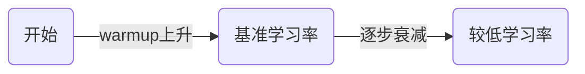

- 上图展示了学习率先warmup上升，后逐步衰减的典型曲线。
- 实际训练中，合理设置学习率及其变化策略对模型收敛和最终效果非常重要。

#### 批处理数量
- batch越大越好
- 能够帮助我们减少计算机资源的需求
- 样本数量量足够大就能避免小样本的过拟合问题

#### 批处理（Batch）与过拟合（Overfitting）
- 批处理（Batch）是指在训练神经网络时，将训练数据分成若干小批量（batch）进行模型参数的更新。每个batch包含若干样本，模型会在每个batch上计算损失和梯度，然后更新参数。
- 批处理的优点：
  - 提高计算效率，充分利用硬件资源（如GPU并行计算）。
  - 有助于模型收敛更稳定，减少每次更新的方差。
  - 可以通过调整batch size来平衡内存消耗和训练速度。
- batch越大，模型参数更新越平滑，但需要更多内存；batch越小，更新更频繁，可能带来更多噪声。

- 过拟合（Overfitting）是指模型在训练集上表现很好，但在新数据（测试集）上效果变差。原因是模型“记住”了训练数据的细节和噪声，失去了泛化能力。
- 过拟合的常见原因：
  - 训练样本数量太少，模型复杂度太高。
  - 没有合适的正则化手段。
- 批处理有助于缓解过拟合：
  - 较大的batch size可以让模型在每次更新时看到更多样本，减少对单一样本的依赖。
  - 但根本解决过拟合还需增加数据量、使用正则化（如Dropout、L2正则）、数据增强等方法。

#### 泛化能力（Generalization）
- 泛化能力是指模型在未见过的新数据（测试集或实际应用场景）上表现良好的能力。
- 一个具有良好泛化能力的模型，不仅能在训练集上取得好成绩，更能适应和预测新的、未见过的数据。
- 泛化能力强的模型可以有效避免过拟合，即不会只记住训练数据的细节和噪声，而是学到数据的本质规律。
- 提高模型泛化能力的常用方法：
  - 增加训练数据量，提升数据多样性。
  - 使用正则化技术（如L1/L2正则、Dropout等）。
  - 数据增强（如图像旋转、裁剪、噪声扰动等）。
  - 选择合适的模型复杂度，避免模型过于复杂。
  - 交叉验证等方法评估模型在不同数据上的表现。
- 总结：泛化能力是衡量机器学习模型优劣的核心标准之一，目标是让模型不仅在训练集上表现好，更能适应实际应用中的新数据。

#### 反向传播（Backpropagation）
- 反向传播是一种用于训练神经网络的核心算法，通过计算损失函数对每个参数的梯度，指导参数如何更新以最小化损失。
- 反向传播的核心思想是利用链式法则（Chain Rule）计算损失函数对每一层参数的梯度。
- 以一个简单的两层神经网络为例：
  - 假设输入 $x$，第一层权重 $W_1$，第二层权重 $W_2$，激活函数 $f$，输出 $y$，损失函数 $L$。
  - 前向传播：
    $h = f(W_1 x)$
    $\hat{y} = f(W_2 h)$
    $L = \text{Loss}(\hat{y}, y)$
  - 反向传播时，目标是计算 $\frac{\partial L}{\partial W_1}$ 和 $\frac{\partial L}{\partial W_2}$。
  - 利用链式法则：
    $\frac{\partial L}{\partial W_2} = \frac{\partial L}{\partial \hat{y}} \cdot \frac{\partial \hat{y}}{\partial W_2}$
    $\frac{\partial L}{\partial W_1} = \frac{\partial L}{\partial \hat{y}} \cdot \frac{\partial \hat{y}}{\partial h} \cdot \frac{\partial h}{\partial W_1}$
- 通过逐层递推，反向传播算法可以高效地计算出所有参数的梯度，用于参数更新。
- 公式总结：
  $\frac{\partial L}{\partial W} = \frac{\partial L}{\partial y} \cdot \frac{\partial y}{\partial W}$
- 这种链式求导的方式，使得深度神经网络的训练成为可能。

#### 卷积神经网络中误差信号的反向传递与权重更新机制

**1. 基本流程概述**
- 前向传播：输入数据经过卷积、激活、池化等层，输出预测结果。
- 损失计算：用损失函数衡量预测与真实标签的差异。
- 反向传播：逐层传递误差信号，计算每层参数的梯度。
- 参数更新：用优化算法（如SGD/Adam）更新权重。

**2. 误差信号的反向传递机制**
- 输出层：先计算损失函数对输出的梯度（∂L/∂y）。
- 卷积层：
  - 设输入为 $x$，卷积核为 $w$，输出为 $y$，激活函数为 $f$：
    - 前向：$y = f(x * w + b)$
    - 反向：
      - 先计算 $\frac{\partial L}{\partial y}$
      - 通过激活函数求 $\frac{\partial L}{\partial (x * w + b)}$
      - 通过卷积操作求 $\frac{\partial L}{\partial w}$ 和 $\frac{\partial L}{\partial x}$
- 卷积核权重的梯度：$\frac{\partial L}{\partial w} = x \star \delta$（$\star$ 表示互相关）
- 偏置的梯度：$\frac{\partial L}{\partial b} = \sum \delta$
- 输入的梯度：$\frac{\partial L}{\partial x} = \delta * w_{flip}$（$w_{flip}$为卷积核翻转）

**3. 公式推导**
- 设 $L$ 为损失，$y = x * w + b$，$\delta = \frac{\partial L}{\partial y}$
- $\frac{\partial L}{\partial w} = x \star \delta$
- $\frac{\partial L}{\partial b} = \sum \delta$
- $\frac{\partial L}{\partial x} = \delta * w_{flip}$

**4. 图示说明**


输入x  --卷积--->  y  --损失--->  L
   |                   ^
   |                   |
   |<--反向传播(δ)-----|
   |                   |
   |<--权重更新--------|

---

- 误差信号δ从损失函数反向传递，经过每一层的梯度计算，最终用于更新卷积核w和偏置b。

**5. 代码片段（PyTorch风格）**
```python
# 前向传播
y = F.conv2d(x, w, b)
loss = criterion(y, target)
# 反向传播
delta = loss.backward()
# w.grad, b.grad 即为梯度
optimizer.step()
```

**6. 参数更新**
- $w_{new} = w_{old} - \eta \frac{\partial L}{\partial w}$
- $b_{new} = b_{old} - \eta \frac{\partial L}{\partial b}$

**7. 总结**
- 误差信号通过链式法则逐层传递。
- 卷积层权重梯度由输入与误差信号的卷积得到。
- 参数通过梯度下降等方法更新。

---

（如需更详细的数学推导或更复杂的多通道/多层结构图示，可进一步补充。）

#### 神经网络结构图示

单层神经网络（感知机）：
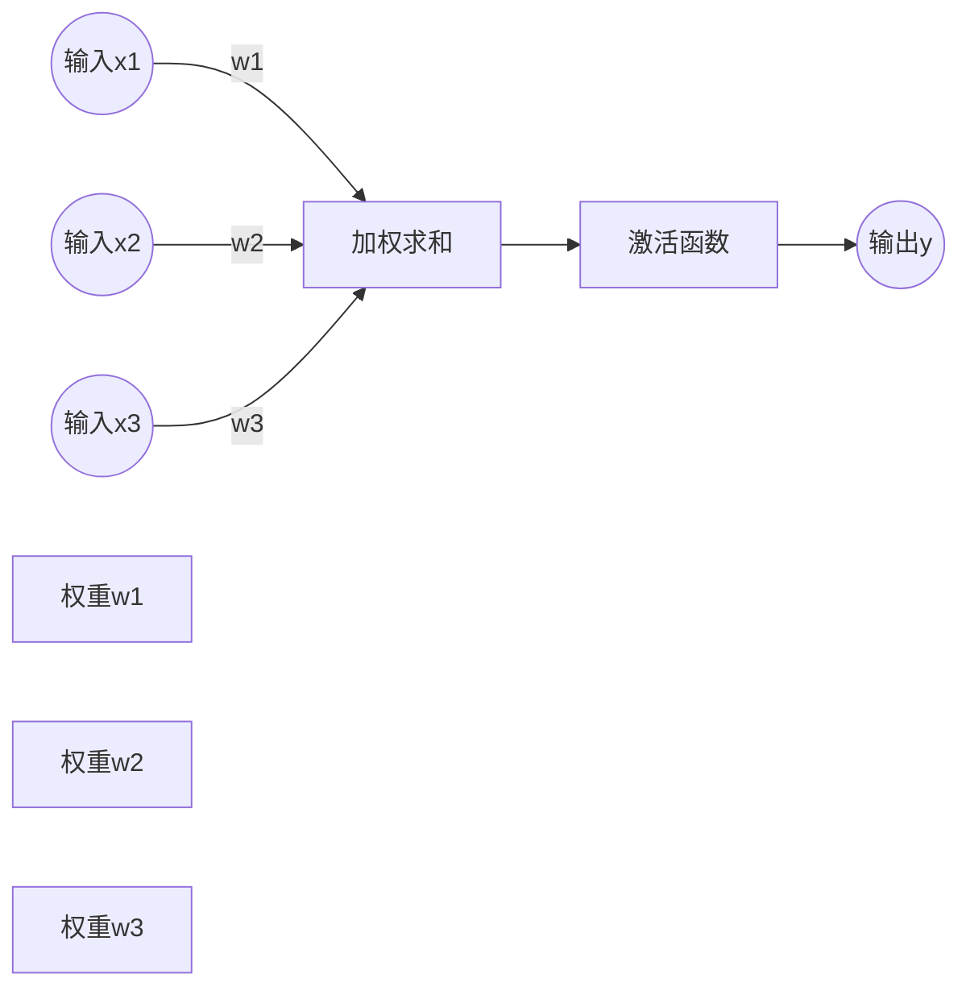

多层神经网络（多层感知机MLP）：
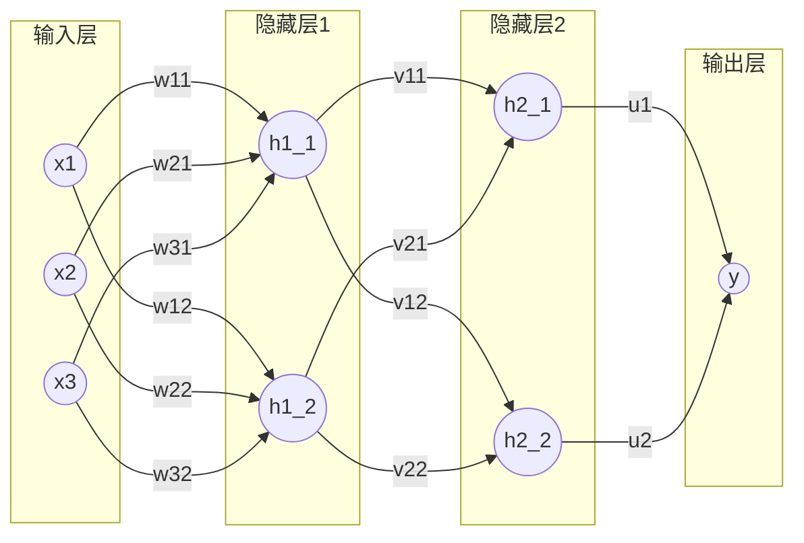

#### 神经网络的数据公式表达
- 以最简单的单层神经网络（感知机）为例：
  - 输入特征向量 $x = [x_1, x_2, ..., x_n]$
  - 权重向量 $w = [w_1, w_2, ..., w_n]$
  - 偏置 $b$
  - 输出 $y = w_1 x_1 + w_2 x_2 + ... + w_n x_n + b = w^T x + b$
  - 激活函数 $f$（如sigmoid、ReLU）：$\hat{y} = f(y)$

- 多层神经网络（以两层为例）：
  - 第一层：$h = f_1(W_1 x + b_1)$
  - 第二层：$\hat{y} = f_2(W_2 h + b_2)$
  - 其中 $W_1$、$W_2$ 是权重矩阵，$b_1$、$b_2$ 是偏置，$f_1$、$f_2$ 是激活函数

- 损失函数（以均方误差为例）：
  $L = \frac{1}{2}(\hat{y} - y_{true})^2$

- 梯度下降更新参数：
  $w \leftarrow w - \eta \frac{\partial L}{\partial w}$
  其中 $\eta$ 是学习率

- 机器学习的过程：
  1. 输入数据 $x$，前向传播计算输出 $\hat{y}$
  2. 计算损失 $L$
  3. 反向传播计算梯度 $\frac{\partial L}{\partial w}$
  4. 用梯度下降法更新参数 $w$
  5. 重复以上步骤，直到损失收敛

- 公式总结：
  - $\hat{y} = f(Wx + b)$
  - $L = \text{Loss}(\hat{y}, y_{true})$
  - $W \leftarrow W - \eta \frac{\partial L}{\partial W}$

- 通过这些公式，神经网络可以自动学习数据中的规律，实现分类、回归等任务。

#### 激活函数与投影解释
- 激活函数（Activation Function）是神经网络中用于引入非线性变换的函数，常见的有：
  - Sigmoid: $f(x) = \frac{1}{1 + e^{-x}}$
  - Tanh: $f(x) = \tanh(x)$
  - ReLU: $f(x) = \max(0, x)$
- 激活函数的作用是将线性变换 $Wx + b$ 的结果映射到一个新的空间，使神经网络能够拟合复杂的非线性关系。

- 对 $xW_1 + b_1$ 做投影：
  - $xW_1 + b_1$ 可以看作是将输入 $x$ 通过权重矩阵 $W_1$ 和偏置 $b_1$ 映射（投影）到新的特征空间（通常是隐藏层）。
  - 这种投影本质上是线性变换，将原始输入空间的数据“投影”到一个新的空间，提取更有用的特征。
  - 公式：$h = f(xW_1 + b_1)$，其中 $h$ 是隐藏层的输出。

- 直观理解：
  - $x$ 是原始输入，$W_1$ 决定了投影的方向和尺度，$b_1$ 决定了平移。
  - 激活函数 $f$ 再对投影结果进行非线性变换，增强模型表达能力。

- 总结：
  - $xW_1 + b_1$ 是对输入的线性投影，激活函数 $f$ 让神经网络能拟合更复杂的函数。

#### 常见激活函数进一步解释
- Sigmoid激活函数：
  - 公式：$f(x) = \frac{1}{1 + e^{-x}}$
  - 输出范围在(0, 1)，常用于二分类的输出层。
  - 特点：可以将输入“压缩”到0~1之间，适合概率输出，但在深层网络中容易出现梯度消失问题（输入绝对值较大时梯度趋近于0，导致参数难以更新）。

- ReLU激活函数（Rectified Linear Unit）：
  - 公式：$f(x) = \max(0, x)$
  - 输出范围为[0, +∞)，只保留正数部分，负数部分直接输出0。
  - 特点：
    - 计算简单，收敛速度快。
    - 有效缓解梯度消失问题，适合深层神经网络。
    - 具有“稀疏激活”特性：当输入为负时，输出为0，相当于该神经元在当前样本下不激活。

- ReLU如何淘汰无用数据：
  - 在训练过程中，输入为负的神经元输出恒为0，这些神经元对当前样本的前向传播和反向传播都没有贡献，相当于被“屏蔽”或“淘汰”。
  - 这种机制让网络自动忽略对当前任务无用的特征或噪声，提高了模型的稀疏性和泛化能力。
  - 但如果某些神经元长期输出为0，可能导致“神经元死亡”现象（即永远不激活），需要合理初始化权重和设置学习率。

- 总结：
  - Sigmoid适合输出概率，但深层网络易梯度消失。
  - ReLU高效、稀疏、能自动淘汰无用特征，是现代深度学习的主流激活函数。

这里面的x、h1、h2都是权重组合，但机器学习存在的问题是一个不可解释的黑盒子
特征是不是越多越好？特征增加了会带来什么问题？
cs.stanford.edu/people/karparthy/convertjs/demo/classfy2d.html
开源的代码，不仅仅需要源码、权重，还需要初始化权重，才能得到我们想要的结果。大模型有训练好的初始化权重，所以大模型对于机器学习来说好用

- 离群点会导致神经网络学习错误，但机器学习不知道它是离群点，因为过拟合导致在应用的时候判断错误。所以学习的数据质量或人工往里面注入垃圾数据会导致过拟合，如何解决该问题？

- 离群点（outlier）和低质量数据会影响神经网络的训练，导致模型过拟合甚至学习到错误的规律。
- 解决方法：
  1. 数据清洗：在训练前对数据进行统计分析，剔除或修正异常值、离群点和明显错误的数据。
  2. 增加数据量：收集更多高质量、真实分布的数据，减少离群点对整体模型的影响。
  3. 数据增强：通过旋转、裁剪、加噪声等方式扩充数据集，提高模型鲁棒性。
  4. 正则化：如L1/L2正则、Dropout等，防止模型过度拟合离群点。
  5. 鲁棒损失函数：采用对离群点不敏感的损失函数（如Huber loss等）。
  6. 交叉验证：用多组数据评估模型，及时发现因离群点导致的过拟合。
- 总结：提升数据质量、合理清洗和增强数据、采用正则化和鲁棒方法，是防止离群点和垃圾数据导致过拟合的有效手段。

#### 正则化惩罚进一步解释
- 正则化（Regularization）是一种防止模型过拟合的技术，通过在损失函数中加入“惩罚项”来约束模型参数。惩罚权重比较大的数据，求所有权重的平方和，把平方和加到损失上，则可以排除损失大的权重参数
- 常见正则化方式：
  - L1正则化（Lasso）：惩罚项为参数绝对值之和
    $L_{total} = L_{data} + \lambda \sum_i |w_i|$
    - 作用：促使部分权重变为0，实现特征选择，模型更稀疏。
  - L2正则化（Ridge）：惩罚项为参数平方和
    $L_{total} = L_{data} + \lambda \sum_i w_i^2$
    - 作用：抑制权重过大，让模型更平滑，提升泛化能力。
- 其中 $L_{data}$ 是原始损失（如均方误差、交叉熵），$\lambda$ 是正则化系数，控制惩罚强度。

- 简明例子：
  - 假设有线性回归 $y = wx + b$，损失函数为均方误差：
    $L_{data} = (y_{true} - (wx + b))^2$
  - 加L2正则化后：
    $L_{total} = (y_{true} - (wx + b))^2 + \lambda w^2$
  - 这样即使模型能完美拟合训练数据，若$w$过大也会被惩罚，促使模型选择更小的权重，防止过拟合。

- 总结：正则化通过惩罚过大的参数，让模型更简单、更健壮，是深度学习防止过拟合的常用手段。

#### Dropout机制与过拟合的防治

- **过拟合**是神经网络训练中常见的问题，表现为模型在训练集上表现很好，但在新数据上效果变差，原因是模型“记住”了训练数据的细节和噪声。

**Dropout机制原理：**
- Dropout是一种简单有效的正则化方法，通过在训练过程中“随机杀死”部分神经元（即将其输出暂时置为0），防止模型对某些特征或神经元过度依赖。
- 每次前向传播时，按照设定概率$p$（如0.5）随机将一部分神经元的输出置零。
- 这样每次训练都相当于在不同的“子网络”上训练，模型无法依赖某一部分特征，增强了模型的泛化能力。

**Dropout的作用：**
- 防止神经元之间的“共适应”，减少对局部特征的依赖。
- 等价于对神经网络进行集成（ensemble），提升泛化能力。
- 简单易用，常用于全连接层，也可用于卷积层。

**训练与推理的区别：**
- 训练时：Dropout随机丢弃神经元。
- 推理（测试）时：不丢弃神经元，但需将输出乘以保留概率$p$，保证输出期望一致。

**Python代码示例（PyTorch）：**
```python
import torch.nn as nn
layer = nn.Sequential(
    nn.Linear(128, 64),
    nn.ReLU(),
    nn.Dropout(p=0.5),  # 以50%概率随机丢弃神经元
    nn.Linear(64, 10)
)
```
---

**Mermaid图示：**
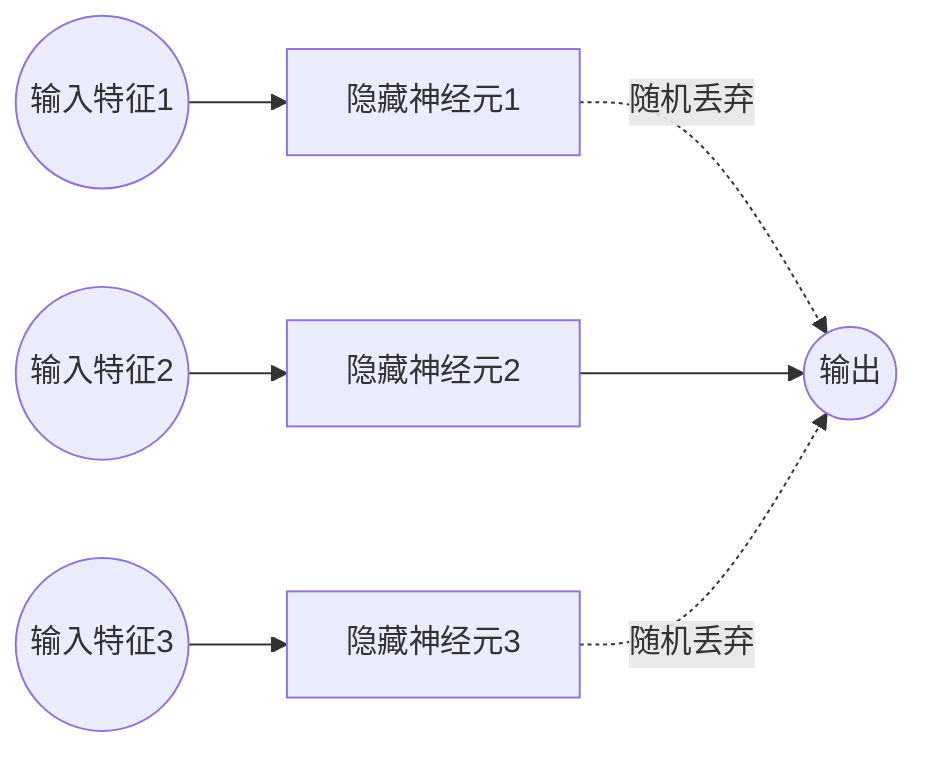

- 总结：Dropout通过训练时随机丢弃部分神经元，有效防止过拟合，是深度学习中常用的正则化手段。

#### 梯度截断（Gradient Clipping）
- 梯度截断是一种防止神经网络训练过程中梯度爆炸（即梯度值过大，导致参数更新过大，模型发散）的技术。权重越小越好，越稳定越好。
- 原理：当反向传播计算得到的梯度超过设定阈值时，将其“截断”到阈值范围内，防止梯度过大。
- 常见做法：
  - 按元素截断：将每个梯度元素限制在[-threshold, threshold]区间。如果梯度超过threshold，则截断为threshold。
  - 按范数截断：如果梯度向量的L2范数大于阈值，则按比例缩小梯度，使其范数等于阈值。
    - 公式：$g \leftarrow g \cdot \frac{\text{threshold}}{\|g\|}$（当$\|g\| > \text{threshold}$时）
- 应用场景：
  - 常用于循环神经网络（RNN）等深层网络，防止训练不稳定。
- 总结：梯度截断能有效防止梯度爆炸，保证模型训练过程的稳定性。

#### 数据预处理及其对模型效果的影响
- 数据预处理是指在模型训练前，对原始数据进行清洗、转换和规范化等操作，以提升数据质量和模型效果。
- 数据预处理不仅仅是在模型训练前对原始数据进行清洗和转换，在网络模型的学习和推理过程中也常常需要进行预处理和后处理。
- 训练过程中的预处理：
  1. 动态数据增强：如每个epoch/每个batch随机裁剪、旋转、加噪声等，提升模型鲁棒性。
  2. 在线归一化/标准化：如BatchNorm、LayerNorm等在网络内部对特征进行归一化，帮助模型更快收敛、提升稳定性。
  3. 特征变换：如对输入特征做log变换、分桶、嵌入等，提升特征表达能力。
- 推理（预测）过程中的预处理：
  - 输入数据需与训练时采用相同的预处理流程（如归一化、编码等），保证模型输入分布一致。
- 总结：数据预处理不仅仅是训练前的准备工作，训练和推理过程中也需要动态或同步的预处理，才能保证模型效果和泛化能力。每层都需要做标准化，不做不行。
- 常见的数据预处理方法：
  1. 缺失值处理：填充、删除或用统计值（均值/中位数）替换缺失数据。
  2. 异常值处理：检测并剔除或修正离群点，防止极端值影响模型。
  3. 特征缩放：如归一化（Min-Max）、标准化（Z-score），让各特征在相同尺度，提升模型收敛速度和效果。
  4. 编码处理：将类别型数据转换为数值型（如One-Hot编码、Label Encoding）。
  5. 特征构造与选择：根据业务和数据分布，构造新特征或筛选有用特征，去除冗余和无关特征。
  6. 数据去重、文本分词、去停用词等针对不同数据类型的处理。

- 数据预处理对模型效果的影响：
  - 预处理不当（如未标准化、未处理异常值）会导致模型训练困难、收敛慢、泛化能力差，甚至模型失效。
  - 合理预处理能提升数据质量，减少噪声和偏差，让模型更容易学习到数据的本质规律。
  - 不同预处理方式对同一模型的效果影响很大，甚至决定模型能否成功应用。

- 如何用好数据预处理：
  1. 结合数据分布和业务理解，选择合适的预处理方法。
  2. 在训练集和测试集上采用相同的预处理流程，防止数据泄漏。
  3. 充分分析数据，针对不同特征采用不同策略，避免“一刀切”。
  4. 通过交叉验证等方式评估不同预处理方案对模型效果的影响。

- 总结：数据预处理是机器学习成败的关键环节，合理的预处理能极大提升模型效果，反之则可能导致模型失效。

#### 大模型对数据量和多样性的需求及解决思路
- 随着模型规模（神经元和参数数量）增大，模型表达能力更强，但也更容易过拟合，需要更多、更丰富的数据进行训练。
- 主要矛盾：大模型需要大量且多样性高的数据，但现实中高质量、多样性的数据难以获取。
- 解决思路：
  1. 数据增强：通过旋转、缩放、裁剪、加噪声等方式扩充现有数据集，提升数据多样性。
  2. 合成数据：利用仿真、生成模型（如GAN）等方法自动生成新样本，弥补真实数据的不足。
  3. 多任务学习：让模型在多个相关任务上共同训练，提升泛化能力，间接增加数据多样性。
  4. 迁移学习：先用大规模通用数据预训练模型，再用少量特定领域数据微调，充分利用已有知识。
  5. 联邦学习/数据共享：多方协作共享数据或模型参数，扩大数据覆盖范围，保护隐私。
  6. 主动学习：让模型主动挑选最有价值的数据进行标注，提升数据利用效率。
- 总结：通过数据增强、合成、迁移学习等多种手段，可以在有限数据下提升大模型的泛化能力，缓解对大规模多样性数据的依赖。

#### 梯度下降举例说明
- 梯度下降（Gradient Descent）是一种常用的优化算法，用于最小化损失函数，找到模型参数的最优解。
- 直观理解：就像在山地中寻找最低点，每次沿着当前斜率（梯度）的反方向走一步，逐步接近最低点。

- 以一元线性回归为例：
  - 假设损失函数 $L(w) = (wx - y)^2$，目标是找到使损失最小的 $w$。
  - 梯度为 $\frac{\partial L}{\partial w} = 2x(wx - y)$。
  - 梯度下降更新公式：$w \leftarrow w - \eta \frac{\partial L}{\partial w}$，其中 $\eta$ 是学习率。

- Python代码示例：
```python
import numpy as np
import matplotlib.pyplot as plt

def loss(w):
    x, y = 2, 4
    return (w * x - y) ** 2

def grad(w):
    x, y = 2, 4
    return 2 * x * (w * x - y)

w = 0.0
lr = 0.1
ws, ls = [w], [loss(w)]
for i in range(10):
    w = w - lr * grad(w)
    ws.append(w)
    ls.append(loss(w))

plt.plot(ws, ls, marker='o')
plt.xlabel('w')
plt.ylabel('Loss')
plt.title('Gradient Descent Trajectory')
plt.show()
```

- 上图展示了参数 $w$ 如何在梯度下降过程中逐步逼近损失函数的最小值。

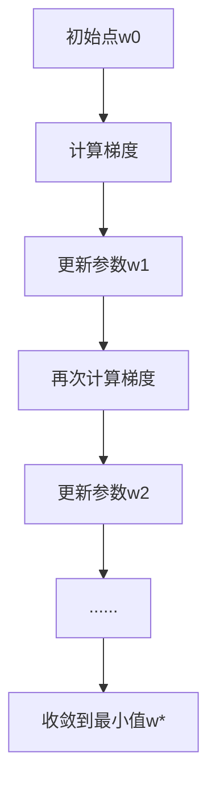

- 总结：梯度下降通过不断沿着损失函数的下降方向更新参数，最终找到最优解，是深度学习训练的核心方法。

梯度下降举例说明

- 假设我们有一个简单的二次函数损失 $L(w) = (w-3)^2$，目标是找到使损失最小的 $w$。
- 梯度下降的思想是：每次沿着损失函数关于参数 $w$ 的负梯度方向更新 $w$，逐步逼近最优解。
- 公式：$w_{new} = w_{old} - \eta \frac{dL}{dw}$，其中 $\eta$ 是学习率。

**举例：**
- 初始 $w=0$，学习率 $\eta=0.1$。
- 第1步：$\frac{dL}{dw} = 2(w-3) = 2(0-3) = -6$，$w_{new} = 0 - 0.1 \times (-6) = 0.6$
- 第2步：$\frac{dL}{dw} = 2(0.6-3) = -4.8$，$w_{new} = 0.6 - 0.1 \times (-4.8) = 1.08$
- 如此迭代，$w$ 会逐步接近3，损失最小。

**Python代码可视化：**
```python
import numpy as np
import matplotlib.pyplot as plt

# 损失函数和梯度
def loss(w):
    return (w - 3) ** 2

def grad(w):
    return 2 * (w - 3)

w = 0
lr = 0.1
ws = [w]
for i inrange(10):
    w = w - lr * grad(w)
    ws.append(w)

x = np.linspace(-1, 5, 100)
plt.plot(x, loss(x), label='Loss Curve')
plt.scatter(ws, [loss(wi) for wi in ws], color='red', label='GD Steps')
plt.xlabel('w')
plt.ylabel('Loss')
plt.title('Gradient Descent Example')
plt.legend()
plt.show()
```

**Mermaid图示：**
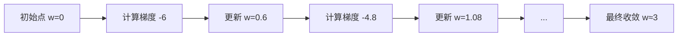

- 上述例子展示了梯度下降如何通过多次迭代，逐步逼近损失函数的最小值。

#### 梯度下降中的动量（Momentum）/惯性

- **动量（Momentum）** 是对标准梯度下降法的改进，借鉴了物理中的惯性原理。其核心思想是：参数更新时不仅考虑当前的梯度，还叠加上一次更新的“惯性”，让优化过程更平滑、更快。
- 物理类比：就像小球在山谷中滚动，带有惯性，遇到小的阻力或震荡时能更快冲过，减少来回震荡。

**动量梯度下降公式：**
- 设 $v$ 为速度（动量项），$\gamma$ 为动量系数（常取0.9），$\eta$ 为学习率：
  - $v_{t+1} = \gamma v_t + \eta \nabla L(w_t)$
  - $w_{t+1} = w_t - v_{t+1}$
- 其中 $v$ 会累积之前的梯度信息，使参数更新方向更稳定。

**动量的作用：**
- 加快收敛速度，尤其是在狭长谷地或曲面上，能减少“锯齿”式震荡。
- 有助于跳出局部最优。
- 但动量过大可能导致发散，需要合理设置 $\gamma$。

**Python代码示例：**
```python
import numpy as np
import matplotlib.pyplot as plt

def loss(w):
    return (w - 3) ** 2

def grad(w):
    return 2 * (w - 3)

w = 0
lr = 0.1
momentum = 0.9
v = 0
ws = [w]
for i in range(10):
    v = momentum * v + lr * grad(w)
    w = w - v
    ws.append(w)

x = np.linspace(-1, 5, 100)
plt.plot(x, loss(x), label='Loss Curve')
plt.scatter(ws, [loss(wi) for wi in ws], color='green', label='Momentum Steps')
plt.xlabel('w')
plt.ylabel('Loss')
plt.title('Gradient Descent with Momentum')
plt.legend()
plt.show()
```

**Mermaid图示：**
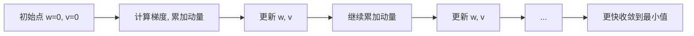

- 动量法通过累积历史梯度，能更快、更平滑地收敛到最优解，是深度学习优化常用技巧。

#### 参数初始化及其策略

- **参数初始化**是指在神经网络训练开始前，为每一层的权重和偏置赋予初始值。良好的初始化有助于模型快速收敛，避免梯度消失或爆炸。

**1. 为什么参数初始化很重要？**
- 如果所有参数都初始化为0，所有神经元的梯度和输出都一样，无法学习到多样特征（称为“对称性破坏”）。
- 初始化过大或过小会导致前向/反向传播时激活值或梯度迅速变大（爆炸）或变小（消失），影响训练。

**2. 常见的随机初始化策略**
- **均匀分布/高斯分布初始化**：
  - 权重 $w \sim \mathcal{U}(-a, a)$ 或 $w \sim \mathcal{N}(0, \sigma^2)$，其中 $a$ 和 $\sigma$ 需根据网络层输入/输出规模调整。
- **Xavier（Glorot）初始化**：
  - 适用于Sigmoid/Tanh等激活函数。
  - $w \sim \mathcal{U}\left(-\sqrt{\frac{6}{n_{in}+n_{out}}, \sqrt{\frac{6}{n_{in}+n_{out}}}\right)$
  - 或 $w \sim \mathcal{N}\left(0, \frac{2}{n_{in}+n_{out}}\right)$
  - 其中 $n_{in}$、$n_{out}$ 分别为输入和输出单元数。
- **He初始化**：
  - 适用于ReLU激活函数。
  - $w \sim \mathcal{N}\left(0, \frac{2}{n_{in}}\right)$ 或 $w \sim \mathcal{U}\left(-\sqrt{\frac{6}{n_{in}}}, \sqrt{\frac{6}{n_{in}}}\right)$
- **偏置b** 通常初始化为0或很小的常数。

**3. 不良初始化的危害**
- 权重过大：激活值/梯度爆炸，训练不稳定。
- 权重过小：激活值/梯度消失，网络难以学习。
- 全零初始化：神经元无差异，无法学习。

**4. 如何更好地进行参数初始化？**
- 选择与激活函数匹配的初始化方法（如ReLU用He，Sigmoid/Tanh用Xavier）。
- 保证每层输出的方差与输入方差相近，避免信号在网络中逐层放大或缩小。
- 对于深层网络，建议采用框架自带的初始化方法（如PyTorch、TensorFlow等均已内置）。

**5. 利用预训练模型进行参数初始化**
- 预训练模型（如ImageNet上的ResNet、BERT等）已在大规模数据上训练好权重。
- 在新任务中，直接加载预训练权重作为初始化，称为“迁移学习”。
- 优势：
  - 加快收敛速度，减少训练时间。
  - 显著提升小样本任务的效果。
  - 充分利用已有知识，提升泛化能力。
- 工程实践：
  - 加载预训练模型参数后，可选择“微调”（finetune）全部参数，或只训练最后几层。

**简明举例（PyTorch）：**
```python
import torch.nn as nn
# Xavier初始化
nn.init.xavier_uniform_(layer.weight)
# He初始化
nn.init.kaiming_normal_(layer.weight, nonlinearity='relu')
# 加载预训练模型
from torchvision import models
model = models.resnet18(pretrained=True)
```

- 总结：合理的参数初始化是深度学习成功训练的关键，推荐优先采用与激活函数匹配的初始化方法，或直接利用预训练模型权重。

#### 过拟合问题的系统化解决方法与对比

**一、常见解决过拟合的方法**
1. **增加数据量与多样性**
   - 通过收集更多样本、数据增强（如旋转、裁剪、加噪声等）提升模型泛化能力。
   - 优点：根本性提升泛化能力，适用于所有模型。
   - 缺点：数据收集成本高，部分场景难以获得更多数据。

2. **正则化（Regularization）**
   - L1正则化：促使部分权重为0，实现特征选择，模型更稀疏。
   - L2正则化：抑制权重过大，让模型更平滑。
   - 优点：实现简单，适用于大多数神经网络和线性模型。
   - 缺点：正则化系数需调优，过强可能欠拟合。

3. **Dropout机制**
   - 训练时随机丢弃部分神经元，防止神经元间共适应。
   - 优点：实现简单，显著提升深度网络泛化能力。
   - 缺点：推理时需调整输出，过高dropout率可能导致欠拟合。

4. **提前停止（Early Stopping）**
   - 在验证集损失不再下降时提前终止训练，防止模型在训练集上过度拟合。
   - 优点：无需修改模型结构，简单有效。
   - 缺点：需预留验证集，训练过程需监控。

5. **模型简化/降维**
   - 降低模型复杂度（如减少层数、神经元数），或通过特征选择/降维（PCA等）减少输入特征。
   - 优点：降低过拟合风险，提升模型可解释性。
   - 缺点：可能损失部分表达能力。

6. **数据清洗与异常值处理**
   - 剔除离群点、错误数据，提升数据质量。
   - 优点：提升模型鲁棒性，减少噪声影响。
   - 缺点：需人工分析，部分异常难以识别。

7. **集成学习（Ensemble）**
   - 结合多个模型结果（如Bagging、Boosting、Stacking），提升泛化能力。
   - 优点：显著提升效果，降低单模型过拟合风险。
   - 缺点：计算资源消耗大，部署复杂。

8. **迁移学习与预训练模型**
   - 利用大规模数据上预训练的模型权重，微调于新任务。
   - 优点：小样本场景下效果显著，收敛快。
   - 缺点：需有合适的预训练模型，部分领域适用性有限。

**二、方法对比与适用场景**
| 方法         | 优点                   | 缺点                   | 适用场景           |
|--------------|------------------------|------------------------|--------------------|
| 增加数据量   | 根本提升泛化能力       | 成本高，难获取         | 所有模型           |
| 正则化       | 简单通用，易实现       | 需调参，过强欠拟合     | 神经网络/线性模型  |
| Dropout      | 深度网络效果好         | 过高欠拟合，推理需调整 | 深度神经网络       |
| EarlyStopping| 简单有效，无需改结构   | 需验证集，监控训练     | 所有模型           |
| 模型简化     | 降低风险，易解释       | 表达能力下降           |特征多/模型复杂场景 |
| 数据清洗     | 提升鲁棒性             | 需人工，难自动化       |数据质量不高场景    |
| 集成学习     | 效果提升显著           | 资源消耗大，复杂       |高精度需求场景      |
| 迁移学习     | 小样本效果好           | 需预训练模型           |小样本/新领域       |

**三、实际工程中系统化防止过拟合的建议**
1. **优先保证数据质量和多样性**：数据是基础，优先清洗异常、增强多样性。
2. **合理选择模型复杂度**：根据数据量和任务难度选择合适的模型结构，避免过深或过宽。
3. **常规正则化与Dropout并用**：L2正则+Dropout是深度学习常用组合。
4. **动态监控训练过程**：采用Early Stopping，防止训练过度。
5. **充分利用迁移学习**：小样本任务优先考虑预训练模型。
6. **必要时采用集成方法**：对精度要求极高时可用集成学习。
7. **多方法结合**：实际工程中常需多种手段协同，综合提升泛化能力。

- 总结：过拟合防治需从数据、模型、训练、正则化等多方面系统考虑，结合实际场景灵活选用和组合多种方法，才能获得最优泛化效果。

#### 卷积神经网络（CNN, Convolutional Neural Network）系统化说明

**1. 基本概念**
- 卷积神经网络（CNN）是一类专门用于处理具有类似网格结构的数据（如图像、语音等）的深度学习模型。
- CNN通过卷积操作自动提取局部特征，广泛应用于图像分类、目标检测、语音识别等领域。

https://plantdraw2.samlab.cn/


**2. 核心结构与原理**
- **卷积层（Convolutional Layer）**：
  - 通过卷积核（filter）在输入数据上滑动，提取局部空间特征。
  - 每个卷积核学习到不同的特征（如边缘、纹理等）。
  - 卷积操作公式：$Y(i, j) = \sum_{m,n} X(i+m, j+n) \cdot K(m, n)$，其中$K$为卷积核。
- **激活函数（Activation）**：
  - 常用ReLU，增加非线性表达能力。
- **池化层（Pooling Layer）**：
  - 降采样操作，常用最大池化（Max Pooling）或平均池化（Average Pooling），减少特征维度，提升平移不变性。
- **全连接层（Fully Connected, FC）**：
  - 将卷积/池化后的特征展平成向量，进行最终分类或回归。
- **归一化层（如BatchNorm）**：
  - 加速收敛，提升稳定性。

**3. 典型结构示意**
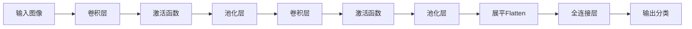

**4. CNN的优势与特点**
- 局部感受野：每个神经元只关注输入的一小块区域，能有效捕捉局部特征。
- 权重共享：同一卷积核在不同位置共享参数，大幅减少模型参数量。
- 平移不变性：通过池化和卷积操作，模型对输入的平移、变形具有较强鲁棒性。
- 自动特征提取：无需手工设计特征，网络可自动学习多层次特征。

**5. 常见CNN结构举例**
- LeNet-5：早期手写数字识别网络，结构简单。
- AlexNet：首次在ImageNet大赛中大幅超越传统方法，推动深度学习发展。
- VGGNet：使用大量3x3小卷积核，结构深且规则。
- ResNet：引入残差连接，极大缓解深层网络训练难题。

**6. Python代码简例（PyTorch）**
```python
import torch.nn as nn
class SimpleCNN(nn.Module):
    def __init__(self):
        super().__init__()
        self.conv1 = nn.Conv2d(3, 16, 3, padding=1)
        self.pool = nn.MaxPool2d(2, 2)
        self.conv2 = nn.Conv2d(16, 32, 3, padding=1)
        self.fc = nn.Linear(32 * 8 * 8, 10)
    def forward(self, x):
        x = self.pool(nn.ReLU()(self.conv1(x)))
        x = self.pool(nn.ReLU()(self.conv2(x)))
        x = x.view(x.size(0), -1)
        x = self.fc(x)
        return x
```

**7. 工程实践建议**
- 输入数据需归一化，提升训练稳定性。
- 合理选择卷积核大小、步幅、池化方式，防止特征过度丢失。
- 可结合BatchNorm、Dropout等提升泛化能力。
- 深层网络建议采用残差结构（ResNet）防止梯度消失。

- 总结：CNN通过卷积、池化等机制高效提取空间特征，是计算机视觉等任务的主流模型。

#### CNN中的参数共享机制系统化解释
- **参数共享（Weight Sharing）**：
  - 在卷积神经网络（CNN）中，卷积核（滤波器）在输入的不同空间位置滑动时，使用同一组权重参数。
  - 这种机制意味着同一个卷积核在整张图像（或特征图）上重复应用，极大减少了模型参数数量。
  - 参数共享让CNN能够自动学习空间局部特征，并具有平移不变性（即特征在不同位置都能被检测到）。
- **优点**：
  - 显著降低模型复杂度和内存消耗，便于训练大规模模型。
  - 提升泛化能力，减少过拟合风险。
  - 适合处理具有空间结构的数据（如图像、语音等）。

#### RNN、CNN、Transformer等神经网络的异同与特点对比

| 特性/模型   | CNN（卷积神经网络）      | RNN（循环神经网络）      | Transformer           |
|-------------|------------------------|------------------------|-----------------------|
| 适用数据    | 图像、局部结构         | 序列、时序             | 序列、图像、跨模态    |
| 依赖建模    | 局部空间               | 时间/顺序               | 全局（任意位置）      |
| 参数共享    | 卷积核全局共享         | 时间步参数共享         | 层内参数共享          |
| 并行能力    | 高                     | 低（递归）             | 高（全并行）          |
| 长距离依赖  | 弱                     | 难（梯度消失/爆炸）     | 强（自注意力）        |
| 结构特点    | 卷积+池化              | 递归/门控单元           | 多头注意力+前馈网络   |
| 训练效率    | 高                     | 低                     | 高                    |
| 代表任务    | 图像分类、检测         | 语音识别、文本生成       | 机器翻译、NLP、CV等   |

- **CNN特点**：参数共享、局部感受野、适合空间结构、并行高效。
- **RNN特点**：时间步递归、参数共享、适合时序建模、难以并行。
- **Transformer特点**：自注意力全局建模、强并行、适合长依赖和多模态任务。

#### 卷积神经网络（CNN）与传统神经网络（全连接网络/MLP）的系统化比较

**1. 结构与原理对比**
- **传统神经网络（MLP/全连接网络）**：
  - 每一层的每个神经元与上一层所有神经元全连接。
  - 结构简单，参数量大，缺乏空间结构建模能力。
- **卷积神经网络（CNN）**：
  - 采用卷积层、池化层等结构，局部连接、权重共享。
  - 能自动提取局部空间特征，参数量大幅减少。

**2. 优势与劣势对比**
| 方面         | 传统神经网络（MLP）         | 卷积神经网络（CNN）           |
|--------------|----------------------------|-------------------------------|
| 参数量       | 非常大，易过拟合           | 显著减少，易于训练            |
| 空间结构建模 | 无法建模空间/局部关系       | 能捕捉空间/局部特征           |
| 权重共享     | 无，参数冗余                | 有，提升泛化能力              |
| 平移不变性   | 差                         | 好（池化/卷积带来不变性）      |
| 计算效率     | 低，资源消耗大              | 高，适合大规模数据             |
| 特征提取     | 需手工设计                  | 自动学习多层次特征            |
| 适用数据类型 | 一维向量（表格、信号等）    | 网格/图像/时空结构数据         |
| 解释性       | 较强（小模型）              | 较弱（深层网络为黑盒）         |

**3. 应用场景对比**
- **传统神经网络（MLP）**：
  - 适用于结构化数据（如表格、金融、传感器信号等），小型分类/回归任务。
  - 特征间无空间关系或空间关系不重要的场景。
- **卷积神经网络（CNN）**：
  - 适用于图像、视频、语音、医学影像等具有空间或时空结构的数据。
  - 主要应用于图像分类、目标检测、分割、视频分析、语音识别等领域。

**4. 总结**
- CNN通过局部连接和权重共享，极大提升了对空间结构数据的建模能力，是视觉等领域的主流模型。
- 传统神经网络适合结构化、无空间结构的数据。
- 实际工程中，需根据数据类型和任务需求选择合适的网络结构。

### 多层CNN结构与各层功能图示

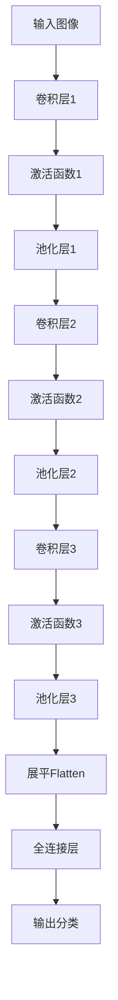

- **卷积层（Convolution）**：提取局部空间特征，参数共享，增强模型对空间结构的感知。
- **池化层（Pooling）**：降采样，减少特征维度，提升平移不变性。
- **转换层（Flatten/Reshape）**：将多维特征展平成一维向量，便于后续全连接层处理。
- **全连接层（Fully Connected）**：综合所有特征，输出最终分类或回归结果。

### 多层卷积效果变差的原因与解决办法
- **问题**：多层卷积堆叠后，可能出现梯度消失、特征退化、训练困难等现象，导致效果变差。
- **解决办法**：
  1. **残差连接（Residual Connection, ResNet）**：在卷积层间引入跳跃连接，直接传递输入特征，缓解退化和梯度消失。
  2. **批归一化（BatchNorm）**：规范化每层输出，稳定训练过程。
  3. **合理初始化和激活函数**：如ReLU、He初始化，提升深层网络训练效果。
  4. **堆叠时引入1x1卷积、瓶颈结构**：减少参数量，提升表达能力。
  5. **适当增加数据和正则化**：防止过拟合。
- **工程建议**：采用ResNet、DenseNet等成熟深层结构，堆叠多层时引入残差或密集连接，保证深度提升时模型性能至少不比原来差。

#### 视觉识别

- 视觉的算法已经很成熟了，很多开源的库已经做很好了
- 视觉识别主要做的是数据打标签完成数据标注
- 一张图4毛钱打标签

##### 案例分析：如何在上海石化工厂识别人员抽烟和喝酒——视觉识别系统化解决方案

1. **问题定义与需求分析**
   - 目标：自动识别工厂内人员是否存在抽烟、喝酒等违规行为，保障安全生产。
   - 难点：场景复杂、人员动作多样、遮挡、光照变化、目标小等。

2. **数据采集与标注**
   - 部署高清摄像头，采集工厂内不同区域、时段的视频数据。
   - 手工标注抽烟、喝酒等行为的图像/视频片段，形成高质量数据集。
   - 数据增强：旋转、裁剪、加噪声、不同光照等，提升模型鲁棒性。

3. **模型选择与设计**
   - **目标检测模型**：如YOLO、Faster R-CNN等，检测人员及手部、烟、酒瓶等关键物体。
   - **行为识别模型**：结合时序信息（如3D CNN、时序卷积、Transformer等），识别抽烟、喝酒等动作。
   - **多模态融合**：可结合人体姿态估计、物体检测结果，提升识别准确率。

4. **系统流程**
   - (1) 人员检测与跟踪：定位工厂内所有人员，跟踪其行为轨迹。
   - (2) 关键物体检测：检测手部、烟、酒瓶等物体。
   - (3) 行为识别：分析手部与烟/酒瓶的空间关系、动作时序，判断是否为抽烟/喝酒。
   - (4) 告警与记录：识别到违规行为后，自动告警并记录视频片段。

5. **工程实践建议**
   - 采用高分辨率摄像头，保证细节可见。
   - 持续采集和标注新数据，定期优化模型。
   - 结合多角度、多摄像头信息，提升检测鲁棒性。
   - 加强隐私保护与合规性设计。

6. **可视化流程图（Mermaid）**
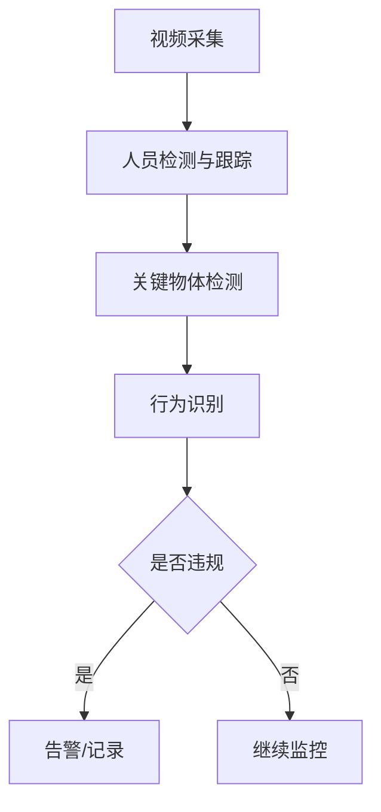

7. **总结**
- 通过“目标检测+行为识别+多模态融合”构建端到端视觉识别系统，可有效识别工厂内抽烟、喝酒等违规行为，提升安全管理智能化水平。

##### 石化行业模型迁移的可行性、挑战与通用性实现思路

1. **模型迁移的可行性**
- 可以将上海石化训练好的视觉识别模型迁移到新的石化行业场景，但直接迁移往往面临通用性和适应性挑战。

2. **主要挑战**
- **场景差异**：不同工厂的环境、摄像头角度、光照、背景、人员服饰等存在差异，影响模型泛化。
- **目标差异**：新场景中抽烟、喝酒等动作的表现形式、物体外观可能不同。
- **数据分布偏移**：新场景数据分布与原场景不同，导致模型性能下降（Domain Shift）。
- **标签不一致**：新场景可能有新的违规行为类别或标签标准。
- **硬件与部署环境差异**：摄像头分辨率、帧率、部署算力等不同，影响模型推理效果。

3. **实现模型通用性的解决思路**
- **数据层面**：
  - 在新场景采集少量有代表性的数据，进行标注，形成“小样本适应集”。
  - 采用数据增强、风格迁移等方法提升数据多样性。
- **模型层面**：
  - 利用迁移学习（Transfer Learning）：加载上海石化模型权重，在新场景数据上微调（finetune），快速适应新环境。
  - 采用领域自适应（Domain Adaptation）技术，缩小源域与目标域分布差异。
  - 多源融合：结合多个工厂的数据训练更通用的模型。
- **工程与部署层面**：
  - 设计灵活的模型输入预处理流程，适配不同摄像头和环境。
  - 持续采集新场景数据，定期增量训练和模型更新。

4. **可视化流程图（Mermaid）**
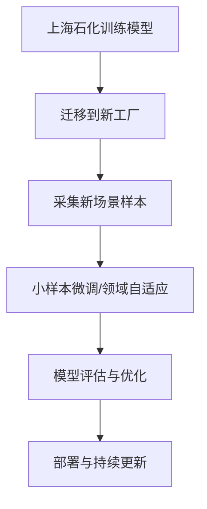

5. **总结**
- 迁移学习和领域自适应是提升模型通用性的核心手段。通过在新场景采集少量数据并微调模型，可大幅提升模型在不同石化工厂的适应性和鲁棒性，实现模型的快速迁移和通用部署。

#### RNN、Transformer整体架构与word2vec、端到端概念系统化介绍

**1. RNN（循环神经网络）整体架构**
- RNN是一类用于处理序列数据（如文本、语音、时间序列等）的神经网络。
- 结构特点：
  - 网络在时间维度上递归，每个时刻的输出依赖于当前输入和上一个时刻的隐藏状态。
  - 公式：$h_t = f(W_{xh}x_t + W_{hh}h_{t-1} + b)$，$y_t = W_{hy}h_t + c$
  - 适合建模时序依赖，如语言建模、机器翻译等。
- 局限：
  - 长序列训练时易出现梯度消失/爆炸。
  - 变体：LSTM、GRU等，通过门控机制缓解长依赖问题。

#### Transformer中的Encoder-Decoder结构与Attention机制系统化介绍

**1. Encoder-Decoder整体流程**
- Transformer采用Encoder-Decoder架构，广泛用于机器翻译、文本生成等任务。
- **Encoder（编码器）**：
  - 输入原始序列（如句子），通过多层自注意力和前馈网络，提取序列的深层特征表示。
  - 输出为一组上下文相关的特征向量（隐藏状态）。
- **Decoder（解码器）**：
  - 以Encoder输出的特征为条件，结合已生成的目标序列，逐步预测下一个输出。
  - 每一步都能关注输入序列的不同部分，实现条件生成。

**2. Attention机制原理**
- Attention（注意力）机制是Transformer的核心，能让模型动态关注输入序列中与当前任务最相关的部分。
- **自注意力（Self-Attention）**：
  - 输入序列的每个位置都能与其他所有位置建立联系，捕捉全局依赖。
  - 计算方式：
    - 对每个输入向量，分别映射为Query（Q）、Key（K）、Value（V）。
    - 相关性分数：$score = Q \cdot K^T / \sqrt{d_k}$
    - 权重归一化（Softmax），再加权求和得到输出：$Attention(Q, K, V) = softmax(score) \cdot V$
- **多头注意力（Multi-Head Attention）**：
  - 并行计算多个不同的注意力子空间，提升模型表达能力。

**3. Encoder-Decoder Attention**
- Decoder中既有自注意力（关注已生成序列），也有Encoder-Decoder Attention（关注输入特征）。
- Decoder每一步根据已生成内容和Encoder特征，动态选择关注输入的哪些部分，实现条件生成。

**4. 典型流程Mermaid图**
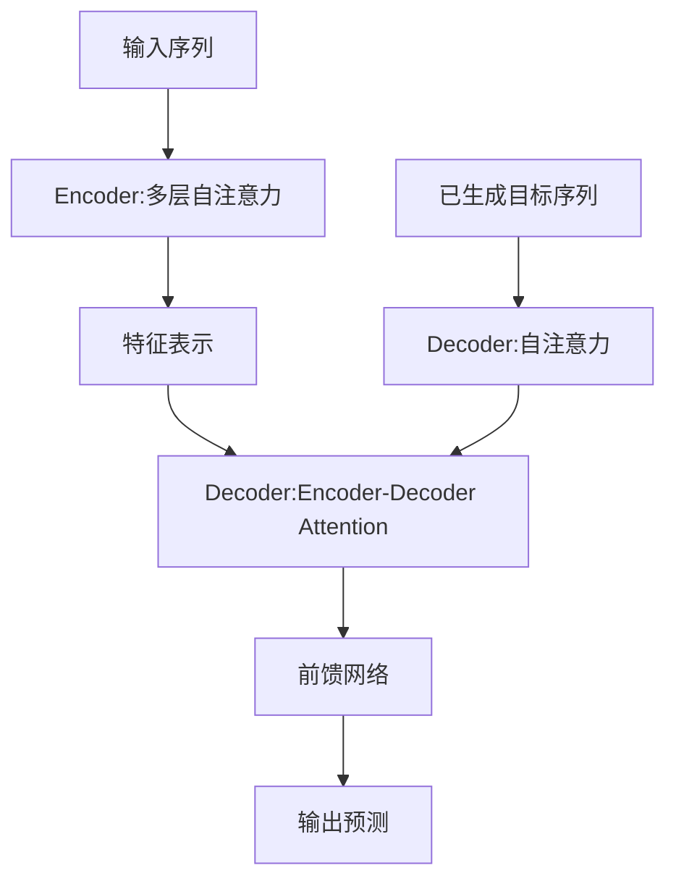

**5. 总结**
- Transformer通过Encoder提取输入特征，再用Decoder结合注意力机制预测新数据，实现高效的序列到序列建模。
- Attention机制让模型能动态聚焦最相关的信息，是提升长距离依赖建模和生成能力的关键。

#### Self-Attention（自注意力）计算方法与图形化讲解

**1. Self-Attention计算步骤**
- 输入：一个序列的特征向量（如句子中每个词的嵌入）。
- 步骤：
  1. 对每个输入向量$x_i$，分别通过线性变换得到Query（Q）、Key（K）、Value（V）：
     - $Q_i = W^Q x_i$
     - $K_i = W^K x_i$
     - $V_i = W^V x_i$
  2. 计算每个Query与所有Key的相似度（如点积）：
     - $score_{ij} = Q_i \cdot K_j^T$
  3. 对分数进行缩放（除以$\sqrt{d_k}$，$d_k$为Key的维度，用来做平均化，保证不同维度的向量内积结果具有可比性），再用Softmax归一化，得到权重：
     - $\alpha_{ij} = softmax_j(score_{ij}/\sqrt{d_k})$
  4. 用权重对所有Value加权求和，得到输出：
     - $z_i = \sum_j \alpha_{ij} V_j$
- 每个输出$z_i$都融合了全序列的信息，权重反映了各位置对当前输出的贡献。

**2. Self-Attention结构图（Mermaid）**
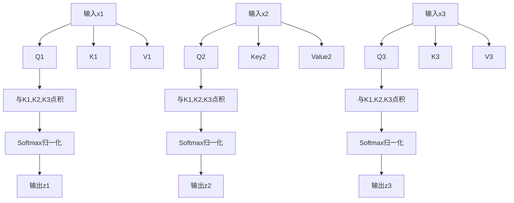

**3. 总结**
- Self-Attention通过Query、Key、Value机制，让每个位置都能动态关注全序列的关键信息，实现信息的全局融合和权重分配，是Self-Attention的核心计算单元。

#### Self-Attention中的Queries、Keys、Values的作用与关系

**1. 三个辅助向量的作用**
- **Query（查询向量）**：表示当前需要“提问”或“关注”信息的目标（如当前词）。
- **Key（键向量）**：为每个输入位置提供“被检索”的特征，代表序列中每个元素的内容特征。
- **Value（值向量）**：为每个输入位置提供最终要被加权汇总的信息内容。

**2. 计算流程与关系**
- 对于序列中每个位置$i$，用其Query与所有位置的Key计算相似度（如点积），得到一组权重（注意力分数）。
- 用这些权重对所有Value加权求和，得到该位置的输出。
- 公式：
  - $score_{ij} = Q_i \cdot K_j^T$
  - $\alpha_{ij} = softmax_j(score_{ij})$
  - $z_i = \sum_{j=1}^3 \alpha_{ij} V_j$
- 关系总结：
  - Query决定“我要关注什么”，Key决定“我能被关注到什么”，Value决定“我能贡献什么信息”。
  - Query和Key共同决定注意力分配，Value决定信息融合内容。

**3. 图形化关系说明（Mermaid）**
```mermaid
flowchart LR
    subgraph 输入序列
      X1[输入1] X2[输入2] X3[输入3]
    end
    X1 --> Q1[Query1] & K1[Key1] & V1[Value1]
    X2 --> Q2[Query2] & K2[Key2] & V2[Value2]
    X3 --> Q3[Query3] & K3[K3] & V3[V3]
    Q1 --与所有Key点积--> S1[权重分配]
    S1 --加权所有Value--> Z1[输出1]
    Q2 --与所有Key点积--> S2[权重分配]
    S2 --加权所有Value--> Z2[输出2]
    Q3 --与所有Key点积--> S3[权重分配]
    S3 --加权所有Value--> Z3[输出3]
```

**4. 总结**
- Queries、Keys、Values三者协作，让每个位置都能动态聚合全局信息，实现灵活的信息流动和全局依赖建模，是Self-Attention的核心机制。

#### Transformer中Q、K、V矩阵的训练与计算样例

**1. Q、K、V矩阵的训练方式**
- Q（Query）、K（Key）、V（Value）矩阵是通过神经网络中的可学习参数（权重矩阵）与输入特征线性变换得到的。
- 训练过程：
  - Q、K、V的权重矩阵（$W^Q, W^K, W^V$）在模型训练时与其他参数一起，通过反向传播和梯度下降自动优化。
  - 损失函数（如交叉熵）对最终输出有影响，误差信号会反向传递到Q、K、V的权重矩阵，更新其参数。

**2. 具体计算样例说明**
- 假设输入序列有3个词，每个词的嵌入向量维度为4：
  - $X = [x_1, x_2, x_3]$，每个$x_i$为$1\times4$向量
- Q、K、V的权重矩阵均为$4\times4$，初始化为可学习参数。

- 计算步骤：
  1. 线性变换：
     - $Q = X \cdot W^Q$
     - $K = X \cdot W^K$
     - $V = X \cdot W^V$
  2. 计算注意力分数（以第1个词为例）：
     - $score_{1j} = Q_1 \cdot K_j^T / \sqrt{d_k}$，$j=1,2,3$
  3. Softmax归一化得到权重：
     - $\alpha_{1j} = softmax_j(score_{1j})$
  4. 加权求和得到输出：
     - $z_1 = \sum_{j=1}^3 \alpha_{1j} V_j$

**3. Python伪代码样例**
```python
import numpy as np
import torch.nn.functional as F

# 假设输入序列X shape: (3, 4)
X = np.array([[1,2,3,4], [2,3,4,5], [3,4,5,6]])
WQ = np.random.randn(4,4)
WK = np.random.randn(4,4)
WV = np.random.randn(4,4)
Q = X @ WQ  # (3,4)
K = X @ WK  # (3,4)
V = X @ WV  # (3,4)
# 计算注意力分数
scores = Q @ K.T / np.sqrt(4)  # (3,3)
weights = np.exp(scores) / np.exp(scores).sum(axis=1, keepdims=True)  # softmax
Z = weights @ V  # (3,4)
```

**4. 总结**
- Q、K、V矩阵的权重通过训练自动优化，计算过程包括线性变换、相关性打分、softmax归一化和加权求和，最终实现信息融合和动态关注。

#### Multi-Head Attention（多头注意力）机制系统化解释

**1. 概念与原理**
- Multi-Head Attention是Transformer的核心机制之一。
- 它指的是：在同一层中并行地执行多组独立的Self-Attention，每组称为一个“头”（head）。
- 每个头有独立的Q、K、V权重矩阵，能在不同的子空间学习不同的特征关系。

**2. 计算流程**
- 输入序列通过多个不同的Q、K、V线性变换，分别计算多个注意力输出（每个head一个）。
- 所有head的输出在特征维度上拼接（concat），再通过一个线性变换融合，得到最终输出。
- 公式：
  - $head_i = Attention(QW^Q_i, KW^K_i, VW^V_i)$
  - $MultiHead(Q,K,V) = Concat(head_1,...,head_h)W^O$

**3. 用途与优势**
- 多头机制让模型能在不同的子空间、不同角度捕捉序列中多样化的依赖关系（如语法、语义、位置等）。
- 提升模型表达能力和鲁棒性，避免单一注意力头的局限。
- 支持并行计算，提升效率。

**4. 用法举例（PyTorch）**
```python
import torch.nn as nn
mha = nn.MultiheadAttention(embed_dim=512, num_heads=8)
output, attn_weights = mha(query, key, value)
```

**5. 图形化说明（Mermaid）**
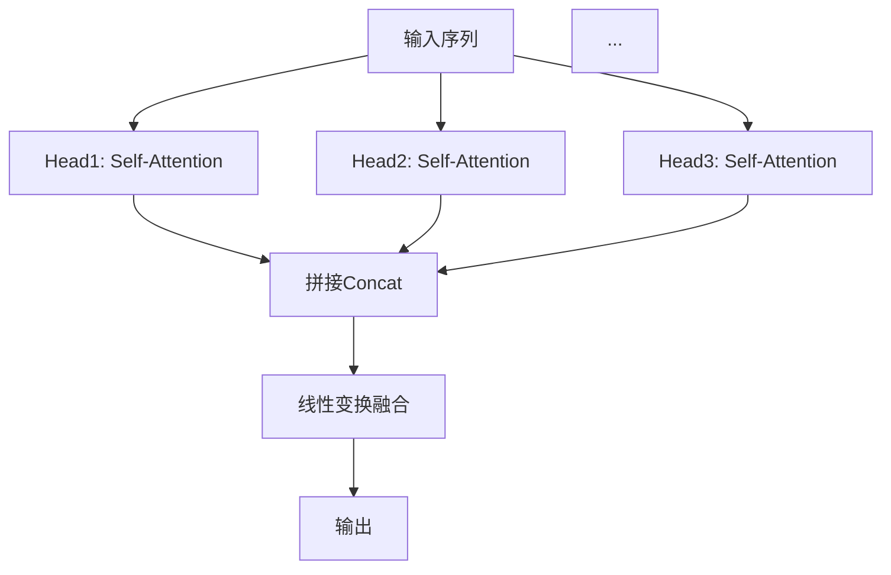

**6. 总结**
- Multi-Head Attention通过多组并行注意力机制，让模型能同时关注信息的不同方面，是Transformer强大建模能力的关键。


### Deformable Attention（可变形注意力）系统化原理、公式、图示与稀疏注意力对比

#### 1. 原理简介
Deformable Attention是一种动态、可学习采样点的稀疏注意力机制。与标准自注意力对所有位置全局加权不同，Deformable Attention只在一组动态预测的关键采样点上聚合信息，这些采样点的位置和权重均可通过神经网络自适应学习。

#### 2. 公式推导
- 对于每个Query位置$p$，预测$M$个采样偏移$\Delta p_m$和权重$w_m$：
  $$
  \text{DeformAttn}(Q, K, V) = \sum_{m=1}^M w_m \cdot V(p + \Delta p_m)
  $$
- 采样点$\Delta p_m$和权重$w_m$均由神经网络端到端学习。
- 采样点可为连续坐标（如图像空间的亚像素位置），通过双线性插值获得特征值。

#### 3. 结构图示（Mermaid）
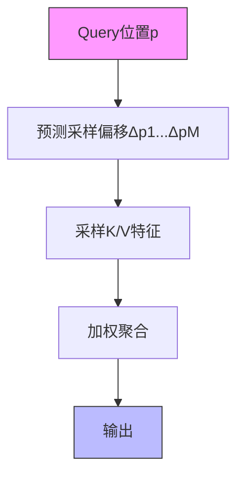

#### 4. 与稀疏注意力的对比
| 机制           | 稀疏注意力（Sparse Attention） | Deformable Attention（可变形注意力） |
|----------------|-------------------------------|--------------------------------------|
| 采样点选择     | 固定（如窗口、分块、规则采样） | 动态、可学习、输入自适应             |
| 采样点位置     | 离散、规则                     | 连续、可为亚像素/任意位置            |
| 计算效率       | 高                             | 高                                   |
| 表达能力       | 局部/全局混合，有限            | 可自适应捕捉关键区域，表达更灵活      |
| 典型应用       | NLP长文本、时序、图结构        | 视觉检测、时序建模、图结构            |

#### 5. 主要用途
- **视觉检测/分割**：如Deformable DETR，能自适应关注目标边缘、关键区域，提升检测精度和效率。
- **时序建模**：聚焦关键时间点，适应非均匀采样、长依赖等问题。
- **图神经网络**：动态选择邻居节点，提升结构建模能力。
- **大规模数据建模**：降低计算复杂度，提升模型对稀疏/局部特征的捕捉能力。

#### 6. 总结
- Deformable Attention是稀疏注意力的动态、可学习升级版，兼具高效性和灵活性。
- 适用于需要自适应关注关键区域/时刻的复杂结构数据建模。

---

## 稀释注意力机制（Sparse Attention）

### 1. 原理
- 标准注意力机制（如Transformer的Self-Attention）对所有Token两两计算注意力，计算复杂度为$O(N^2)$，N为序列长度。
- 稀释注意力机制通过只计算部分Token之间的注意力（如局部窗口、分块、随机采样等），将复杂度降低到$O(N)$或$O(N\log N)$，大幅提升效率。
- 常见稀释方式：
  - 局部窗口注意力（只关注邻近Token）
  - 分块注意力（序列分块，每块内部全连接）
  - 随机稀疏/滑动窗口/全局+局部混合

### 2. 能解决的问题
- 主要解决长序列下注意力计算资源消耗过大、显存溢出、训练速度慢等问题。
- 使Transformer等模型可扩展到更长输入，适用于NLP、CV、时序分析等。

### 3. 具体使用方法与工程建议
- 选择合适稀疏模式：如局部窗口适合有强局部相关性的任务，分块适合结构化数据，混合模式适合需要全局信息的场景。
- 典型实现：Longformer、BigBird、Sparse Transformer等开源模型均实现了稀释注意力。
- PyTorch代码示例（局部窗口稀疏注意力）：
  ```python
  import torch
  import torch.nn.functional as F

  def local_window_attention(q, k, v, window_size=3):
      # q, k, v: [batch, seq_len, dim]
      seq_len = q.size(1)
      output = []
      for i in range(seq_len):
          left = max(0, i - window_size)
          right = min(seq_len, i + window_size + 1)
          attn_scores = torch.matmul(q[:, i:i+1, :], k[:, left:right, :].transpose(-2, -1)) / (q.size(-1) ** 0.5)
          attn_weights = F.softmax(attn_scores, dim=-1)
          attn_output = torch.matmul(attn_weights, v[:, left:right, :])
          output.append(attn_output)
      return torch.cat(output, dim=1)
  ```
- 工程建议：优先使用社区成熟实现（如HuggingFace Transformers的Longformer/BigBird），根据任务和硬件资源调整稀疏策略。

### 4. Mermaid结构图示例
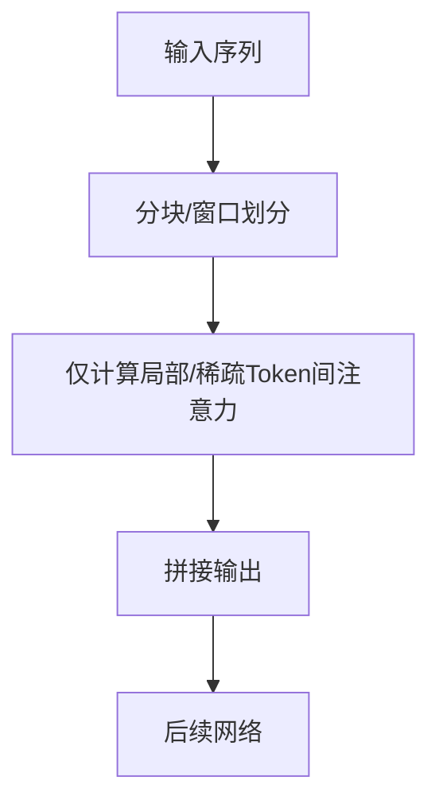

### 5. 常见问题与对比
- 稀释注意力会牺牲部分全局信息，但通过混合全局/局部、引入全局Token等方式可缓解。
- 适合长序列任务，短序列下收益有限。

## 多层Self-Attention特征提取机制

### 1. 原理
- 多层Self-Attention（如多层Transformer Encoder堆叠）可逐层提取序列特征。
- 每层Self-Attention捕捉全局依赖，低层关注基础/局部特征，高层抽象复杂全局特征。
- 类似于CNN的多层卷积，但Self-Attention能直接建模任意位置间关系。

### 2. 优势
- 全局建模能力强，层层递进可捕捉复杂长距离依赖。
- 多层结构可学习多粒度、多层次特征，表达能力强。
- 灵活适应变长序列和多模态输入。
- 支持并行计算，训练效率高。

### 3. 能解决的问题
- 长距离依赖难题：有效捕捉远距离Token间关系，优于RNN。
- 特征表达不足：多层堆叠提取更抽象、更判别力特征。
- 适应复杂任务：如机器翻译、文本理解、图像识别等。

### 4. 工程建议
- 层数可根据任务复杂度和数据规模调整，常见为6~24层。
- 结合残差连接、LayerNorm等提升训练稳定性和效果。

### 5. Mermaid结构图
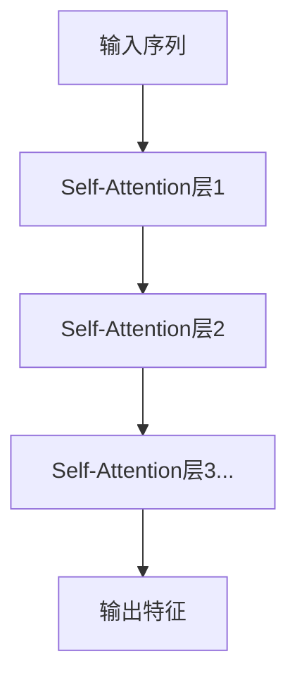

## Transformer中的位置信息表达与解决方案

### 1. 问题：Transformer对文本位置不敏感
- Self-Attention机制本身不区分Token顺序，导致模型无法直接感知输入序列的位置信息。
- 这会影响模型对语序、上下文等依赖顺序的任务表现。

### 2. 解决方法：位置编码（Positional Encoding）
- 在输入Embedding中加入位置编码，使每个Token的表示包含其位置信息。
- 位置编码有两种主流方式：
  - 绝对位置编码（如正弦-余弦编码，Sinusoidal）
  - 可学习的位置编码（Learnable Positional Embedding）

#### 2.1 正弦-余弦位置编码（Sinusoidal Positional Encoding）
- 公式如下：
  $$
  PE_{(pos,2i)} = \sin(pos/10000^{2i/d_{model}})
  $$
  $$
  PE_{(pos,2i+1)} = \cos(pos/10000^{2i/d_{model}})
  $$
  其中 $pos$ 为位置，$i$ 为维度索引，$d_{model}$ 为Embedding维度。
- 这种编码方式能表达绝对和相对位置信息，且无需训练。

#### 2.2 可学习的位置编码
- 直接为每个位置分配一个可训练的向量，随模型训练自动优化。
- 适合固定长度输入，灵活性高。

### 3. 信息位置表达的实现方法
- 将位置编码与Token Embedding相加或拼接，作为Transformer的输入。
- 代码示例（PyTorch）：
  ```python
  # 假设x为[batch, seq_len, d_model]的Token Embedding
  x = x + positional_encoding[:x.size(1), :]
  ```

### 4. Mermaid结构图
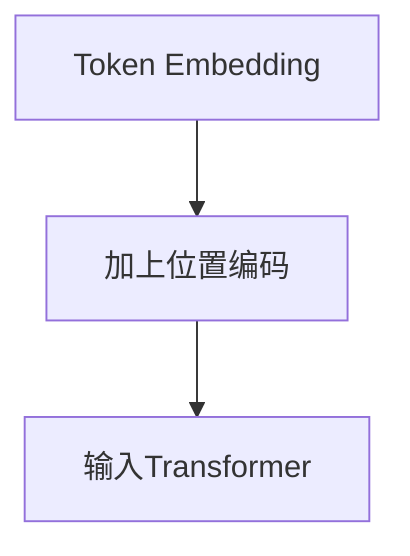

### 5. 工程建议
- NLP任务一般直接采用加法方式注入位置编码。
- 对于变长序列或需要相对位置信息的任务，可采用相对位置编码（如Transformer-XL、T5等）。

## 多种位置编码的融合与Patch划分应用

### 1. 多种位置编码的融合方式
- 可将不同来源的位置信息（如绝对位置、相对位置、周期性/季节性、时间戳等）分别编码为向量，与Token Embedding融合。
- 融合方法：
  - 加法融合：多种位置编码与Token Embedding逐元素相加，适合维度一致。
  - 拼接融合（Concat）：拼接后通过线性变换映射到模型输入维度。
  - 加权融合：为不同类型的位置编码分配可学习权重，模型自动调整各类位置信息的重要性。
- 工程建议：
  - 有周期性/季节性特征的数据可引入周期性正弦/余弦编码或节假日等特殊标记。
  - 多重结构数据（如文本+时间、图像+空间）可分别编码后融合。

#### 代码示例（多种位置编码加权融合，PyTorch伪代码）
```python
# token_embed, abs_pos_embed, rel_pos_embed, seasonal_embed: [batch, seq_len, d_model]
alpha, beta, gamma = nn.Parameter(torch.ones(3))  # 可学习权重
x = token_embed + alpha * abs_pos_embed + beta * rel_pos_embed + gamma * seasonal_embed
```

### 2. Patch划分与位置编码在不同场景的应用

#### 2.1 图像场景（如ViT/视觉Transformer）
- 图像切分为若干Patch，每个Patch展平成向量，作为一个“Token”。
- 每个Patch分配一个位置编码（绝对/相对/二维编码），表达其空间位置。
- Patch Embedding与位置编码相加后输入Encoder。
- 位置编码可采用二维正弦-余弦编码、可学习二维Embedding等。

#### 2.2 时间序列场景
- 长时间序列切分为多个Patch（如滑动窗口），每个Patch作为一个Token。
- Patch可包含时间戳、周期性（如日/周/月）、节假日等多种位置编码。
- Patch Embedding与多种位置编码融合后输入Encoder。
- 适合捕捉局部与全局的时序特征。

#### 2.3 文本场景
- 传统文本为每个Token分配位置编码。
- 有层次结构的文本可引入多级位置编码（如句内、句间、段落内等）。

### 3. Mermaid结构图示例
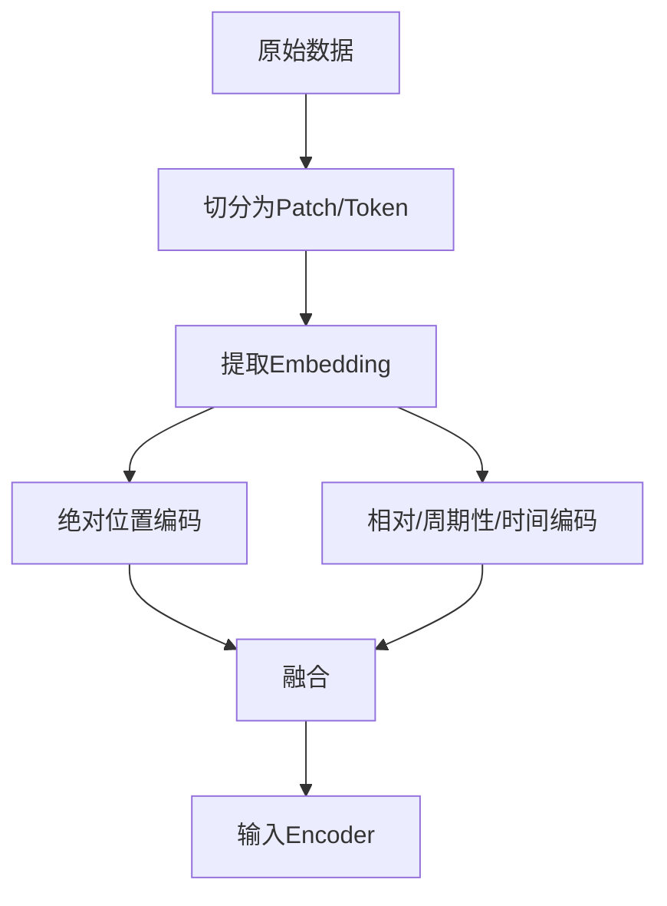

### 4. 工程建议
- 多种位置编码可提升模型对复杂结构和时序/空间特征的建模能力。
- 选择合适的融合方式（加法、拼接、加权）和编码类型，结合任务需求与数据特点。
- 对于图像、时间序列等Patch结构，建议采用二维/多维位置编码。

## Transformer结合标签数据的特征提取与多模态无人驾驶应用

### 1. Transformer如何通过标签数据进行特征提取
- 标签数据（如目标类别、驾驶行为、障碍物类型等）用于监督训练，指导Transformer学习输入特征与目标之间的映射关系。
- 训练时，模型通过最小化预测输出与标签的损失（如交叉熵、MSE等），自动提取对任务有判别力的高维特征。
- 标签不仅可用于分类/回归，还可用于多任务学习（如同时预测物体类别、位置、驾驶决策等）。

### 2. 多模态无人驾驶场景下的特征融合与高维投影

#### 2.1 多摄像头视频信息的高维特征投影
- 多个摄像头采集的二维视频帧，先通过CNN等网络提取每帧的空间特征（如ResNet、ConvNeXt等）。
- 每个摄像头的特征可视为一个“Token”或“Patch”，输入到Transformer中。
- Transformer通过Self-Attention机制融合不同摄像头、不同视角的空间信息，将多源二维特征投影到统一的高维特征空间，实现全局感知。
- 这种高维特征空间便于后续智能驾驶决策（如障碍物检测、路径规划、行为预测等）。

#### 2.2 多模态数据融合
- 除视频外，还可融合激光雷达、毫米波雷达、GPS、IMU等多维传感器数据。
- 各模态特征通过独立网络提取后，拼接或加权融合，统一输入Transformer进行全局建模。
- 标签数据可同时指导多模态特征的联合优化。

#### 2.3 时序建模与前后时间尺度计算
- Transformer可处理序列数据，将连续时刻的多模态特征作为序列输入，利用Self-Attention建模前后时刻的依赖关系。
- 这样不仅能捕捉当前帧信息，还能理解历史与未来趋势（如车辆运动轨迹、动态障碍物预测等）。
- 可采用时序Patch划分+位置编码，提升时序建模能力。

### 3. 结构化流程Mermaid图
```mermaid
graph TD
    A1[多摄像头视频帧] --> B1[空间特征提取（CNN）]
    A2[激光雷达等传感器] --> B2[特征提取]
    B1 --> C[特征融合/拼接]
    B2 --> C
    C --> D[时序Patch划分+位置编码]
    D --> E[Transformer建模]
    E --> F[高维特征空间]
    F --> G[智能驾驶决策]
    G --> H[标签监督训练]
```

### 4. 工程建议
- 多模态特征建议先归一化/对齐时间戳，保证同步。
- 空间特征建议采用主流CNN，时序建模建议采用时序Transformer或带时序位置编码的ViT。
- 标签设计应覆盖多任务（如检测、分割、行为预测），提升模型泛化能力。
- 可采用端到端训练，标签直接指导高维特征空间的优化。

##### Decorder机制
系统化讲解Decoder（解码器）如何进行预测、特征提取方式的灵活性及其解决方案，并从机器翻译扩展到复杂场景，详细说明查询向量Q的初始化、与Encoder的K/V的交互，以及Decoder中的Self-Attention和Cross-Attention机制。内容如下，并将结构化补充进《培训笔记.md》文档末尾。

Transformer Decoder预测与特征提取机制
1. 基础场景：机器翻译中的Decoder预测流程
输入：Decoder通常以“起始符”或上一个时刻的预测结果作为输入，逐步生成目标序列（如翻译句子）。
特征提取：Decoder每一步都根据当前输入、历史已生成内容和Encoder输出的上下文特征，动态提取特征并预测下一个Token。
预测流程：
初始化Q（查询向量），通常为当前时刻的输入Embedding或上一步输出。
通过Self-Attention机制，提取已生成序列的内部依赖。
通过Cross-Attention机制，将Q与Encoder输出的K/V进行交互，融合源语言上下文。
经过Feed Forward层和线性变换，输出下一个Token的概率分布。
选取概率最高的Token作为下一个输入，循环上述过程，直到生成终止符。
2. Decoder特征提取方式的灵活性与解决方案
灵活性来源：Decoder每一步的输入、历史状态、注意力权重都可动态变化，特征提取方式不唯一。
解决方案：
采用多层堆叠、残差连接、LayerNorm等结构，提升特征表达能力和稳定性。
结合多头注意力机制，捕捉多粒度、多角度的特征。
在复杂场景（如多模态生成、对话系统）中，可引入额外的上下文、外部知识或多源信息，丰富特征提取方式。
3. 查询向量Q的初始化与权重计算
Q的初始化：
在Self-Attention中，Q通常由当前Decoder输入（Embedding或上一步输出）生成。
在Cross-Attention中，Q为Decoder当前层的输出，K/V为Encoder输出。
与Encoder的K/V交互：
Decoder的Q需与Encoder所有K/V进行注意力计算，得到融合源语言上下文的新权重向量。
这种机制保证了目标序列生成时能动态关注源序列的不同部分，提升生成质量。
4. Decoder中的两种注意力机制详解
4.1 Self-Attention（自注意力）
作用：建模已生成目标序列内部的依赖关系，捕捉历史Token间的上下文。
特点：采用掩码（Mask），防止模型看到未来信息（即只关注当前位置及之前的Token）。
公式与Encoder类似，但加了Mask。
4.2 Cross-Attention（交叉注意力）
作用：将Decoder当前状态与Encoder输出的上下文特征融合，实现源-目标序列的信息交互。
机制：Q来自Decoder，K/V来自Encoder输出。
使Decoder能动态关注源序列的不同部分，提升生成质量。
5. Mermaid结构图
```mermaid
flowchart TD
    A[Decoder输入/上一步输出] --> B[Self-Attention (带Mask)]
    B --> C[Cross-Attention (与Encoder输出K/V)]
    C --> D[Feed Forward & 线性变换]
    D --> E[预测下一个Token]
    E --> F[作为下一个输入，循环]
```

6. 工程建议
简单场景（如机器翻译）可直接采用标准Decoder结构。
复杂场景可引入多源信息、外部知识、动态掩码等机制，提升特征提取能力。
Q/K/V的初始化和交互方式可根据任务需求灵活调整。

### Decoder中的Mask机制与终止字符

#### 1. Mask机制介绍
- 在Transformer的Decoder中，Self-Attention层采用了“掩码（Mask）”机制。
- 作用：防止模型在生成序列时看到未来的信息（即当前位置之后的Token），保证每一步的预测只依赖于已生成的内容。
- 实现方式：对注意力分数矩阵进行上三角遮挡（mask），将未来位置的分数设为负无穷，使Softmax后权重为0。
- 公式：
  - $\text{MaskedAttention}(Q, K, V) = \text{softmax}(\frac{QK^T}{\sqrt{d_k}} + M) V$
  - 其中$M$为mask矩阵，未来位置为$-\infty$，当前及之前为0。
- 工程意义：
  - 保证自回归生成的正确性，防止信息泄漏。
  - 支持并行训练时的正确依赖关系。

#### 2. Mask机制能解决的问题
- 防止模型在生成下一个Token时“偷看”未来的目标序列，保证生成的合理性和泛化能力。
- 支持自回归（Auto-Regressive）生成，适用于机器翻译、文本生成等任务。

#### 3. End of Sentence（终止字符）设置
- 终止字符（如<eos>、[SEP]、[END]等）用于指示序列生成的结束。
- 设置方式：
  - 在目标词表中专门分配一个Token作为终止符。
  - 训练时，目标序列末尾加上终止符，模型学习在合适时机输出该Token。
  - 推理/生成时，遇到终止符即停止生成。
- 工程建议：
  - 终止符应与任务和数据集一致（如NLP常用<eos>，对话系统可用[END]等）。
  - 训练数据需保证每条样本都包含终止符。

## DETR（Detection Transformer）系统化解读

### 1. 概念
- DETR（Detection Transformer）是Facebook提出的一种端到端目标检测方法，将目标检测任务转化为序列到序列的预测问题。
- 它将Transformer架构（Encoder-Decoder）引入目标检测，省略了传统检测中的锚框（anchor）、NMS（非极大值抑制）等复杂后处理，直接输出目标边界框和类别。

### 2. 用法与具体用途
- 用法：输入一张图像，经过CNN（如ResNet）提取特征后，送入Transformer Encoder-Decoder结构。
  - Encoder：对整张图像的特征进行全局建模。
  - Decoder：输入一组可学习的“查询向量”（object queries），每个query预测一个目标。
  - 输出：每个query输出一个边界框和类别，未检测到目标的query输出“无目标”类别。
- 具体用途：
  - 端到端目标检测（物体检测、实例分割等）
  - 适用于遮挡、重叠、复杂场景下的目标检测
  - 可扩展到视频目标检测、多模态检测等任务

### 3. 遮挡目标的识别能力
- DETR通过全局Self-Attention机制，能捕捉图像中任意区域的依赖关系，不局限于局部窗口。
- 即使目标被部分遮挡，模型可利用全局上下文信息推断目标的存在和位置。
- Decoder的object queries能主动“询问”图像中可能存在的目标，提升对遮挡、重叠目标的检测能力。

### 4. Cross-Attention与Self-Attention在Decoder中的作用
- Self-Attention：
  - Decoder内部各object query之间进行信息交互，避免重复预测同一目标，提升多目标区分能力。
- Cross-Attention：
  - Decoder的每个object query与Encoder输出的全局图像特征进行交互，动态关注图像中最相关的区域，实现目标定位和识别。
- 这种机制让Decoder能综合全局特征和目标间关系，实现高效、准确的目标检测。

### 5. Mermaid结构图
```mermaid
graph TD
    A[输入图像] --> B[CNN特征提取]
    B --> C[Transformer Encoder]
    C --> D[Transformer Decoder (object queries)]
    D --> E[边界框+类别输出]
```

### 6. 工程建议
- 训练时建议使用大规模标注数据，提升对复杂场景和遮挡目标的鲁棒性。
- 可根据任务需求调整object query数量，适应不同目标密度。
- 推理时直接输出目标，无需NMS等后处理，简化部署流程。

## Transformer Encoder-Decoder完整模块详解（结构图）

```mermaid
graph TD
    subgraph Encoder
        A1[输入序列/特征] --> B1[Embedding/位置编码]
        B1 --> C1[多层Self-Attention]
        C1 --> D1[多层前馈投影层（Feed Forward）]
        D1 --> E1[编码输出（上下文特征）]
    end
    subgraph Decoder
        A2[目标序列起始符/上一步输出] --> B2[Embedding/位置编码]
        B2 --> C2[多层Masked Self-Attention]
        C2 --> D2[多层Cross-Attention (与Encoder输出交互)]
        D2 --> E2[多层前馈投影层（Feed Forward）]
        E2 --> F2[输出预测（下一个Token/目标）]
    end
    E1 -.-> D2
    F2 --> G2[作为下一个输入，循环]
```


**说明：**
- Encoder部分：输入经过Embedding和位置编码，依次通过多层Self-Attention和前馈投影层，输出全局上下文特征。
- Decoder部分：输入目标序列（或上一步输出），经过Embedding和位置编码，先通过Masked Self-Attention（防止信息泄漏），再与Encoder输出通过Cross-Attention交互，最后通过前馈投影层输出预测结果。
- Encoder输出作为Decoder Cross-Attention的输入，实现源-目标序列的信息融合。
- Decoder输出可循环作为下一个时刻的输入，直到生成终止符。

## 多模态Transformer：Encoder-Decoder结合多模态特征提取系统化解释

### 1. 多模态特征提取的基本思路
- 多模态任务（如文本+图像、语音+文本等）需要融合不同类型的数据，实现信息互补和联合理解。
- Transformer的Encoder-Decoder结构天然适合多模态特征融合：
  - Encoder可分别处理不同模态的原始特征（如文本、图像），提取高层次语义表示。
  - Decoder可融合多模态特征，实现跨模态生成、理解或决策。

### 2. 典型多模态特征提取流程
1. **模态特征提取**：
   - 文本：通过Embedding+位置编码，送入文本Encoder。
   - 图像：通过CNN或ViT等提取Patch特征，送入图像Encoder。
2. **多模态特征融合**：
   - 可采用多路Encoder分别处理各模态，输出高维特征。
   - 融合方式：拼接、加权、Cross-Attention等。
3. **Decoder融合与生成**：
   - Decoder可通过Cross-Attention机制与所有Encoder输出交互，实现多模态信息融合。
   - 支持多模态到单模态（如图文生成）、多模态到多模态（如视觉问答）等任务。

### 3. Cross-Attention在多模态中的作用
- Decoder的Cross-Attention可同时关注文本Encoder和图像Encoder的输出，实现跨模态信息流动。
- 例如：
  - 文本生成时，Decoder可动态聚焦图像和文本的关键信息，提升生成内容的相关性和准确性。
  - 视觉问答时，Decoder可根据问题文本和图像内容联合推理。

### 4. Mermaid结构图
```mermaid
graph TD
    A1[文本输入] --> B1[文本Encoder]
    A2[图像输入] --> B2[图像Encoder]
    B1 --> C[多模态特征融合]
    B2 --> C
    C --> D[Decoder: Cross-Attention融合]
    D --> E[输出/生成/决策]
```

### 5. 工程建议
- 各模态Encoder可采用专用结构（如BERT、ViT等），提升特征提取能力。
- 融合方式可根据任务复杂度选择简单拼接或多层Cross-Attention。
- 训练时建议采用多模态大数据集，提升模型泛化和跨模态理解能力。

## 智能体Agent
智能体（Agent）通常需要包含以下核心要素：

感知（Perception）
能够通过传感器或输入接口感知环境信息，如视觉、听觉、文本、状态等。

状态表示（State Representation）
对环境和自身的感知信息进行内部建模，形成可用于决策的状态表示。

决策与推理（Decision Making & Reasoning）
根据当前状态和目标，利用规则、策略、学习算法等做出行动决策。

行动（Action/Actuation）
通过执行器或输出接口对环境做出响应，如移动、说话、操作等。

目标与动机（Goal & Motivation）
具备明确的目标、任务或激励机制，驱动智能体持续行动。

学习与适应（Learning & Adaptation）
能够通过经验、反馈或数据不断优化自身的感知、决策和行为。

交互与通信（Interaction & Communication）
与其他智能体或人类进行信息交流、协作或竞争。

这些要素共同构成了一个完整的智能体，使其能够在复杂环境中自主感知、决策、行动和学习。

### 主要特征：
- 感知
- 记忆
- 反馈
- 决策

### 智能体驱动的自动化测试技术方案

1. 架构设计
- 构建基于智能体的自动化测试平台，核心模块包括：
  - 感知模块：自动识别测试环境状态、界面元素、接口响应等。
  - 决策模块：根据测试目标和历史数据，动态选择和生成测试用例。
  - 行动模块：自动执行测试操作（如UI点击、API调用、数据输入等）。
  - 学习模块：基于测试结果和反馈，持续优化测试策略和用例集。
  - 交互模块：与CI/CD系统、缺陷管理平台、开发环境等集成，实现自动触发和结果回传。

2. 关键技术实现
- 测试用例自动生成：利用模型推理、规则引擎或大语言模型，根据需求文档、接口定义、历史缺陷等自动生成高覆盖率测试用例。
- 智能异常检测：通过日志分析、异常模式识别、异常分布建模等手段，自动发现和定位潜在缺陷。
- 用户行为模拟：基于强化学习或用户行为数据，智能体可模拟真实用户操作路径，提升探索性测试能力。
- 测试数据自动生成与管理：结合数据生成算法和敏感数据脱敏，自动构造多样化、边界性测试数据。
- 持续学习与自适应：智能体根据测试结果、缺陷修复情况等动态调整测试重点和策略，实现自适应测试。

3. 典型流程
```mermaid
graph TD
    A[需求/变更输入] --> B[用例生成]
    B --> C[测试环境感知]
    C --> D[自动执行测试]
    D --> E[异常检测与反馈]
    E --> F[学习与优化]
    F --> B
    D --> G[结果回传CI/CD]
```

4. 工程建议
- 优先集成主流CI/CD平台，实现自动触发和回归测试。
- 结合大语言模型、RPA、强化学习等前沿技术，提升智能体的泛化和自适应能力。
- 建立测试知识库和用例库，支持智能体持续学习和知识迁移。
- 强化异常检测和结果可视化，便于研发团队快速定位和修复问题。

## 最新单智能体与多智能体的概念、用例及MetaGPT解决方案

### 1. 单智能体（Single-Agent）
- 概念：单智能体系统指在特定环境中只有一个智能体独立感知、决策和行动，目标是最大化自身收益或完成指定任务。
- 典型用例：
  - 智能客服/对话机器人
  - 自动化测试脚本生成与执行
  - 单人游戏AI、自动驾驶车辆的单车决策
  - 代码自动生成、文档摘要等单任务场景

### 2. 多智能体（Multi-Agent）
- 概念：多智能体系统包含多个智能体，智能体间可协作、竞争或通信，共同完成复杂任务或在共享环境中实现各自目标。
- 典型用例：
  - 多机器人协作（如仓储物流、无人机编队）
  - 多角色对话与协作（如AI团队协作写作、项目管理）
  - 智能体博弈与市场模拟
  - 多用户环境下的推荐系统、虚拟社会仿真

### 3. MetaGPT的多智能体协作解决方案
- MetaGPT是GitHub上的开源多智能体协作框架，专注于“多智能体协作式软件开发”。
- 主要特点与解决方式：
  - 采用“角色扮演”机制，将复杂任务拆分为多个子任务，由不同的智能体（如产品经理、架构师、开发、测试等）协作完成。
  - 每个智能体具备独立的感知、决策和行动能力，并能通过消息传递与其他智能体协作，模拟真实团队的工作流。
  - 支持任务分解、需求分析、代码生成、测试、文档等全流程自动化，提升多智能体协作效率。
  - 适用于自动化软件开发、AI团队协作、复杂项目管理等多智能体场景。
- 通过多智能体分工协作、消息通信和自动化流程，MetaGPT有效解决了多智能体协作开发中的任务分解、角色协作和流程自动化等问题，是当前多智能体应用的代表性开源项目。

### 多智能体在电力运维自动化中的技术方案

1. 架构设计
- 构建多智能体协作平台，核心智能体角色包括：
  - 监测智能体：实时采集和分析电力设备运行数据，检测异常和预警。
  - 巡检智能体：自动规划巡检路线，调度无人机/机器人进行现场巡检和图像采集。
  - 诊断智能体：对异常数据和巡检结果进行智能诊断，定位故障原因。
  - 运维决策智能体：根据诊断结果自动生成维修、调度和应急响应方案。
  - 协同调度智能体：协调各类资源（人、设备、备件），优化运维流程。

2. 关键技术实现
- 多源数据融合：集成SCADA、传感器、视频、历史工单等多模态数据，提升感知能力。
- 智能巡检与异常检测：结合机器视觉、时序分析和异常检测算法，实现无人化巡检和早期故障发现。
- 故障诊断与知识推理：利用专家系统、知识图谱和大模型，实现复杂故障的自动诊断和知识推理。
- 多智能体协作机制：通过消息通信、任务分解与分工、协同决策等机制，实现各智能体高效协作。
- 自适应学习与优化：智能体根据运维结果持续学习，优化巡检策略和故障处理流程。

3. 典型流程
```mermaid
graph TD
    A[设备实时监测] --> B[异常检测智能体]
    B --异常--> C[巡检调度智能体]
    C --> D[无人机/机器人巡检]
    D --> E[诊断智能体分析]
    E --> F[运维决策智能体]
    F --> G[协同调度与执行]
    G --> H[结果反馈与学习]
    H --> B
```

4. 工程建议
- 优先集成现有电力自动化平台和IoT设备，降低部署门槛。
- 强化多智能体间的通信协议和安全机制，保障协作可靠性。
- 建立运维知识库和案例库，支持智能体持续学习和知识迁移。
- 推广无人化巡检、智能诊断和自动调度，提升电力运维智能化和自动化水平。

### 迁移学习系统化解释与中间层冻结方法

#### 1. 迁移学习概念
- 迁移学习（Transfer Learning）是指将一个领域（源任务）中学到的知识迁移到另一个相关领域（目标任务），以提升目标任务的学习效率和效果。
- 常用于数据量有限、标注成本高的新任务，通过利用已有大规模数据训练的模型（如ImageNet预训练模型）加速新任务收敛。

#### 2. 迁移学习常见流程
1. 选择与目标任务相关的预训练模型（如ResNet、BERT等）。
2. 将预训练模型的参数加载到新任务模型中。
3. 冻结部分中间层（如前几层卷积/Transformer Block），只训练最后几层或新加的分类头。
4. 用少量目标任务数据微调（fine-tune）未冻结的层。

#### 3. 冻结中间层实现少量数据训练的方法
- **原理**：
  - 预训练模型的低层/中间层已学到通用特征（如边缘、纹理、基础语义），无需在新任务上重复训练。
  - 只训练高层/输出层，减少参数量，降低过拟合风险，适合小样本场景。
- **实现方法（以PyTorch为例）**：
  ```python
  # 假设model为预训练模型
  for param in model.features.parameters():
      param.requires_grad = False  # 冻结特征提取层
  # 只训练分类头
  optimizer = torch.optim.Adam(model.classifier.parameters(), lr=1e-3)
  ```
- **工程建议**：
  - 冻结层数可根据数据量和任务相似度调整，数据越少可冻结越多。
  - 可先全冻结，后逐步解冻部分层进行微调（逐层解冻策略）。
  - 适用于图像分类、NLP、时序预测等多种任务。

#### 4. 优势
- 显著减少对目标任务数据的需求。
- 加快训练速度，提升小样本泛化能力。
- 利用大模型的通用知识，提升新任务表现。

### Time-Series-Library项目的debug与iter/epoch运行说明

#### 1. Debug方法
- 本地断点调试：用VS Code、PyCharm等IDE打开Time-Series-Library，定位`run.py`或`exp/`目录下的实验脚本（如`exp_long_term_forecasting.py`），在主函数、模型前向、数据加载等关键位置设置断点，F5启动调试。
- 插入print/log：在数据加载、模型forward、loss计算等环节插入`print()`或`logging`，观察数据形状、梯度、loss变化等，定位问题。
- 命令行调试：运行脚本时可加`pdb.set_trace()`，在关键位置进入交互式调试。
- 单元测试：可在`exp/`、`models/`、`layers/`等目录下新建测试脚本，单独测试数据流、模型结构等。

**案例：**
- 在`exp/exp_long_term_forecasting.py`的`train()`方法内插入`print(batch_x.shape, batch_y.shape)`，可实时查看每个batch的数据形状。
- 在模型`forward`方法内插入`print(output.shape)`，可检查输出维度是否符合预期。

#### 2. 通过iter和epoch运行项目
- epoch：完整遍历一次训练集。主循环一般在`exp/exp_long_term_forecasting.py`等文件的`train()`方法：
  ```python
  for epoch in range(self.args.train_epochs):
      for i, (batch_x, batch_y, ...) in enumerate(train_loader):
          # ...训练代码...
  ```
  可通过命令行参数`--train_epochs`控制epoch数量。
- iter（iteration）：每次参数更新（即每个batch的训练）。在每个epoch内，`enumerate(train_loader)`的每一步就是一次iter。可通过`--batch_size`控制每个iter的样本数。
- 指定epoch/iter运行：
  ```powershell
  python run.py --task long_term_forecast --train_epochs 10 --batch_size 32
  ```
  这样会训练10个epoch，每个batch 32条数据。若只跑部分iter，可在`train()`循环内加break或条件判断。

**案例：**
- 只训练2个epoch、每个batch 16条数据：
  ```powershell
  python run.py --task long_term_forecast --train_epochs 2 --batch_size 16
  ```
- 在`train()`方法内加如下代码，只跑前100个iter：
  ```python
  for i, (batch_x, batch_y, ...) in enumerate(train_loader):
      if i >= 100:
          break
      # ...训练代码...
  ```

#### 3. 工程建议
- 推荐先用小数据、少epoch跑通流程，逐步加大规模。
- debug时可用print/断点/日志等多种方式结合，定位数据、模型、loss、梯度等问题。
- 若需更细粒度控制iter，可在`train()`内部加自定义计数器。


## 练习
### 时间序列
预测：利用已有的历史观测数据，直接预测未来的真实数据点，不依赖于递归地用预测结果继续预测。
短期与长期预测：根据预测时间跨度的不同，分为短时预测（如几步内）和长序列预测（如较长时间段）。
分类：对时间序列数据进行类别判别，如识别行为类型、状态等。
补全：在序列中存在缺失片段时，利用前后已知数据推断和填补中间缺失部分，类似“完形填空”。
故障诊断/异常检测：通过分析连续时间序列，识别异常点或区间。可逐点预测是否异常，或采用滑动窗口方式检测异常模式。

#### TimesNet
论文《2210.02186v3.pdf》介绍了一种将一维时间序列（1D）转化为二维（2D）表示的方法，主要目的是利用2D结构（如图像、矩阵）更好地捕捉时间序列中的时序依赖和局部/全局特征，从而提升模型的表达能力和预测性能。以下是该论文1D转2D的核心思想与方法分析：

1. 1D数据通过FFT转为2D频域特征
   - 对原始1D时间序列应用快速傅里叶变换（FFT），得到复数频谱（包含不同频率分量的幅值和相位）。
   - 将不同频率（周期）分量的幅值和相位按行或列排列，构成2D频域特征矩阵。

2. 按周期分组做卷积特征提取
   - 将2D频域特征按不同周期（频率）分组，对每组特征分别用卷积核进行卷积操作，提取各周期下的特征向量。
   - 这样可捕捉不同周期（如日、周、月等）下的时序模式。

3. 特征融合与幅值加权
   - 对每个周期，提取的特征向量与该周期对应的幅值进行加权（如相乘或相加），突出主导周期的特征贡献。
   - 将所有周期的加权特征向量进行融合（如求和或拼接），形成全局特征表示。

4. 重复FFT-卷积-融合过程实现预测
   - 将上述FFT变换、周期卷积特征提取和融合过程作为模型的一个层或模块，输出特征用于后续预测。
   - 可多次迭代该过程，逐步提取更深层次的时序特征，提升预测准确性。

5. 应用于时间序列预测
   - 最终融合特征输入到全连接层或解码器，输出未来时间步的预测值。

**优势**：
- FFT将时域信息转为频域，便于捕捉周期性和全局特征。
- 按周期卷积提取多尺度特征，提升模型对复杂时序模式的建模能力。
- 幅值加权突出主导周期，增强特征表达。
- 可与深度学习模型（如CNN、Transformer）结合，提升预测性能。

- 需要指定batch：16
- 序列长度：100
- 特征个数F：10 （序列中每个点由10个特征数据组成）

#### 基于FFT的1D转2D特征提取与周期卷积预测方法（结合论文图示简明解释）

1. **FFT将1D转为2D**
   - 对原始1D时间序列应用FFT，得到不同频率（周期）分量的幅值和相位。
   - 将各频率分量按周期排列，构成2D频域特征矩阵（如论文图2所示，横轴为周期，纵轴为特征通道）。

2. **周期卷积特征提取**
   - 针对每个周期（频率），用卷积核在2D频域特征上提取周期性特征向量。
   - 这样可捕捉不同周期下的时序模式。

3. **幅值归一化与特征融合**
   - 对每个周期的幅值做softmax归一化，得到各周期的重要性权重。
   - 将每个周期提取的特征向量与其softmax归一化后的幅值相乘，再对所有周期的加权特征向量求和，得到全局特征。

4. **重复FFT-卷积-融合过程**
   - 可多层堆叠该过程，逐步提取更深层次的时序特征，实现高效的时间序列预测。

5. **论文图示说明**
   - 参考论文图2/图3：
     - (a) 1D序列经FFT变换为2D周期-通道矩阵。
     - (b) 不同周期用卷积提取特征。
     - (c) 幅值softmax归一化后加权融合。
     - (d) 输出特征用于预测。

**优势**：
- FFT捕捉全局周期性，周期卷积提取多尺度特征，幅值归一化突出主导周期，整体结构高效且易于并行。

#### 电力系统电流数据的FFT展开与2D特征说明

1. **FFT计算实现**
   - 对原始1D电流序列 $x = [x_1, x_2, ..., x_N]$ 应用快速傅里叶变换（FFT），得到复数频谱 $X = FFT(x)$。
   - $X$ 的每个元素 $X_k$ 对应一个频率分量，包含幅值 $|X_k|$ 和相位 $\angle X_k$。
   - 幅值反映该频率（周期）在原始信号中的强度，常用于后续特征提取。

2. **1D到2D的展开方法**
   - **按周期（频率）展开**：将FFT得到的所有幅值（或幅值+相位）按频率顺序排列，形成一行或一列。
   - **多通道/多窗口**：如有多路电流数据或采用滑动窗口，可将每个窗口/通道的FFT结果堆叠，形成二维矩阵。
   - **Patch分组**：可将长序列分为若干patch，对每个patch做FFT，patch间堆叠为2D。

3. **展开后2D数据的具体信息**
   - **行（或列）**：代表不同的时间窗口、通道或patch。
   - **列（或行）**：代表不同的频率（周期）分量。
   - **每个元素**：为对应窗口/patch在某一频率下的幅值（可选相位）。
   - 这种2D结构可直接输入2D卷积、Transformer等模型，便于提取周期性、全局和局部特征。

**总结**：
用电力系统的电流1D数据，先用FFT变换得到频域幅值（和相位），再按窗口/patch/通道堆叠为2D矩阵。展开后的2D数据每一行（或列）代表一个窗口/patch/通道的频谱特征，每一列（或行）代表不同周期（频率）分量的强度。这种2D结构便于后续深度学习模型进行多尺度周期特征提取和预测。

--task_name
short_term_forecast
--is_training
1
--root_path
./dataset/m4
--seasonal_patterns
Monthly
--model_id
m4_Monthly
--model
TimesNet
--data
m4
--features
M
--e_layers
2
--d_layers
1
--factor
3
--enc_in
1
--dec_in
1
--c_out
1
--batch_size
16
--d_model
32
--d_ff
32
--top_k
5
--des
'Exp'
--itr
1
--learning_rate
0.001
--loss
SMAPE
#### 时间序列的预测

#### TimesNet时间序列预测实现原理详解

TimesNet通过以下步骤实现时间序列的高效预测：

1. **输入与嵌入**
   - 输入为原始时间序列（如电力、金融等连续数据），首先经过归一化和嵌入层（DataEmbedding），将原始数值映射到高维特征空间，增强模型表达能力。

2. **周期性特征提取（FFT+TopK）**
   - 对输入序列应用快速傅里叶变换（FFT），提取频域信息，自动识别出最重要的TopK个主导周期。
   - 这些周期反映了序列中的主要重复模式（如日、周、月等周期性）。

3. **1D到2D变换与周期卷积**
   - 针对每个主导周期，将序列重组为2D结构（patch），并用2D卷积（Inception Block）提取周期性特征。
   - 这种2D卷积能同时捕捉局部和全局的时序依赖。

4. **幅值加权融合（Softmax归一化）**
   - 对每个周期的幅值做softmax归一化，得到各周期的重要性权重。
   - 将每个周期卷积提取的特征向量与其权重相乘，再对所有周期的加权特征向量求和，形成全局特征。

5. **多层堆叠与残差连接**
   - 多个TimesBlock堆叠，逐层提取更深层次的时序特征。
   - 每层输出与输入做残差连接，提升训练稳定性和特征表达。

6. **预测输出**
   - 堆叠后的全局特征通过线性投影层，输出未来时间步的预测值。
   - 支持多步预测、分类、补全等多种时间序列任务。

**优势总结**：
- TimesNet结合FFT、2D卷积和自适应加权机制，能自动发现并建模多尺度周期性和复杂时序依赖，提升预测准确率和泛化能力。


#### TimesNet时间序列预测的论文详解
以下是针对论文《TIMESNET: TEMPORAL 2D-VARIATION MODELING FOR GENERAL TIME SERIES ANALYSIS》的总结，重点围绕核心问题、解决方案和实验效果展开：

---

##### **一、核心问题**
传统时间序列分析面临**复杂时序模式建模的挑战**：
1. **1D序列的局限性**：RNN/TCN难以捕获长期依赖，Transformer易受杂乱时序模式干扰
2. **多周期耦合难题**：真实场景中多个周期（如日/周/年周期）相互叠加，导致变化模式复杂
3. **统一建模需求**：现有方法多为任务定制，缺乏通用时序表征框架

---

##### **二、创新解决方案：TimesNet**
###### **核心洞察**
- **多周期性理论**：时序数据存在多重周期（如电力数据的日/周周期）
- **二维分解**：将时序变化拆解为：
  - **周期内变化**（intraperiod-variation）：单周期内局部模式
  - **周期间变化**（interperiod-variation）：跨周期的长期趋势


###### **关键技术**
1. **1D→2D自适应变换**
   - 通过FFT检测top-k显著频率 → 计算周期长度
   - 按周期长度重塑为二维张量：
     ```math
     X_{2D}^i = \text{Reshape}_{p_i,f_i}(\text{Padding}(X_{1D}))
     ```
     - *行*：周期间变化（跨周期趋势）
     - *列*：周期内变化（局部模式）
   

2. **TimesBlock模块**
   - **参数共享的Inception块**：高效捕获多尺度2D时空特征
   - **自适应聚合**：基于振幅加权融合多周期表示
   

3. **通用性优势**：可直接集成ResNet/ConvNeXt等CV骨干网络

---

##### **三、实验效果**
###### **五大任务SOTA性能**
| **任务**          | **关键指标**         | **相对提升**                          |
|-------------------|---------------------|--------------------------------------|
| 长时序预测（96-720步） | MSE平均降低12.6%     | 40/48数据集最优（ETT/Electricity等） |
| 短时序预测（M4）     | OWA指标0.851        | 超越N-BEATS等专用模型                |
| 缺失值填补         | 50%缺失时MAE↓18.4%  | 显著优于FEDformer/Autoformer        |
| 异常检测           | F1-score达86.34%    | 在PSM数据集达97.47%                  |
| 分类任务           | UEA平均准确率73.6%   | 超越Rocket等传统方法                  |

###### **核心优势验证**
1. **表征能力分析**：CKA相似度证明适配不同任务需求（低阶预测/高阶分类）
   
   
2. **计算效率**：参数量仅0.067M（ILl任务），推理速度比Transformer快17倍

3. **可解释性**：二维变换可视化清晰展示周期结构
   

---

##### **四、意义与局限**
**突破性贡献**：
- 首开时序分析→计算机视觉的跨领域迁移
- 建立首个覆盖五大任务的通用时序框架  
**局限**：
- 强周期性数据效果更显著
- 极长序列（>10K）计算效率待优化  
**开源**：代码已发布（https://github.com/thuml/TimesNet）


#### TimesNet训练与推理的详细调用链与forward、损失计算说明

1. **主入口与参数解析**
   - 运行 `run.py`，传入 `--task_name short_term_forecast ... --model TimesNet ...` 等参数。
   - `run.py` 解析参数，选择 `Exp_Short_Term_Forecast` 作为实验类。

2. **实例化与训练流程**
   - `exp = Exp_Short_Term_Forecast(args)`
     - 继承自 `Exp_Basic`，初始化模型字典，调用 `_build_model()`。
     - `_build_model()` 里根据 `args.model` 选用 `TimesNet.Model`，并设置输入输出等参数。
   - `exp.train(setting)`
     - 调用 `_get_data('train')` 和 `_get_data('val')` 加载训练和验证数据。
     - 选择优化器和损失函数（如SMAPE）。
     - 进入训练循环：每个epoch遍历train_loader，执行前向传播、损失计算、反向传播和优化。
     - 每轮后在验证集上评估，早停机制保存最优模型。

3. **TimesNet模型内部**
   - `TimesNet.Model` 初始化时堆叆多个 `TimesBlock`。
   - `TimesBlock.forward(x)`：
     - 对输入序列x（[B, T, C]）在时间维做FFT，得到复数频谱。
     - 计算每个频率分量的幅值（复数模），在batch和通道维度上取均值，得到每个频率的平均能量。
     - 将直流分量（频率为0）置零，避免其干扰。
     - 选取幅值最大的top_k个频率（主导周期），这些周期反映了序列中最显著的周期性结构。
     - 针对每个主导周期做2D卷积特征提取，并用softmax归一化的幅值加权融合所有周期特征。
     - 残差连接输出。

4. **model()的forward调用与损失计算/反向传播详解**
   - 在训练主循环中，`outputs = self.model(batch_x, None, dec_inp, None)` 实际调用了TimesNet的`forward`方法：
     - 输入经过嵌入层（DataEmbedding），再通过多层TimesBlock提取周期性和全局特征。
     - 每层TimesBlock内部，先用FFT分析主导周期，再对每个周期做2D卷积特征提取，最后用softmax幅值加权融合所有周期特征，并加残差。
     - 多层堆叠后，输出通过线性投影层得到预测序列。
   - 损失计算：
     - 预测输出与真实序列用SMAPE等损失函数对比，衡量预测误差。
     - 反向传播：`loss.backward()` 计算梯度，`optimizer.step()` 更新模型参数。
     - `optimizer.zero_grad()` 每次迭代前清空上一步的梯度，避免累加。
   - 训练过程中，模型会自动聚焦于最重要的周期特征，提升对复杂时序模式的建模能力。

5. **结果分析**
   - 你的参数会让模型用M4月度数据，采用TimesNet结构，输入输出通道均为1，batch=16，2层encoder，1层decoder，top_k=5，损失为SMAPE。
   - 训练过程中，模型会自动寻找最重要的5个周期，分别做2D卷积特征提取，并用softmax幅值加权融合，提升对周期性和多尺度特征的建模能力。
   - 训练结束后，模型会在验证集和测试集上评估表现，输出预测结果和损失。

6. **调用链**
```python
run.py
  └─ Exp_Short_Term_Forecast(args)
      └─ _build_model() → TimesNet.Model
      └─ train(setting)
          └─ _get_data('train')/('val')
          └─ for epoch:
                └─ for batch:
                      └─ model(batch_x, ...)
                          └─ TimesBlock.forward
                              └─ FFT_for_Period
                              └─ 2D卷积/加权融合
                      └─ 损失计算/反向传播
          └─ vali()/early_stopping
```
---


如需更详细的某一环节代码追踪或输出分析，请告知。


#### 图与超图的概念及应用场景

- **图（Graph）**：
  - 图是一种由节点（顶点）和边组成的数据结构，用于描述对象之间的关系。
  - 每条边连接两个节点，常用于建模二元关系（如社交网络中的好友关系、交通网络中的路段等）。
  - 图可分为有向图（边有方向）和无向图（边无方向），还可带权重（加权图）。

- **超图（Hypergraph）**：
  - 超图是图的推广，其边（称为超边）可以连接两个及以上的节点。
  - 超图能自然表达多元关系（如一个超边连接多个节点，表示多个对象间的群体关系）。
  - 超图结构更灵活，适合描述复杂的高阶关联。

- **主要应用场景**：
  - 图：
    - 社交网络分析、推荐系统、知识图谱、交通网络、分子结构建模、图神经网络（GNN）等。
  - 超图：
    - 文档/关键词共现分析、群体行为建模、多模态数据融合、生物信息学（如基因调控网络）、高阶关系推理等。

#### TimesNet模型的forward调用与损失计算/反向传播详细解释

1. **forward调用流程**
   - 输入数据（如batch_x、batch_y、dec_inp等）首先经过嵌入层（DataEmbedding），将原始数值映射到高维特征空间。
   - 经过线性变换（predict_linear）调整特征维度。
   - 多层TimesBlock堆叠：
     - 每层TimesBlock内部，先用FFT分析输入序列，自动选出top_k个主导周期。
     - 针对每个周期，将序列重组为2D结构（patch），用2D卷积（Inception Block）提取周期性特征。
     - 对每个周期的幅值做softmax归一化，得到权重。
     - 用权重加权融合所有周期的特征（adaptive aggregation），并加上残差连接。
     - 多层堆叠后，逐步提取更深层次的时序特征。
   - 最终特征通过线性projection层，输出预测序列。

2. **损失计算**
   - 模型输出的预测序列outputs，与真实标签batch_y（未来真实序列）进行对比。
   - 损失函数如SMAPE、MSE、MAE等，衡量预测误差。
   - 例如SMAPE，计算预测序列与真实序列之间的对称平均百分比误差。
   - 损失值loss = criterion(outputs, batch_y, ...)

3. **反向传播与优化**
   - loss.backward() 自动计算模型所有参数的梯度。
   - optimizer.step() 根据梯度调整模型参数，最小化损失。
   - optimizer.zero_grad() 每次迭代前清空上一步的梯度，避免累加。

4. **总结**
   - 整个model()运算流程：输入数据经过嵌入和线性变换，进入多层TimesBlock，每层用FFT分析周期、2D卷积提取周期特征、softmax幅值加权融合，残差连接，多层堆叠后输出预测序列。预测序列与真实标签计算损失，反向传播优化参数。
   - 这种结构能自动发现并建模多尺度周期性和复杂时序依赖，提升预测准确率和泛化能力。

#### TimesNet.py中forward方法详细解释（以2167行为插入点）

**1. 输入与变量初始化**
- `x`：输入张量，形状为 (B, T, N)，分别代表 batch size、时间步长、特征数。
- `period_list, period_weight = FFT_for_Period(x, self.k)`：
  - 通过FFT分析，提取输入序列的前k个主周期（period_list）及其幅值权重（period_weight），用于后续周期建模。

**2. 多周期建模主循环**
- 对每个主周期 period 进行如下处理：
  - **padding**：
    - 若 (self.seq_len + self.pred_len) 不能被当前周期整除，则补零，使序列长度变为周期的整数倍，便于后续reshape。
    - 产出：补齐后的序列 out，shape 变为 (B, length, N)。
  - **reshape**：
    - `out = out.reshape(B, length // period, period, N).permute(0, 3, 1, 2).contiguous()`
    - 作用：将1D时序数据重排为2D结构（batch, feature, num_periods, period_length），便于2D卷积提取周期-局部联合特征。
    - 产出：shape为 (B, N, num_periods, period)。
    - **为什么要reshape**：
      - 1D序列直接卷积难以同时捕捉周期性和局部变化。
      - 2D结构可让卷积核在“周期维”和“局部时间维”同时滑动，增强周期建模能力。
  - **conv方法**：
    - `out = self.conv(out)`
    - 作用：对2D重排后的数据做2D卷积，提取周期性与局部变化的复合特征。
    - 产出：shape不变，内容为卷积后的特征。
    - **为什么要2D卷积**：
      - 2D卷积可同时建模周期内的局部模式和周期间的全局模式。
  - **reshape back**：
    - `out = out.permute(0, 2, 3, 1).reshape(B, -1, N)`
    - 作用：将卷积后的2D特征还原回原始的时序结构（B, T, N），便于后续处理。
    - 产出：与输入长度一致的序列特征。
  - **截断**：
    - 只保留前 (self.seq_len + self.pred_len) 步，去除padding部分。
    - 结果加入res列表。

**3. 多周期融合与输出**
- `res = torch.stack(res, dim=-1)`：将k个周期的输出堆叠，shape为 (B, T, N, k)。
- `period_weight = F.softmax(period_weight, dim=1)`：对周期权重做softmax归一化。
- `period_weight = period_weight.unsqueeze(1).unsqueeze(1).repeat(1, T, N, 1)`：扩展权重维度，使其可与res逐元素相乘。
- `res = torch.sum(res * period_weight, -1)`：对k个周期加权求和，自适应融合多周期特征。
- `res = res + x`：残差连接，保留原始输入信息。
- `return res`：输出最终特征。

**4. 总结说明**
- 该forward方法核心思想是：
  - 通过FFT自动提取主周期，针对每个周期将1D序列重排为2D结构，利用2D卷积提取周期-局部复合特征。
  - 多周期特征自适应加权融合，提升模型对复杂周期性时序的建模能力。
- **reshape**：实现1D到2D的结构转换，是周期建模的关键。
- **conv方法**：2D卷积同时建模周期内和周期间的特征，是TimesNet区别于传统时序模型的核心创新。

---

### Informer模型系统化讲解

#### 1. Informer模型简介
Informer是一种专为长序列时间序列预测设计的高效Transformer变体。其核心创新包括：
- **ProbSparse Self-Attention（概率稀疏自注意力）**：极大降低了长序列的计算复杂度。
- **自适应分层解码器**：提升长序列建模能力。
- **高效的编码-解码结构**：适合大规模、多变量时间序列预测。

#### 2. Informer结构图示

```
输入序列x  →  嵌入层  →  编码器(ProbSparse Attention)  →  解码器  →  输出预测y
```

或更详细：

```
[Input] → [Embedding] → [Encoder Blocks (ProbSparse Attention + FFN)] → [Decoder Blocks] → [Output]
```

#### 3. Informer核心公式与机制

- **输入嵌入**：
  $X_{emb} = Embedding(X) + PositionalEncoding$

- **ProbSparse Attention**：
  - 传统自注意力复杂度为$O(L^2)$，Informer通过概率稀疏机制降为$O(L \log L)$。
  - 公式：
    $Attention(Q, K, V) = softmax\left(\frac{QK^T}{\sqrt{d_k}}\right)V$
  - Informer只对重要的Q和K子集计算注意力，减少无效计算。

- **编码器-解码器结构**：
  - 编码器：多层ProbSparse Attention + 残差 + LayerNorm
  - 解码器：自回归或全局解码，支持多步预测

#### 4. ProbSparse Attention计算方法

- **步骤1：对K做采样**
  - 随机采样K中的一部分，减少计算量。
- **步骤2：选出重要的Q**
  - 通过Q的范数或信息熵等指标，选出对输出影响最大的Q。
- **步骤3：仅对重要Q与采样K计算注意力**
  - 其余Q直接用均值近似，极大加速。
- **公式**：
  $\text{ProbAttention}(Q, K, V) = softmax\left(\frac{Q'K'^T}{\sqrt{d_k}}\right)V'$
  其中$Q', K', V'$为采样后的子集。

- **为什么先采样K再选Q？**
  - K采样减少候选空间，Q筛选聚焦于关键查询，保证稀疏性和高效性。

#### 5. 时间序列的长尾效应

- **定义**：
  - 长尾效应指时间序列中大部分信息集中在少数主导周期/模式上，而大量小幅度、低频事件分布在长尾。
- **计算方法**：
  - 对序列做FFT，统计能量分布，主频能量占比高，尾部能量分布稀疏。
  - 公式：
    $E_{tail} = \sum_{i=k+1}^N |F_i|^2$
    其中$F_i$为FFT第i个分量，k为主频数量。
- **用途**：
  - Informer等模型可聚焦主导模式，忽略长尾噪声，提高预测效率和泛化能力。

#### 6. 总结
- Informer通过ProbSparse Attention高效建模长序列，适合大规模时间序列预测。
- 长尾效应分析帮助模型聚焦主导特征，提升性能。
- ProbAttention通过K采样和Q筛选实现稀疏高效注意力。

---

（如需补充公式推导、代码实现或更详细结构图，请随时告知。）


---

### Time-LLM模型系统化讲解

#### 1. Time-LLM模型简介
Time-LLM（Time Series Large Language Model）是一种将大语言模型（LLM）能力与时间序列建模相结合的创新架构。其核心思想是利用LLM强大的序列建模和泛化能力，结合专门的时序特征处理模块，实现对复杂、多模态时间序列的高效预测与理解。

#### 2. Time-LLM结构图示

```
[原始时序数据] → [时序特征编码] → [Prompt构建] → [LLM主干] → [输出预测/生成]
```

或更详细：

```
┌──────────────┐   ┌──────────────┐   ┌──────────────┐   ┌──────────────┐
│  时序输入x   │→│ 特征工程/嵌入 │→│ Prompt拼接   │→│ LLM主干推理 │→ 输出y
└──────────────┘   └──────────────┘   └──────────────┘   └──────────────┘
```

#### 3. Time-LLM核心机制与公式

- **时序特征编码**：
  - 对原始时间序列x进行归一化、嵌入、时间特征提取等处理，得到特征向量$E(x)$。
- **Prompt构建**：
  - 将时序特征、上下文、任务描述等拼接为LLM可理解的Prompt：
    $Prompt = [E(x); Context; Task]$
- **LLM主干推理**：
  - LLM（如Transformer/LLM）对Prompt进行自注意力建模：
    $Y = LLM(Prompt)$
- **输出预测/生成**：
  - 通过解码器或线性头输出预测值：
    $\hat{y} = Head(Y)$

#### 4. Time-LLM计算流程

1. 输入多变量时序数据$x \in \mathbb{R}^{B \times T \times N}$。
2. 特征工程/嵌入层将$x$编码为高维特征$E(x)$。
3. 构建包含时序上下文和任务信息的Prompt。
4. LLM主干通过多层自注意力机制对Prompt进行推理，捕捉复杂时序依赖。
5. 输出层生成预测结果$\hat{y}$。

#### 5. 公式推导
- **自注意力机制**：
  $Attention(Q, K, V) = softmax\left(\frac{QK^T}{\sqrt{d_k}}\right)V$
- **Prompt拼接**：
  $Prompt = [E(x_1), E(x_2), ..., E(x_T), Context, Task]$
- **LLM输出**：
  $Y = LLM(Prompt)$
- **预测**：
  $\hat{y} = W_o Y + b$

#### 6. Time-LLM优势与应用
- 利用LLM强大的泛化和推理能力，适应多样化时序任务（预测、分类、生成等）。
- 支持多模态输入（如时序+文本+图像等）。
- 通过Prompt灵活注入先验知识和任务指令。

#### 7. 总结
- Time-LLM将时序特征工程与大语言模型结合，提升了复杂时序任务的建模能力。
- 其核心在于高效的特征编码、Prompt构建和LLM主干推理。

---

（如需补充代码实现、详细结构图或案例分析，请随时告知。）

---

### 时序数据投影映射与Patch划分：LLM可理解特征的构建机制详解

#### 1. 时序数据到LLM特征的投影映射
- **原始时序数据 $X$**：通常为 $B \times T \times N$（批量、时间步、变量数）结构。
- **特征编码 $E$**：通过线性投影、卷积、嵌入等方式，将原始数据映射到高维特征空间：
  $E = f_{embed}(X)$
  其中 $f_{embed}$ 可为线性层、卷积层、时序嵌入等。
- **Patch划分**：
  - 将长序列分割为若干patch（片段），每个patch包含连续的时间步。
  - 例如，将 $E$ 按时间维度划分为 $P$ 个patch，每个patch长度为 $L_p$：
    $E = [E_1, E_2, ..., E_P]$
  - 每个patch可视为一个“单词”或“token”，便于LLM处理。
- **Patch特征聚合/变换**：
  - 对每个patch内的特征可做池化、平均、卷积等聚合，得到patch-level embedding。
  - 公式：$E'_i = Pool(E_i)$，$E' = [E'_1, ..., E'_P]$

#### 2. 图中source部分E到E'的转换
- **E**：原始时序特征编码（如线性投影、卷积、嵌入等得到的高维特征）。
- **E'**：经过patch划分与聚合后的patch-level特征，是LLM输入的“token”序列。
- **转换过程**：
  - $E \xrightarrow{patch\,split+pool} E'$
  - 先按patch划分，再对每个patch做池化/聚合，得到E'。
  - 这样E'的每一行对应一个patch，作为LLM的输入token。

#### 3. vocab到prototype的特征提取与patch的关系
- **vocab**：指patch-level特征的集合（即E'），类似于自然语言中的词表。
- **prototype**：可理解为聚类中心或典型特征，代表一类patch的共性。
- **关系**：
  - patch划分后，所有patch embedding组成vocab。
  - 通过聚类、注意力等机制，从vocab中提取prototype，作为全局或局部的代表特征。
  - 公式：$prototype = Cluster(E')$ 或 $prototype = Attention(E', context)$

#### 4. Patch划分与LLM理解的关系
- Patch机制将长时序数据切分为短片段，使其结构与自然语言token序列类似，便于LLM直接处理。
- 每个patch embedding作为一个token输入LLM，LLM可通过自注意力机制建模patch间的复杂依赖。
- 这种方式兼顾了局部细节（patch内部）和全局结构（patch间关系）。

#### 5. 总结
- 时序数据通过特征编码和patch划分，转化为LLM可理解的token序列。
- patch-level特征（E'）既是vocab，也是后续prototype提取的基础。
- patch机制是时序-LLM融合的关键桥梁。

---

（如需补充代码实现、具体图示解读或案例分析，请随时告知。）

---

### 时序数据Patch划分与LLM特征映射机制（结合原理图）

#### 1. 系统性讲解
- **原始时序数据（Source）**：输入为多变量时序数据 $X \in \mathbb{R}^{B \times T \times N}$。
- **特征编码（E）**：通过线性层、卷积、嵌入等方式，将原始数据映射为高维特征 $E$，保留时序和变量信息。
- **Patch划分与聚合（E→E'）**：
  - 将 $E$ 按时间维度划分为若干patch，每个patch包含连续的时间步。
  - 对每个patch内特征做池化/卷积/平均等聚合，得到patch-level embedding $E'$。
  - $E'$ 的每一行即为一个patch token，作为LLM的输入单元。
- **Patch-level Vocab与Prototype**：
  - 所有patch embedding组成vocab，类似于自然语言的词表。
  - 通过聚类、注意力等机制，从vocab中提取prototype，代表一类patch的共性特征。
- **LLM主干推理**：
  - patch-level token序列输入LLM，LLM通过自注意力机制建模patch间复杂依赖，实现时序理解与预测。

#### 2. Mermaid结构图

```mermaid
flowchart TD
    A[原始时序数据 X] --> B[特征编码 E]
    B --> C[Patch划分与聚合 E']
    C --> D[Patch-level Vocab]
    D --> E[Prototype提取]
    C --> F[LLM主干推理]
    F --> G[输出预测/生成]
    E -.-> F
    style A fill:#f9f,stroke:#333,stroke-width:1px
    style G fill:#bbf,stroke:#333,stroke-width:1px
```

#### 3. 关键机制说明
- Patch机制将长时序数据切分为短片段，使其结构与token序列类似，便于LLM处理。
- patch-level vocab为后续聚类、prototype提取和全局建模提供基础。
- LLM主干可通过自注意力机制捕捉patch间的复杂依赖，实现高效时序理解。

---

（如需补充代码实现、具体图示解读或案例分析，请随时告知。）

---

### 图神经网络（GNN）及其在电力在线监测中的应用

#### 1. GNN是什么？
图神经网络（Graph Neural Network, GNN）是一类专门处理图结构数据的神经网络。GNN能够建模节点（点）、边（连接关系）及其属性，实现节点分类、图分类、链路预测等任务。

#### 2. 同构图与异构图
- **同构图（Homogeneous Graph）**：所有节点和边类型相同。例如：社交网络中每个节点都是人，边都是“朋友”关系。
- **异构图（Heterogeneous Graph）**：节点和/或边有多种类型。例如：知识图谱中有“人”、“公司”、“地点”等不同节点类型，边也有“工作于”、“位于”等多种关系。

#### 3. 邻接矩阵
- 邻接矩阵（Adjacency Matrix）是图结构的数学表示。对于 $N$ 个节点的图，邻接矩阵 $A \in \mathbb{R}^{N \times N}$，$A_{ij}=1$ 表示节点 $i$ 与节点 $j$ 有边相连，否则为0。
- 异构图可用多张邻接矩阵分别表示不同类型的边。

#### 4. 如何设计点与点之间的边（邻居定义）
- **物理连接**：如电网中变电站之间的实际线路。
- **空间距离**：如传感器之间的地理距离小于阈值则连边。
- **相似性**：如测量值相关性高的节点连边。
- **领域知识**：结合业务规则自定义邻居。
- **自动学习**：用数据驱动方法动态学习邻接关系。

#### 5. GNN是否需要多层计算？
- 是。GNN通常堆叆多层，每层聚合更远邻居的信息。
- 第1层聚合1阶邻居，第2层聚合2阶邻居……，多层有助于捕捉全局结构。

#### 6. GNN与电力在线监测传感器的结合
- **场景**：电力系统布设大量传感器（如电流、电压、温度等），节点为传感器，边为物理/空间/相关性连接。
- **应用**：
  - 故障检测与定位：GNN可融合多传感器数据，识别异常模式。
  - 状态估计与预测：利用图结构建模传感器间依赖，提升预测准确性。
  - 数据补全与去噪：GNN可利用邻居信息补全缺失数据。

#### 7. 图示说明（Mermaid）
```mermaid
flowchart TD
    A[传感器1] -- 物理/空间/相关性边 --> B[传感器2]
    B -- ... --> C[传感器3]
    C -- ... --> D[传感器4]
    A -- ... --> D
    subgraph GNN
        A
        B
        C
        D
    end
    GNN --> E[故障检测/预测/补全]
```

#### 8. 公式与GNN基本计算
- 节点特征更新：
  $h_i^{(l+1)} = \sigma\left( W^{(l)} \cdot AGG\left(\{h_j^{(l)}: j \in N(i)\}\right) \right)$
  其中 $h_i^{(l)}$ 为第 $l$ 层节点 $i$ 的特征，$N(i)$ 为邻居集合，$AGG$ 为聚合函数（如求和、平均、最大等），$W^{(l)}$ 为可学习权重，$\sigma$ 为激活函数。

---

（如需补充代码实现、案例分析或更详细图示，请随时告知。）

---

### 图卷积网络（GCN）原理、应用与GNN对比

#### 1. GCN是什么？
图卷积网络（Graph Convolutional Network, GCN）是一种专门用于处理图结构数据的神经网络。GCN通过在图结构上定义卷积操作，实现节点特征的聚合与更新，能够有效捕捉节点间的结构关系。

#### 2. GCN的核心公式
- 单层GCN的节点特征更新公式：
  $$
  H^{(l+1)} = \sigma\left( \tilde{D}^{-1/2} \tilde{A} \tilde{D}^{-1/2} H^{(l)} W^{(l)} \right)
  $$
  其中：
  - $\tilde{A} = A + I$ 为加自环的邻接矩阵
  - $\tilde{D}$ 为 $\tilde{A}$ 的度矩阵
  - $H^{(l)}$ 为第 $l$ 层节点特征
  - $W^{(l)}$ 为可学习权重
  - $\sigma$ 为激活函数（如ReLU）

#### 3. GCN能解决什么问题？
- 节点分类（如社交网络用户属性预测）
- 图分类（如分子性质预测）
- 链路预测（如推荐系统）
- 社区发现、异常检测等

#### 4. GCN典型用例
- **手势识别**：将手部关键点建模为图，GCN聚合空间结构信息，实现动态手势识别。
- **交通预测**：以交通路网为图，节点为路口/传感器，边为道路，GCN建模交通流量的空间依赖，实现路况预测。
- **分子属性预测**：分子结构为图，节点为原子，边为化学键，GCN预测分子活性等性质。

#### 5. GCN结构图示（Mermaid）
```mermaid
flowchart TD
    A[节点1] -- 边 --> B[节点2]
    B -- 边 --> C[节点3]
    A -- 边 --> C
    subgraph GCN
        A
        B
        C
    end
    GCN --> D[节点特征聚合与更新]
```

#### 6. GNN与GCN的异同点

| 维度         | GNN（广义）                | GCN（特例）                |
|--------------|----------------------------|----------------------------|
| 定义         | 图神经网络总称，包含多种结构 | 一种基于卷积的GNN         |
| 聚合方式     | 可为求和、最大、注意力等    | 固定归一化的加权求和       |
| 适用图类型   | 同构/异构/动态图等          | 主要为同构静态图           |
| 代表模型     | GCN, GAT, GraphSAGE等      | GCN                        |
| 优势         | 灵活、可扩展、适应多场景    | 结构简单、易于实现         |
| 局限         | 需设计聚合/更新机制         | 受限于归一化和静态结构     |

#### 7. 总结
- GCN是GNN家族中最经典的模型之一，适合结构清晰的图数据。
- 通过图卷积操作，GCN可高效聚合邻居信息，广泛应用于社交、交通、分子等领域。
- GNN是更广义的图学习框架，GCN是其重要特例。

---

（如需补充代码实现、案例分析或更详细图示，请随时告知。）
---

### Transformer中Q/K/V的含义与计算流程

#### 1. Q/K/V分别代表什么？
- **Q（Query，查询向量）**：表示当前要关注的信息（如当前token的特征）。
- **K（Key，键向量）**：表示所有可被关注的信息的特征（如所有token的特征）。
- **V（Value，值向量）**：表示与每个Key对应的实际内容（如所有token的内容特征）。

#### 2. Q/K/V的计算方法
- 假设输入序列为 $X \in \mathbb{R}^{L \times d_{model}}$，$L$为序列长度，$d_{model}$为特征维度。
- 通过可学习的线性变换得到：
  $$
  Q = X W^Q, \quad K = X W^K, \quad V = X W^V
  $$
  其中 $W^Q, $W^K, $W^V \in \mathbb{R}^{d_{model} \times d_k}$ 为参数矩阵，$d_k$为注意力维度。

#### 3. 计算流程图（Mermaid）
```mermaid
flowchart TD
    A[输入序列 X] --> B1[线性变换 W^Q] --> C1[Q (Query)]
    A --> B2[线性变换 W^K] --> C2[K (Key)]
    A --> B3[线性变换 W^V] --> C3[V (Value)]
    C1 --> D[注意力计算]
    C2 --> D
    C3 --> D
    D --> E[输出]
```

#### 4. 具体计算样例
- 假设 $X$ 为3个token，每个token特征为4维：
  $$
  X = \begin{bmatrix}
  1 & 2 & 3 & 4 \\
  5 & 6 & 7 & 8 \\
  9 & 10 & 11 & 12
  \end{bmatrix}
  $$
- 假设 $W^Q, W^K, W^V$ 都是 $4 \times 2$ 的参数矩阵：
  $$
  W^Q = \begin{bmatrix}1 & 0 \\ 0 & 1 \\ 1 & 0 \\ 0 & 1\end{bmatrix},
  W^K = \begin{bmatrix}0 & 1 \\ 1 & 0 \\ 0 & 1 \\ 1 & 0\end{bmatrix},
  W^V = \begin{bmatrix}1 & 1 \\ 0 & 0 \\ 1 & 1 \\ 0 & 0\end{bmatrix}
  $$
- 则：
  $$
  Q = X W^Q, \quad K = X W^K, \quad V = X W^V
  $$
  逐步计算即可得到Q/K/V。

#### 5. 总结
- Q/K/V是Transformer注意力机制的核心，分别由输入序列通过不同线性变换得到。
- 计算流程为：输入→线性变换→Q/K/V→注意力计算→输出。

---

（如需补充代码实现、详细矩阵计算过程或案例分析，请随时告知。）


## 微调大模型 
### SFT监督微调（如QA）， PPO强化监督微调，
- llama-factory
- Coze
- RAG FLOW
- Embedding模型

### Agent智能体
- MetaGPT，比较成熟了，二次开发工作流MCP等很容易入门，Docker一键部署
-

---

